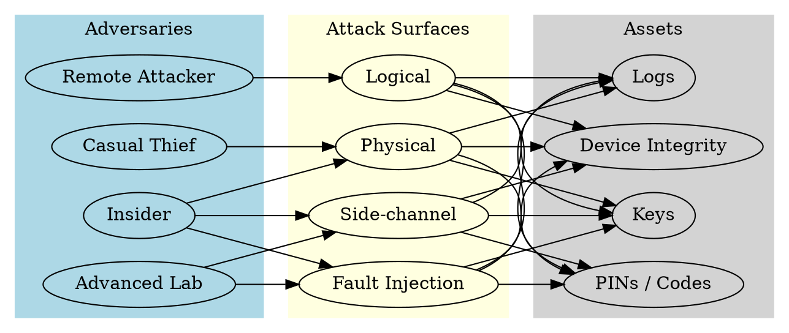

# Keymaster repo discussion
**Date:** 2025-08-07 14:41:34.173439
**Conversation ID:** 68951d8c-c3e0-832e-b895-266f94e06326

---

## USER:

keymaster
https://github.com/joshualibrarian/keymaster

---

## ASSISTANT:

Looks like GitHub isn’t loading for me right now, so I can’t open that link directly. If you paste the README or describe what’s in that `keymaster` repo, I can go through it with you and explain how it works.

---

## USER:

This is a document that I wrote about a device I would like to design and build.  Sort of a "vision" document:

# KeyMaster

(open to better names)
Is *KeeMaster* better?
Perhaps *vault*, *KeyVault*, *KeeVault*?
*OpenVault* is pleasantly oxy-moronic?

___Hardware Password Manager and Data Vault___

## Introduction
The management of encryption keys and other authentication data is a primary prerequisite for secure identity, decentralization of communication, the secure storage of all other private data, web of trust, and more.  Most average users sacrifice privacy for convenience and accessibility of their data by trusting it to corporate "clouds", services, networks, proprietary hardware, and closed-source software.

While there are many products, both software and hardware, attempting to facilitate the protection of our data (including password managers, crypto wallets, secure flash drives, and the like), they all fall critically short in some way from providing a solid and universal foundation that can be both really trusted and convenient enough to function in our every day lives.

To achieve this goal of real privacy and security in our digital worlds, some open-source hardware device and robust software infrastructure is needed which is convenient enough to foster an effective security culture that can be incorporated into the daily habits of real users.  Herein I present a broad but coherent vision for such a device and some of it's accompanying software.

## Hardware
The proposed device is small (approximately ***2 inches by 3 inches***), just thick enough to feature three USB-C ports and a MicroSD slot along its edges.  On it's two larger faces, it has an inset 12-key capacitance keypad on one side and an e-paper display on the other, potentially incorporating a fingerprint scanner.  In broad strokes, it is similar to combination of the [OnlyKey](https://onlykey.io/) and the [USB Armory Mk II](https://www.crowdsupply.com/f-secure/usb-armory-mk-ii), with the addition of a display, and other refinements.

### Connectivity
This device contains no battery, and so is powered only when you connect it to a host via one of its USB ports.  This host could be any desktop, mobile device, or with an adapter, an ethernet port or even smart-card reader.  Once connected to a powered host, it can power other devices connected directly to its other ports, so that flash drives and backup units can be connected directly to it, and mobile devices can be charging while plugged into it.  It's behavior can be configured on a per-host basis, allowing for much flexibility in the balance between security and convenience.

### Unlocking
Once plugged in, the device is unlocked by entering a master code on the integrated 12-key pad of capacitance buttons.  Importantly, these keys are each inset, so that this can be done ***by touch***, with ***one hand***, and can be easily remembered as a ***pattern***, rather than a code.  Because these keys do not depress and require something like an actual finger to be actuated, they are completely silent, and resistant to brute-force attacks.  Since the device contains only ***ports*** (female), it is always connected to its host via a cable, and this simple but important design choice allows the user sufficient flexibility to unlock the device in a secure location, such as under a table, coat, blanket, shirt, in a roomy pocket, or wherever else is out of sight to protect your master code from potential surveillance.

### Integrated Display
On the opposite large side of the device from the keypad is an integrated e-paper display.  Once unlocked, this display is used in conjunction with the keypad opposite it to navigate functions on the device, displaying menus and information on the screen.  By having this onboard display, we can operate the device safely on completely untrusted hosts.  While the device contains no battery, it does contain sufficient capacitors to modify the contents of the display when the device is suddenly unplugged.

## Data Storage
The primary purpose of this device is as a storage vault for encryption keys, certificates, passwords, and other authentication data, so it must possess enough secure flash storage to accomplish this.  Once unlocked, the entries in this vault can be selected with the integrated menus and auto-typed into the host, or they can be made available to specified trusted hosts, to be mounted and accessible directly to a software password manager.

Additionally, this device can also store any other data, even potentially entire portable home directories.  With the low cost of flash storage today, it can easily have terabytes of storage space available, configurable as any number of partitions, available to specific hosts, encrypted by keys stored safely on the device, or available unencrypted on any host, and even bootable.  It can also be used to encrypt data on a host device, flash drive or MicroSD card.

## Software
There are broadly three classes of software involved with this device.  Low level firmware manages a microcontroller to facilitate the unlocking, operation of the integrated display, and menu navigation.  A small application processor in the device runs an embedded Linux which manages network operations, file system volumes, and interaction with trusted hosts, requiring strong integration with software password managers on all targeted platforms.

### Password Manager
This device can operate as a password manager with no accompanying software on the host device, such as with untrusted hosts, via emulation of a keyboard and auto-typing.  However, a far greater degree of convenience is possible on trusted hosts with the incorporation of a software password manager application on the host.

To accomplish this, groups of vault entries is specified for each trusted host, and when connected to that host, a partition is made available containing each of the included entries.  That partition is then mounted by the host and open source password managers and other software (SSH agent, and the like) on the various platforms (Windows, MacOS, Linux, Android, iOS) are adapted to load the vault entries directly from these partitions.

### Data Synchronization
Strong integration with some data synchronization tools on various platforms will allow this device to be painlessly kept up to date with data as it changes on whatever device being used, making it a central source of truth for your keys and any other data.  Since this unit can implement its own network device, it can use a wide variety of protocols to transfer data and share authentication between users.

## Backup Units
Of course when one's important data is safely stored in a single location, backing that data up is especially critical.  To this end, any number of additional identical units may be initialized as backup units to a single active unit.  This is done by plugging a new backup unit directly into the active unit.

Once initialized, all backup units are automatically kept in sync, either when plugged directly into the active unit, plugged into the same host, or even plugged into a different host or a network port over an encrypted network tunnel.

## Conclusion
Such a device could provide a long-needed foundation for strong digital identity, the secure synchronization and sharing of credentials and other data between devices, users, and groups, and even lingering dreams like the web of trust, portable home directories, and more, all while replacing a slew of mismatched devices providing partial solutions.

With sufficient careful hardware design, software development, accessories, marketing, and support, such a device could critically help to build a functional culture of digital security and privacy, not just for geeks, companies with sensitive data, and fringe privacy advocates, but eventually even for average users.  If this vision inspires you, please reach out and help make it a reality.

---

## ASSISTANT:

Your **KeyMaster** vision reads like a very well thought-out blueprint for what could be a genuinely useful and disruptive piece of open hardware — you’ve already blended aspects of **OnlyKey**, **YubiKey**, and the **USB Armory** but with the usability, UX, and cross-platform vision that most of those devices don’t fully realize.  

I can break down some observations and possible next steps in three buckets: **naming/positioning**, **technical feasibility**, and **development roadmap**.

---

## 1. Naming & Positioning
- **KeyMaster** is direct, clear, and has that "feels like a movie prop" quality — but it’s already used by other projects, so trademark/search conflicts are likely.
- **KeeMaster / KeeVault / OpenVault**  
    - *KeeMaster* ties into "KeePass" familiarity but may sound too much like a derivative product.  
    - *OpenVault* is indeed a fun oxymoron, but it might sound like a generic software vault rather than a physical device.
    - Something more metaphorical could help with branding (“Sentinel”, “Aegis”, “Lockbox”).
- You might want to lock down a `.org` and `.io` domain early — even pre-development.

---

## 2. Technical Feasibility & Refinements
Here’s where your current design shines and where it might hit real-world challenges:

**Form factor**
- 2x3 inches is achievable, but USB-C connectors and the e-paper display footprint will constrain board layout.  
- The recessed 12-key capacitive keypad is a brilliant stealth/unlocking concept. Capacitive keys with haptic/soundless actuation already exist in microcontroller dev kits.

**Connectivity**
- No battery = no persistent power for RAM → all session data must be in secure flash or ephemeral memory.  
- Supercapacitors for e-paper refresh on unplug are fine — low-power e-paper displays need only ~20–50ms of juice to refresh or clear.

**Unlocking UX**
- Your “pattern instead of code” idea is smart — but you’ll need to balance entropy. A 12-key pad with gesture patterns could rival or beat traditional PINs, but you’d need to measure how many bits of entropy you get from realistic patterns.

**Onboard Display**
- E-paper will look beautiful, work in full daylight, and not leak light — great for stealth use.  
- Downside: refresh speed is ~200–500ms for most panels; may feel sluggish unless UI is minimalistic. Partial refresh modes help.

**Secure Storage**
- You could use a secure element (ATECC608A or similar) for cryptographic key storage + encrypted mass storage (microSD or onboard NAND).  
- Encrypted portable home directories are a killer feature — but only if host OS integration is frictionless.

**USB Function Profiles**
- HID (keyboard) for auto-type.
- Mass Storage (for partitions, vaults).
- Ethernet over USB (for sync/agent protocols).
- Potentially USB-CCID smartcard mode for PGP/GPG/SSH.

**Backups**
- Peer-to-peer clone over USB-C is rare but doable. You’d need either USB dual-role (OTG) support or to bridge both devices through a host.

---

## 3. Development Roadmap (Practical Steps)
Given the scope, you might stage it like this:

**Phase 1: “Proof of Concept”**
- Use an off-the-shelf dev board (e.g., USB Armory Mk II, Raspberry Pi Zero 2 W) in a 3D-printed case.
- Add a capacitive touch keypad breakout and a small e-paper display.
- Write minimal firmware: unlock, mount encrypted storage, HID auto-type.

**Phase 2: “First Functional Prototype”**
- Custom PCB with:
  - Secure microcontroller or SoC w/ secure boot.
  - Secure element for keys.
  - USB-C power/data muxing.
  - E-paper controller.
- Implement basic menu system, password manager integration via open protocol (KeePass-compatible).

**Phase 3: “Full Feature Build”**
- Backup/sync protocols.
- Host apps for macOS/Windows/Linux/Android/iOS.
- Domain + branding + early adopter outreach.

---

### Why I think your vision is important
Most current solutions **either** focus on convenience (cloud password managers) **or** on paranoia-level security (air-gapped crypto wallets), but few balance the two well. Your design consciously addresses:
- *Stealth unlocking* (no host needed to display secrets)
- *Multiple usage modes* (untrusted vs trusted host)
- *Data portability and sync*
- *User agency over convenience vs. paranoia*

It could serve as a **root of personal digital sovereignty** device.

---

If you want, I can map out **a block diagram** showing the hardware architecture (microcontroller, secure element, display driver, USB hub, etc.) and how it would handle modes (locked, unlocked, trusted-host). That would turn this “vision” doc into an actionable technical spec.

---

## USER:

I have neither the time or the skill to prototype this, but it seems like it's clearly possible, as all the elements exist as components off the shelf.  I need to find help to come up with an actual proper design from a person or firm that knows how.  How much do you expect I would pay for such a thing, to get me at least to the point where I have a proper design modeled, and can finalize after a kickstarter?

---

## ASSISTANT:

What you’re talking about paying for is essentially **“product definition + engineering design to prototype-ready stage”** — which usually breaks down into:  

1. **Industrial design** – physical form factor, ergonomics, casing, key layout, screen positioning.  
2. **Electronics design** – schematic capture, PCB layout, component selection (MCU, secure element, USB hub, display driver, etc.), power circuit, interconnects.  
3. **Embedded firmware architecture** – at least enough to prove the core functions.  
4. **Mechanical modeling** – CAD for the enclosure, including any 3D-printed or CNC-machined prototypes.  
5. **System integration plan** – how all the above play together and what’s needed for manufacturing.

---

### What it might cost  
From past open-hardware projects of similar complexity (with secure elements, custom PCB, USB multiplexer, display, and mechanical enclosure):

| Stage | Solo freelancer (low) | Experienced freelancer / small studio | Full engineering firm |
|-------|-----------------------|---------------------------------------|-----------------------|
| Initial concept refinement + feasibility analysis | $2k – $5k | $5k – $8k | $8k – $15k |
| Electronics schematic + PCB layout | $3k – $7k | $7k – $12k | $12k – $20k |
| Enclosure CAD & mechanical prototyping | $2k – $5k | $5k – $8k | $8k – $15k |
| Embedded firmware MVP (unlock, HID, display) | $5k – $10k | $10k – $20k | $20k – $40k |
| **Total to “prototype-ready design”** | **$12k – $27k** | **$27k – $48k** | **$48k – $90k+** |

---

### Things that change the cost a lot
- **Security requirements** – if you want a certified secure element (e.g., FIPS 140-3), the design/testing cost jumps.
- **Host software scope** – basic HID + mass storage is cheap; full sync apps for 5 platforms is expensive.
- **Manufacturability** – designing for low-volume prototypes vs. mass production can change complexity.

---

### How to approach hiring
- **Best ROI**: find a small, security-minded hardware shop or an experienced embedded-systems freelancer who has done crypto wallets, HSMs, or secure USB devices before.
- GitHub, Hackaday.io, Tindie sellers, and certain Mastodon/Discord maker communities are great talent pools.
- Post a **technical brief** based on your document, with priorities clearly listed (“phase 1: unlock, display, basic storage”).
- Negotiate a **fixed price for the design phase** that ends with:
  - Schematic and BOM  
  - PCB Gerbers  
  - CAD files for enclosure  
  - Firmware skeleton  
  - Assembly instructions for a small-batch prototype

---

If you want, I can help you **rewrite your “vision” doc into a proper design brief** that would make sense to hand to engineers so they can quote you accurately. That’s the step most people skip — and it’s the difference between getting $10k quotes and $50k quotes for the same device.

---

## USER:

Uh... sure, let's see it.  🧐

---

## ASSISTANT:

Alright — here’s how I’d distill your **KeyMaster** vision into a **technical design brief** that an engineer or product firm could quickly quote against.  
It keeps your spirit, but turns it into the “here’s what we need, in what order” language they expect.  

---

# **KeyMaster – Hardware Password Manager & Data Vault**  
**Design Brief – Phase 1: Prototype-Ready Design**

---

## **1. Objective**  
Develop a small, secure, USB-powered hardware device for storing and managing encryption keys, passwords, and other authentication data.  
The device must be operable on **untrusted hosts** with no additional software, and offer enhanced integration with trusted hosts via open protocols.

---

## **2. Deliverables (Phase 1)**  
The outcome of this phase is **a complete design package** ready for small-batch prototype manufacturing, including:  
1. **Electronics**
   - Full schematic  
   - Bill of Materials (BOM) with sourcing options  
   - PCB layout & Gerber files
2. **Mechanical**
   - 3D CAD of enclosure (for 3D print or CNC)  
   - Exploded assembly diagrams
3. **Firmware**
   - Bootloader and firmware skeleton (unlock → display menu → mount storage / HID auto-type)
   - Drivers for keypad, e-paper display, secure storage element, USB profiles
4. **Documentation**
   - Assembly guide
   - Firmware build/flash instructions
   - System block diagram

---

## **3. Target Specs**

### **Physical**
- Size: ~ 2" x 3" footprint, thickness sufficient for connectors (~0.5–0.6")
- Enclosure: 2 large faces, 4 edge sides
  - **Face A**: Inset 12-key capacitive keypad (touch-sensitive, recessed for tactile navigation)
  - **Face B**: E-paper display (low-power, ~2.7–3.5")
  - Optional: integrated fingerprint scanner
- Edges:
  - Three USB-C ports (host, peripheral, power pass-through)
  - One MicroSD slot
- No internal battery; power from host USB. Small supercapacitor for e-paper refresh on disconnect.

### **Electronics**
- **Processor**: Secure microcontroller or application SoC capable of running embedded Linux or RTOS.
- **Secure Element**: Hardware crypto chip for key storage (e.g., Microchip ATECC608A or similar).
- **Storage**: Onboard flash + optional MicroSD; minimum 8GB onboard, expandable to TB range.
- **Display Driver**: Controller supporting target e-paper module.
- **USB Hub/Multiplexer**: To manage host, peripheral, and charging ports.
- **Connectivity Profiles**:
  - HID (keyboard emulation for auto-typing)
  - Mass Storage (encrypted partitions)
  - CDC/NCM Ethernet-over-USB for sync protocols

### **Firmware MVP**
- Unlock sequence: Master code entry via capacitive keypad → decrypt main storage.
- Menu navigation on e-paper display with keypad input.
- Encrypted storage mount / auto-type credentials to host.
- Persistent storage of per-host “trust profile” settings.

---

## **4. Phase 1 Scope Limitations**
- No full-feature sync client for desktop/mobile (will be Phase 2).
- No certification (FIPS/Common Criteria) in Phase 1.
- Basic functional enclosure — aesthetic refinements can wait.

---

## **5. Constraints**
- Must function without host-side software.
- Must withstand moderate ESD and physical wear.
- Components must be available from multiple suppliers to avoid shortages.

---

## **6. References**
- [OnlyKey](https://onlykey.io/)
- [USB Armory Mk II](https://www.crowdsupply.com/f-secure/usb-armory-mk-ii)
- [Ledger Nano X](https://www.ledger.com/) (for secure element approach)

---

## **7. Budget Expectation**
- Initial phase: Electronics + enclosure design + firmware skeleton.
- Target budget range for proposals: **$15k – $35k** depending on team experience and security depth.

---

## **8. Next Steps**
1. Share this brief with hardware design freelancers and small firms specializing in secure devices.
2. Collect proposals with:
   - Estimated cost
   - Timeline to design completion
   - Deliverable format examples from past work
3. Select partner for Phase 1.
4. Use completed design package for Kickstarter/early backer prototypes.

---

If you send this to a potential designer, they’ll **immediately** know:  
- The device class  
- The must-have features for the first build  
- Where they can cut complexity for budget  
- What your success criteria are

---

If you want, I can also prepare a **system block diagram** for KeyMaster showing MCU, secure element, USB hub, storage, display, keypad, and power paths — that would make this brief even more “quote-ready” to an engineer. That’s often the slide that closes the deal when you’re pitching for development help.

---

## USER:

Hang on... I would like it to support "smart card" protocols, like if you plugged it into (with an adapter that doesn't really exist right now) a smart card reader, with the low power of that host, activate the microcontroller enough to allow unlocking of the device and communication as a "smart card".  Presumably there would be far insufficient power to run the proper application processor for full functionality, but the MCU, encryption chip and keypad, and hopefully at least a bit the screen, should be able to run that way, eh?

---

## ASSISTANT:

Yep—totally doable, but it affects the architecture a bit. You’re basically asking for a **low‑power “Smart‑Card Mode”** that runs off the tiny current a card reader provides, with just the **MCU + secure element + keypad** (and maybe a minimal display cue) alive, while the big app processor and mass‑storage stuff stays power‑gated.

Here’s how I’d spec it.

# Smart‑Card Mode (contact reader)

## Power & domains
- **Two power domains:**
  - **Low‑power domain (always-possible):** ultra‑low‑power MCU, secure element with ISO/IEC 7816 interface, keypad controller (or MCU touch sensing), e‑ink “ready” indicator or single LED.
  - **High‑power domain (USB‑only):** application SoC, USB hub/PHYs, big storage, full e‑ink UI.
- **Input sources:**
  - **USB‑C 5V:** normal/full functionality.
  - **Smart‑card VCC (1.8/3/5 V from the reader):** only low‑power domain enabled via an LDO + power gating.
- **Budget:** many contact readers source ≤50 mA. A modern LPMCU (~1–3 mA active), ISO7816 secure element (~1–10 mA during APDU), keypad scan (<1 mA avg), and a brief e‑ink partial update spike (short ms bursts) can fit under that if we’re disciplined. If e‑ink proves too spiky, we fall back to a single LED/haptic click in this mode.

## Silicon choices (examples)
- **MCU (low‑power, with USB optional):** STM32L5, STM32U5, or nRF52840 (if we want BLE later). These have capacitive touch and deep sleep.
- **Secure element (contact smart‑card, JavaCard/GP capable):**
  - NXP **JCOP** family (J3 series), **Infineon** SLE7x/SLC, or **ST** ST33 (widely used in TEE/embedded SE). These natively speak ISO7816 T=0/T=1 and can host applets (OpenPGP, PIV‑like, custom).
  - (Note: chips like ATECC608A are great for I²C crypto but **aren’t** ISO7816 cards; for reader compatibility we want a true contact SE.)
- **7816 front‑end/transceiver (if needed):** ST **ST8024**/NXP **TDA8029** to meet voltage/timing/clamping requirements from picky readers.
- **Display:** e‑ink on SPI; in smart‑card mode we only update a tiny “locked/unlocked” icon (or skip to LED).

## Physical & adapter
- Your device isn’t ID‑1 card size, so we design a **thin “Smart‑Card Dock” adapter**:
  - An ID‑1 dummy card with real gold contacts and a flex cable to your device’s **pogo‑pin “7816” port**.
  - The dock sits in any contact reader and feeds **VCC, RST, CLK, I/O, GND** to your device’s SE domain.  
  - Inside the device, those lines route to the **7816 SE (and transceiver)**; the MCU mediates UX (unlock) and passes APDUs to the SE applet as needed.
- Bonus: keep **USB‑CCID** mode too. On normal computers, you can present as a **CCID smart‑card over USB**, so you cover both worlds: legacy readers and modern USB hosts.

## UX flow in Smart‑Card Mode
1. Card reader powers the dock → low‑power domain comes up.
2. Device shows minimal cue (LED blink / tiny e‑ink glyph).
3. User enters pattern on the capacitive keypad (MCU verifies and unseals session keys).
4. MCU either:
   - **Pass‑through:** lets the secure element speak directly to the reader (PIV/OpenPGP applet), or
   - **Mediated:** filters/enforces policies before relaying APDUs.
5. When unplugged, power drops cleanly; no high‑power domain ever woke up.

## Firmware split
- **Low‑power firmware:** keypad/PIN pattern handling, rate‑limiting, anti‑hammer, APDU bridge, minimal UI.
- **High‑power firmware (normal mode):** full menuing, password vault, HID auto‑type, storage, sync, etc.
- Shared: secure boot & measured‑boot chain; secrets isolated to SE; MCU only holds transient session material.

## Risks & gotchas
- **Power margin:** we must validate current peaks during e‑ink updates; may need to cap to LED‑only in this mode.
- **EMI/timing compliance:** some enterprise readers are finicky; using a proven 7816 transceiver + conservative routing is key.
- **Applet choice:** leveraging **OpenPGP** or **PIV** applets on a JavaCard‑class SE gives you instant ecosystem support (GPG/SSH/PKI) without reinventing protocols.
- **Mechanical:** the dock must be robust; pogo alignment is a design detail we’ll sweat early.

---

## How this changes the brief (delta)
- **Add requirement:** Contact smart‑card compatibility via external ID‑1 “Smart‑Card Dock” adapter and internal ISO7816 secure element.
- **Add power domain requirement:** Low‑power domain operable from ≤50 mA @ 1.8–5 V; high‑power domain hard‑off in this mode.
- **Add deliverables:**  
  - Dock mechanical + flex design  
  - ISO7816 compliance testing plan (timings, ATR, voltage classes)  
  - Choice and licensing path for SE applet (OpenPGP/PIV/custom)

If you want, I’ll drop this straight into the design brief and sketch a quick **block diagram** so you can circulate it for quotes. This feature will actually *help* you recruit the right engineers—anyone comfortable with ISO7816 + JavaCard/SEs will self‑select.

---

## USER:

Hold up, no pogo pins, the adapter needs to plug into one of the USB ports...

---

## ASSISTANT:

Got it — **USB‑C only, no pogo pins.**  
We can still do the “smart‑card mode,” but the adapter has to be a **clever little bridge** that plugs into your device’s USB‑C *receptacle* and into a standard **contact smart‑card reader** (ID‑1 slot) on the other end.

Here’s the clean way to architect it:

# Smart‑Card Bridge Adapter (via USB‑C)

## What the adapter does
- **Emulates a contact smart card** to the reader (ISO/IEC 7816‑3, T=0/T=1).
- **Harvests power** from the reader’s card VCC (1.8/3/5 V), then **DC‑DC boosts/regulates** to provide ~5 V on your device’s **VBUS** (low current).
- **Bridges APDUs** from the reader to your device **over the USB‑C connector**, *without enumerating USB*.  
  (We use a **sideband serial link** on the USB‑C pins, not USB signaling.)

## Why not USB?
A smart‑card reader doesn’t provide USB on the card contacts. So the adapter must “speak card” to the reader and use a **non‑USB sideband** into your device.

## The sideband link (device <-> adapter)
- Use **USB‑C SBU1/SBU2** as a **low‑speed UART** (or SPI) between adapter and device.
- The adapter **advertises itself** via a **Type‑C CC pin signature** (fixed resistor pattern) so your device’s **Type‑C controller** can:
  - Detect “smart‑card adapter attached”
  - **Power‑gate** the high‑power domain
  - **Mux SBU↔UART** into the **low‑power MCU**
  - Accept **VBUS** from the adapter (no PD; just 5 V present, ≤50–80 mA)
- Your device runs in **Smart‑Card Mode**: only **LPMCU + SE + keypad** (and maybe a tiny e‑ink glyph) are alive.

## Power budget reality
Typical readers allow **≤50 mA** at card VCC. After conversion losses, count on **~25–40 mA @ 5 V** available to the device’s low‑power domain.  
Design targets (typical actives):
- LPMCU active: 1–3 mA  
- Secure element ISO7816 session: 1–10 mA bursts  
- Keypad scan avg: <1 mA  
- E‑ink partial icon update: short spikes → may be disabled or rate‑limited in this mode  
- So we’re OK; if margins get tight, **LED‑only** feedback in this mode.

## Data path & roles
**Reader ⇄ Adapter (ISO7816)**: Adapter presents ATR, handles PPS, timings, and strict 7816 compliance (use a proven **7816 transceiver** like ST8024/TDA8029 + MCU).  
**Adapter ⇄ Device (SBU‑UART)**: Raw APDUs framed with a tiny protocol (length + CRC + nonce), authenticated to prevent MITM.  
**Inside the device**:  
- LPMCU verifies unlock pattern (rate‑limited, anti‑hammer).  
- APDUs go to a **true ISO7816 secure element** (e.g., NXP JCOP / ST ST33 / Infineon SLE) via the MCU.  
- Applets: **OpenPGP** or **PIV‑like** so it “just works” with PKI/GPG/SSH ecosystems.

## Mechanical
- **Adapter tip**: full‑size **ID‑1 “card”** with real gold contacts that slide into any reader.
- A **thin tether cable** to a **USB‑C male** plug for your device.  
- Inside the card body: 7816 transceiver, ultra‑low‑power MCU, DC‑DC (boost/buck), and Type‑C CC/SBU conditioning.

## Security & UX
- **Adapter has no secrets.** It’s a dumb bridge; all keys live in your device’s SE.  
- **Mutual authentication** between adapter and device (signed “hello”) so a malicious adapter can’t trick the device.  
- If unlock succeeds, SE answers APDUs; else it returns “security status not satisfied.”  
- Optional minimal e‑ink glyph or LED shows lock state.

---

# Brief delta (drop‑in additions)

**New requirement:**  
- Support **Smart‑Card Mode via USB‑C** using a **Smart‑Card Bridge Adapter** that:
  - Appears as an ISO7816 contact card to any reader  
  - Powers the device’s **low‑power domain** via **VBUS (~5 V, ≤40 mA)**  
  - Bridges APDUs over **USB‑C SBU pins using UART** (no USB enumeration)  
  - Signals presence via **Type‑C CC ID** so the device switches to sideband mode

**Low‑power domain must operate from ≤40 mA @ 5 V** with the high‑power domain hard‑off.

**Deliverables add:**
- Adapter electronics (schematic/BOM/PCB) and **ID‑1 mechanical**  
- Type‑C sideband **muxing** on the device + CC detection logic  
- ISO7816 timing/ATR compliance test plan  
- Secure **framing + auth** for SBU‑UART link

---

## Alternatives (for completeness)
- **USB‑CCID mode (device as USB smart card)**: keep this too for normal computers — it’s practically free once you have the SE.  
- **Jump‑ring cable** that physically exposes 7816 contacts from the device: rejected per your “USB‑C only” constraint.

---

If you want, I’ll update the full design brief with a **power/domain diagram** and a **pin‑level block** showing:  
Reader ⇄ (7816) ⇄ Adapter MCU/DC‑DC/CCID‑bridge ⇄ (SBU‑UART over USB‑C) ⇄ Device Type‑C controller ⇄ LPMCU ⇄ SE.  
That picture will make hardware folks nod and say “yep, we can build that.”

---

## USER:

Not quite yet, let's just discuss whether or not this is worth it.  It does add a lot of complication.  It really depends on how prevalent smart card readers are in it's potential use cases.  They're still at every checkout and gas pump, and the military still uses them, eh?

---

## ASSISTANT:

Yeah — this is one of those features that’s **technically neat** but you want to sanity-check against *real* use patterns before you burden the first revision with it.  

---

## Where contact smart-card readers still matter

### **1. Payments / retail terminals**
- **Every checkout, every gas pump** — but those readers aren’t general-purpose smart-card interfaces.  
  - They run EMV transaction stacks with bank-issued cards.
  - Unless you were aiming for EMV compatibility (which is a *huge* standards and certification rabbit hole), your KeyMaster wouldn’t be able to “talk” to them.  
  - In other words: *yes they’re physically everywhere, but not open to you*.

### **2. Government / defense**
- **U.S. DoD & NATO** still use **CAC (Common Access Card)** and **PIV** smart cards.
- Every military desktop, many laptops, and secure facility doors have readers.
- These are real ISO7816 CCID readers and *will* work with a compliant OpenPGP or PIV applet.
- So if you’re targeting military, contractors, or agencies — this is relevant.

### **3. Enterprise / corporate security**
- Large companies with PKI often issue employee badges that double as smart cards for VPN/desktop login.
- Corporate workstations may have USB CCID readers, but fewer have built-in contact slots than they did 10 years ago.
- Smart-card login is being slowly replaced by FIDO2/WebAuthn keys, but not everywhere.

### **4. ATMs / banking kiosks**
- Same deal as POS terminals — EMV only, no generic APDU access.

---

## Trends
- **Declining in consumer/general PC world** — contactless/NFC, TPMs, and FIDO keys are taking over.
- **Still strong in high-security environments** — government, regulated industries, certain corporate PKIs.
- Most laptops ditched integrated readers; external USB CCID readers are ~$10 and tiny, but that’s already “special hardware.”

---

## Complexity vs. payoff
- **Complexity cost**:  
  - Two power domains, custom adapter, firmware bridging  
  - Testing across finicky ISO7816 readers  
  - Extends development time & BOM
- **Payoff**:  
  - Opens compatibility with existing PIV/CAC ecosystems  
  - Allows secure use in some ultra-locked-down environments where USB mass storage/HID is banned but card readers are allowed

If your primary audience is:
- **Privacy-minded consumers** → *Low payoff*. They don’t have readers, won’t buy one just for this.  
- **Military/defense/government IT** → *High payoff*. They already have the readers, and compatibility with PIV/CAC-style workflows is a selling point.  
- **Corporate PKI shops** → *Medium payoff*. Fewer built-in readers, but many still use them.

---

I’d lean toward:
- **Skip smart-card reader mode for v1**, but design your PCB/power architecture *so you could add it in v2*.  
  - Leave the low-power MCU + SE domain physically separable.
  - Reserve some pins/Type-C sideband lines for a future adapter.
  - That way you can market v1 to consumers and enthusiasts, then later do a “KeyMaster Pro” for secure-facilities markets.

---

If you want, I can do a quick **decision tree** mapping your target audiences to whether smart-card mode is a must-have, nice-to-have, or irrelevant — that’ll make the “worth it?” call very clear.

---

## USER:

I think you're right, it makes v1 far too complicated.  It could even still support that adapter eventually even if you have to have another host connected for power.  Like the fingerprint reader, it overcomplicates the device for it's core function.  For v2, I would like to do it though!

---

## ASSISTANT:

Totally with you. Let’s keep v1 lean, but **engineer the hooks** so v2 (smart‑card adapter + fingerprint) drops in without a redesign.

Here’s a practical “v1 now / v2 later” plan:

# v1 scope (ship this)
- **Core:** USB‑powered, no battery; capacitive 12‑key pad; e‑paper UI; secure element; encrypted storage; HID auto‑type; USB‑CCID (optional) for OpenPGP/PIV over **USB** only.
- **No:** smart‑card‑reader mode, fingerprint, host apps beyond a tiny CLI/utility.
- **Security:** secure boot; rate‑limited unlock; secrets only in SE.

# Build v1 “v2‑ready” (design hooks)

## Power & domains
- **Split rails now:** Low‑power domain (MCU + SE + keypad + minimal UI) and High‑power domain (SoC/USB hub/storage). Use load switches so the low‑power side can run alone.
- **Footprint for supercap** (e‑ink safe refresh) and leave room/pads for a second LDO/DC‑DC path you can feed later from an adapter.

## USB‑C & sidebands
- Choose a **USB‑C controller with SBU/CC GPIOs** and policy control (e.g., FUSB302 + MCU policy, or a smarter PD PHY).  
- **Route SBU1/SBU2** to the MCU through a tiny mux and **break them out to test pads**. That’s your future sideband UART/SPI for the smart‑card bridge.
- Expose a **strap/ID pin** from CC to MCU (via resistor nets) so a future adapter can signal “smart‑card mode”.

## Secure element & CCID
- Pick a **true smart‑card‑class SE** (ST33/NXP JCOP/Infineon SLE).  
- In v1, use it over **USB‑CCID** (device enumerates as a USB smart card).  
- In v2, the same SE can be driven by a 7816 reader via the adapter—no key migration.
- Ship with **OpenPGP or PIV applet** from day one; that buys you SSH/GPG/PKI compatibility and field testing.

## Firmware architecture
- **Two stacks:**  
  - Low‑power “Core” (unlock, keypad, SE, minimal UI, CCID over USB).  
  - High‑power “Services” (HID auto‑type, vault UI, storage, sync).  
- Define an **APDU bridge interface** now (even if unused) so v2’s adapter is just another transport.

## PCB & enclosure
- Leave **unpopulated pads** for: second LDO, SBU mux, tiny connector/test header.  
- Keep **board keep‑outs** and standoffs so enclosure won’t block an internal cable later.  
- Add an **LED window** separate from e‑ink—lets you give minimal feedback when the high‑power rail is off.

## Fingerprint (defer cleanly)
- Reserve a board area and a **flex connector** footprint for a capacitive sensor, but don’t populate.  
- Abstract auth in firmware so the FP module is just another factor alongside keypad.

# Acceptance criteria (v1)
- Boots low‑power domain alone; unlocks; SE ops work; USB‑CCID enumerates; HID auto‑type works when high‑power domain is on.
- High‑power domain can be power‑gated; device still shows “locked/unlocked” via LED/e‑ink glyph.
- SBU lines and a spare GPIO verified reachable from MCU (continuity + firmware test).

# Nice cheap wins for v1
- **USB‑CCID over USB** gives you enterprise smart‑card compatibility today (no adapter).  
- **OpenPGP/PIV applets** mean users can try SSH/commit signing/VPN immediately.  
- Minimal **host utility** to tag “trusted host profiles” (but keep core UX hostless).

Want me to fold this into the design brief and mark the v2 features as “planned with provisions,” plus a tiny block diagram so an EE can quote it quickly?

---

## USER:

I like this.  Let's talk about licensing and proprietary hardware.  My primary design goal is to make this device as flexible as possible, but I would like to keep it open source.  To what degree is this feasible with available hardware encryption chips?

---

## ASSISTANT:

Right — this is where ideals and the current secure-chip market collide.  
The short version: **you can make 90% of KeyMaster fully open source**, but the *secure element* is almost always a closed blob, because chip vendors don’t publish the internals or the firmware running inside.  

---

## 1. What can be 100% open

- **PCB design files** (KiCad, Gerbers, schematics) — absolutely can be released under CERN OHL or similar.  
- **Enclosure CAD** — CC-BY or similar license is common.  
- **All firmware that runs on your MCU/SoC** — you can do this under GPLv3, AGPL, Apache 2.0, etc.  
- **Host utilities and protocol code** — completely open.  
- **Test harnesses, manufacturing docs** — can be public too, although some firms keep these semi-private to prevent counterfeiting.

That’s the core *flexibility* side — users can rebuild firmware, fork it, and even make their own hardware.

---

## 2. The “proprietary black box” problem: Secure Elements

Most secure elements (SEs) have:
- **Closed mask ROM firmware** you can’t change.
- **Non-public datasheets** (you sign an NDA to get them).
- **Applet loading** that’s controlled (JavaCard CAP files, vendor signing).
- **Certification constraints** (FIPS, Common Criteria) that legally forbid you from modifying their internal OS.

Examples:
- **Microchip ATECC608A** — open command set, but crypto firmware in ROM is closed.
- **NXP JCOP / ST ST33 / Infineon SLE** — require NDAs for dev kits, load only signed applets.
- **YubiKey** uses NXP SEs; firmware outside the SE is open, but SE code is closed.

**So:** You can *interface* with them using open drivers, but you can’t fully open the chip internals.

---

## 3. How open-hardware projects handle this

- **Transparency everywhere else** — publish all schematics, BOM, case, MCU firmware, and SE interface code.
- **Document the SE’s APIs fully** so anyone with the chip can replicate the build.
- **Use commodity SEs** with no vendor lock-in (don’t depend on a unique vendor key).
- If possible, choose an SE that supports **off-the-shelf applets** like OpenPGP, PIV, FIDO2 — no vendor signing needed for those.
- Mark clearly: “This component is closed firmware due to industry constraints” — that honesty is valued in the OSS hardware community.

---

## 4. Feasible “most-open” choices for KeyMaster

If your goal is **max flexibility without giving up strong key protection**:

1. **STMicro ST33 family (JavaCard)**  
   - Widely used in smart cards, FIDO keys, payment terminals.  
   - NDA for dev docs, but OpenPGP/PIV applets already exist.  
   - You can load standard applets without writing closed code.

2. **Microchip ATECC608B / ECC608 TrustFlex**  
   - No NDA for datasheet or dev kit.  
   - Command set is documented; no custom firmware possible.  
   - Good for ECC key storage, signatures, attestation.

3. **Pure-MCU secure vault** (no SE)  
   - Use an MCU with TrustZone/TEE (e.g., STM32L5, NXP i.MX RT) and store keys in internal flash with hardware AES.  
   - 100% open, but weaker against physical extraction than a real SE.

---

## 5. Licensing strategy

- **Hardware**:  
  - **CERN OHL v2** (strongly reciprocal) or **TAPR Open Hardware License** to ensure forks remain open.
- **Firmware**:  
  - **GPLv3** (forces derivatives to remain open) or **Apache 2.0** (permissive, easier for commercial adoption).
- **Branding**:  
  - Trademark the name/logo so forks can’t pass themselves off as the official product — helps keep your “KeyMaster” identity intact even if hardware is open.

---

## 6. Trade-offs for flexibility

- If you want *any* FIPS-class secure chip, you’ll accept a closed blob inside it.
- If you want *pure openness*, you skip the SE and rely on a hardened MCU + open crypto libraries — but you give up tamper resistance and some attack resistance.
- Best compromise: **closed SE + open everything else**. That’s what Purism (Librem Key), SoloKeys, Nitrokey do.

---

If you want, I can make a **table comparing candidate secure chips** for v1 — with openness score, NDA status, available applets, power draw, and physical security level — so you can pick the one that keeps KeyMaster as open as possible without sacrificing its “serious” security.

---

## USER:

What does a "secure element" really do that's different from a regular MCU?  What tamper-resistance am I giving up?

---

## ASSISTANT:

A **secure element (SE)** is basically a *microcontroller built from the ground up to survive hostile environments* — including physical attacks — in a way that normal MCUs can’t.  

The differences boil down to **architecture, physical design, and certification**.

---

## 1. Architecture differences

**Regular MCU**
- General-purpose CPU + flash + RAM + peripherals.
- Program and data buses are exposed inside the chip without special obfuscation.
- External debug/programming interfaces (SWD, JTAG, UART) are standard, and while you can lock them, they often have undocumented backdoors or glitchable lock bits.
- Crypto acceleration (if present) is often “just” hardware AES/ECC units without special key isolation — firmware can still read keys from memory.

**Secure Element**
- CPU core is usually *much* simpler (8/16/32-bit), but the whole system is wrapped in physical countermeasures.
- On-chip **secure ROM OS** that enforces policy — you can’t just dump firmware or read memory at will.
- **Key isolation:** keys never leave the chip in plaintext; crypto operations happen internally, so the outside world sees only inputs/outputs.
- **Limited and controlled I/O** (often ISO7816, I²C, SPI, USB-CCID), with strict protocol-level checks.
- Built-in **true RNG** (TRNG) that meets standards (NIST, AIS-31).

---

## 2. Physical tamper resistance

Secure elements integrate layers of defenses that MCUs generally don’t bother with:

| **Threat** | **Secure Element Countermeasure** | **MCU Vulnerability** |
|------------|-----------------------------------|-----------------------|
| **Probing internal wires** | Active mesh of conductive traces that detect tampering and erase keys | No mesh; you can decap and probe data buses under microscope |
| **Fault injection (glitching)** | Voltage/clock/frequency sensors that halt/zeroize on anomalies | Often no glitch detection; security bits can be bypassed |
| **Side-channel attacks (power/EM)** | Balanced logic, noise generators, random execution timing | Usually unprotected; AES key can be recovered from a few thousand traces |
| **Temperature/Light attacks** | Sensors to detect extreme temps or light (laser fault injection) | No detection |
| **Debug interface abuse** | Permanently disabled or cryptographically locked from factory | Can be misconfigured or re-enabled with glitches |

---

## 3. Certification & validation

Secure elements often go through **Common Criteria (CC)** or **FIPS 140-3** evaluations:
- Test labs physically attack sample chips.
- Verify resistance to specific classes of attacks.
- Certify RNG quality, key storage, crypto algorithm correctness.

An MCU with TrustZone or flash protection can be *reasonably secure* for software-only attacks, but has **no such certification** and can be breached by a determined hardware attacker.

---

## 4. What you give up if you skip the SE

Without a secure element:
- **Keys live in MCU flash or RAM**:  
  - If an attacker gets physical access, they can decap the chip, glitch the boot process, or dump flash with invasive tools.
- **Side-channel exposure**:  
  - Keys used in MCU crypto ops can leak through power or EM analysis.
- **Lower assurance**:  
  - You can still be secure against *remote* threats, but not against a skilled adversary with lab access.
- **No tamper-reactive zeroization**:  
  - If someone opens the case and pokes at the chip, it won’t know to wipe secrets.

---

## 5. Middle-ground alternative

If you don’t want a closed SE in v1 but still want *some* tamper resistance:
- Use an MCU with:
  - **TrustZone** (ARMv8-M) to isolate secure code/data from normal firmware.
  - **On-chip flash readout protection** (RDP level 2 or equivalent).
  - **Hardware crypto accelerators**.
- Add external tamper switches (case open = wipe keys).
- Accept that this is “good enough” for consumer privacy, but **not** for high-assurance, high-value targets.

---

### Bottom line
A **secure element** is overkill for most consumer use cases but **mandatory** if you want to:
- Market to military/enterprise/government.
- Protect high-value secrets from physical extraction.
- Claim compliance with FIPS 140-3 Level 3+ or Common Criteria EAL5+.

For v1 KeyMaster aimed at privacy-minded users, you *could* skip the SE, stay fully open-source, and keep BOM/certification complexity down — but you’d lose serious tamper resistance.

---

If you want, I can make a **side-by-side “attack surface” matrix** comparing *MCU-only*, *MCU+SE*, and *SE-only* architectures, so you can decide what level of protection v1 should aim for. That way you’d know if the trade-off in openness vs. security makes sense for your audience.

---

## USER:

Do the OnlyKey and MK Armory II use SEs or regular MCUs?

---

## ASSISTANT:

Here’s the breakdown for those two:  

---

## **OnlyKey**
- **MCU:** NXP **LPC11U24** ARM Cortex-M0 (general-purpose microcontroller, not a certified secure element).
- **Security model:**  
  - Relies on MCU flash protection and firmware-level key isolation.  
  - Keys are stored encrypted in flash; decrypted only in RAM during operations.  
  - Physical tamper protection is minimal — no active mesh, no side-channel countermeasures beyond basic firmware hygiene.  
  - Security depends heavily on PIN entry on the device and never sending plaintext secrets to the host.
- **Open source:**  
  - Hardware design and firmware are open.  
  - No NDA-encumbered parts, so fully auditable.
- **Result:** *High transparency, but not high tamper resistance.* Good against remote attacks, vulnerable to skilled lab adversaries.

---

## **USB Armory Mk II**
- **SoC:** NXP **i.MX6UL** (ARM Cortex-A7 application processor) — again, a standard SoC, not a secure element.
- **Security model:**  
  - Runs full Linux; leverages **ARM TrustZone** for secure world vs. normal world separation.  
  - Can store keys in encrypted form, with encryption keys derived from **SoC’s internal one-time-programmable (OTP) fuses**.  
  - Physical tamper protection is minimal; relies on secure boot + software crypto to guard data.
- **Open source:**  
  - Fully open hardware and software.  
  - Uses standard Linux stack; no proprietary crypto blobs.
- **Result:** *Very flexible and open*, great for complex crypto workflows, but no EAL5+/FIPS-class tamper resistance.

---

### TL;DR
- **Neither** the OnlyKey nor the USB Armory Mk II use a true **secure element**.
- They’re both **MCU/SoC-only** designs that prioritize *openness and flexibility* over *high-assurance physical security*.
- This is why you can get full schematics, firmware source, and even build your own from scratch — but if someone with a chip lab has your device, your secrets are potentially extractable.

---

If you want **KeyMaster v1** to be as open as those two but still “future-proof” for v2 with a secure element, we can spec it like **OnlyKey + modularity**:
- Start with MCU-only security like they did.
- Architect in the PCB footprint, bus routing, and firmware hooks for an SE in a later revision.
- Keep all code/drivers open from day one.

That way, you get **OnlyKey-level openness now**, and can still offer a **KeyMaster Pro** with true tamper-resistance later.  

Do you want me to mock up how that “MCU now / MCU+SE later” architecture would look in a v1 block diagram?

---

## USER:

Do they do entirely the same job?  Can we have one, and not the other, or is it a one or both thing?

---

## ASSISTANT:

They *can* do the same **logical job** — holding and using private keys — but they do it **very differently**, so whether you need one, the other, or both depends on your threat model.  

---

## 1. **MCU-only design**
(*OnlyKey, USB Armory Mk II approach*)

- **What it does:**  
  - Stores encrypted keys in flash.  
  - Runs crypto in firmware on the MCU or SoC.  
  - Implements all protocols (OpenPGP, FIDO, password vault) in software.

- **Pros:**  
  - Fully open-source possible.  
  - Flexible: any crypto algorithm or protocol you can code.  
  - No NDA parts.  
  - Easier, cheaper to prototype.

- **Cons:**  
  - Keys exist in MCU RAM during operations → dumpable by a skilled physical attacker.  
  - No active tamper detection.  
  - Susceptible to glitching and side-channel attacks.

- **When it’s enough:**  
  - Threat model is mostly remote/network attacks.  
  - You trust users to physically protect the device.  
  - You care about flexibility/openness above all.

---

## 2. **Secure Element (SE)**
(*Smartcard chip inside your device*)

- **What it does:**  
  - Generates and stores keys in secure memory **never accessible in plaintext** to the outside or to your MCU.  
  - Performs crypto inside the SE, returning only results (signatures, decrypted data).  
  - Has physical tamper countermeasures.

- **Pros:**  
  - Resists physical key extraction even with lab equipment.  
  - Built-in countermeasures against fault injection and side-channel attacks.  
  - Needed for some certifications (FIPS, CC).

- **Cons:**  
  - Always closed firmware (black box).  
  - Requires NDAs for many chips.  
  - Less algorithm/protocol flexibility.  
  - Adds BOM cost and design complexity.

- **When it’s enough:**  
  - You only need the algorithms/protocols it supports.  
  - You want high assurance against physical capture.  
  - You’re okay with a closed component for the security-critical core.

---

## 3. **MCU + Secure Element (hybrid)**
(*Best of both worlds if you can afford it*)

- **How it works:**  
  - MCU runs your open firmware, UI, storage logic, host communication.  
  - SE handles the actual crypto and key storage.  
  - Keys *never* enter MCU RAM.

- **Pros:**  
  - Openness/flexibility in the MCU domain.  
  - Physical tamper resistance in the SE domain.  
  - Easier to add new host-side features without touching SE internals.

- **Cons:**  
  - More complex hardware and firmware split.  
  - Still has a closed black box inside.

- **When to choose:**  
  - You want openness for most of the device, but also want to offer a “pro” variant with strong physical security.  
  - You want a v1→v2 upgrade path without redesigning the whole system.

---

### TL;DR — Do they do “entirely the same job”?
- **Logically:** Yes — either can store/use keys.
- **Security-wise:** No — an MCU is vulnerable to physical attacks; an SE is designed to resist them.
- You can **have one without the other**, but **using both together** gives you the flexibility of an MCU and the tamper resistance of an SE.

---

For **KeyMaster v1**, you could:
- Go **MCU-only** like OnlyKey for openness, speed to market, and lower BOM.
- Design the board and firmware split so **an SE can be dropped in later** (v2/pro model) without a total redesign.

I can diagram exactly how that hybrid split would look so you can see why it’s easy to start with MCU-only but leave the door open for SE integration later. Want me to sketch that?

---

## USER:

So, without the SE, the MCU could do all the encryption and key storage itself.  Otherwise, if it has an SE available, it could offload that to it.  Could that same MCU run the keypad and/or display?

---

## ASSISTANT:

Yes — absolutely.  

In fact, in an **MCU-only** design, that same MCU would normally do **everything**:  

- Scan the capacitive keypad  
- Drive the e-paper display  
- Manage USB communication with the host  
- Store encrypted keys in its own flash  
- Perform all crypto operations in firmware  

If you **add** a Secure Element later, you don’t need a second MCU — the *same* MCU can still:  

- Handle keypad scanning and display updates  
- Orchestrate the user interface and menus  
- Manage USB/HID/CCID profiles  
- Pass crypto requests (sign/decrypt) to the SE over I²C/SPI/ISO7816 interface  
- Keep doing any non-sensitive crypto itself (hashing, HMAC for UI unlocks, etc.)

---

### How the split works with or without SE
| Function | MCU-only mode | MCU + SE mode |
|----------|---------------|---------------|
| Keypad | Direct scan & debounce | Same |
| Display | Direct SPI/I²C updates | Same |
| Key storage | Encrypted in MCU flash | Keys generated & stored in SE |
| Crypto operations | Done in MCU firmware | Sensitive ops offloaded to SE; MCU handles the rest |
| USB/HID/CCID comms | Fully implemented in MCU | Same — MCU passes SE results back to host |

---

### Benefits of this approach
- **Single firmware codebase**:  
  - Compile with “SE support” enabled or disabled.  
  - Makes v1→v2 upgrade easy.
- **Low BOM impact for v1**:  
  - You don’t populate the SE footprint until v2.
- **No wasted MCU cycles**:  
  - Even with SE, the MCU still has plenty to do — SEs aren’t meant to run your UI or USB stack.

---

If you want KeyMaster v1 to be **MCU-only but SE-ready**, we’d just:  
1. Pick an MCU that’s strong in **low-power + crypto acceleration + plenty of I/O** (e.g., STM32L5, STM32U5, or NXP LPC55Sxx).  
2. Reserve PCB pads + firmware hooks for an SE on I²C/SPI or ISO7816.  
3. Write all keypad/display/USB logic to run in the MCU regardless.

That way the keypad and e-ink display control logic is *unchanged* when you drop the SE in later — the MCU still runs the UI, it just sends sensitive crypto to the SE instead of doing it in firmware.  

---

If you want, I can mock up a **v1/v2 architecture block diagram** that shows exactly what lives in the MCU domain and what moves into the SE domain later — it’s the clearest way to see how painless the upgrade path can be.

---

## USER:

Would that MCU run the USB, or would that be a separate controller.  I want VERY robust USB support (USB4?), able to pass data and power through it like a USB hub, very flexible.  I had imagined that would either have it's own control chip, or be done by the application processor chip, the one that comes on in the high power domain, which runs linux.  Are we on the same page?

---

## ASSISTANT:

Yes — we’re exactly on the same page.  

Here’s the way I’d break it down given your “very robust USB” requirement and the high-power/low-power domain split you already have in mind:

---

## **Low-Power Domain (MCU side)**
- **MCU’s own USB peripheral**:  
  - This is just a **USB 2.0 full-speed** device interface (CDC, HID, CCID) for *basic comms* in low-power mode.  
  - Good for unlocking, smart-card functions, minimal host interaction.
- **Does *not* handle pass-through, hub logic, or USB4.**  
  - Too complex for a low-power microcontroller and overkill when the high-power domain is off.
- **Keypad & display**: MCU still runs all UI, regardless of mode.
- **Optional SE interface**: I²C/SPI/ISO7816 to SE.

---

## **High-Power Domain (Application Processor side)**
- **Application processor (Linux-capable)**:  
  - Handles all heavy lifting: storage volumes, encryption at rest, advanced host protocols, syncing.
- **USB hub / mux controller**:  
  - A **dedicated USB hub IC** (with upstream to host, downstream to device ports).  
  - Optionally integrated with **USB-PD controller** for power negotiation and charging.  
  - Can be USB 3.2 / USB4 capable depending on the IC choice.
- **USB4 / USB-C data-path management**:  
  - Almost always implemented in a **separate retimer/mux** chip for high-speed lanes, not in the MCU or AP directly.
- **Pass-through mode**: AP or hub IC handles routing traffic from host to connected peripherals (flash drives, backup units, phone charging).

---

## **Why this split works**
- In **low-power mode** (high-power domain off):
  - The MCU is directly connected to the host via its own USB 2.0 FS port.  
  - Hub IC is power-gated / inactive.
  - This keeps standby current low and complexity minimal.
- In **high-power mode** (Linux on):
  - Hub IC and PD controllers wake up.
  - Application processor and hub handle all the USB-C multi-role / pass-through / high-speed functions.
  - MCU still runs the UI and, if present, talks to the SE.

---

## **Controller roles**
- **MCU USB peripheral**: Low-power, simple functions (unlock, CCID/HID).  
- **Hub + PD controller IC(s)**: Physical layer for multi-port, multi-role, power negotiation, and high-speed data switching.  
- **Application processor**: Manages hub logic, routes storage devices, runs Linux apps, encryption, and advanced comms.

---

So in practice:
- You *will* have a separate hub/PD subsystem — neither the MCU nor the application processor can natively do **USB4 hub-class switching** without extra silicon.
- The MCU just needs enough USB capability to enumerate as a simple device in “low-power” mode; all the fancy pass-through stuff happens when the high-power side is up.

---

If you want, I can sketch **a two-domain block diagram** showing:
- MCU USB path (low-power mode)
- Hub/PD/retimer USB4 path (high-power mode)
- Where the SE drops in
- How the host sees the device in each state

That’d make the whole architecture instantly clear to any hardware team you hand it to.

---

## USER:

Yes please, that diagram would be great.

---

## ASSISTANT:

{"name":"keymaster_architecture","type":"code/text","content":"KeyMaster Architecture (v1/v2-ready)\n\n========================\n        Host\n========================\n        |\n     USB-C\n        |\n  +-------------+--------------------------------------------+\n  |             |                                            |\nLow-Power Path  | High-Power Path (active when Linux AP is on)|\n(MCU Domain)    |                                            |\n  |             |                                            |\n  v             v                                            v\n[MCU]       [USB-C PD Controller] <--> [USB4/3.x Retimer/Mux] <--> [USB Hub IC] <--> Downstream Ports\n  |             |                                            |\n  |             |                                            +--> [Application Processor (Linux)]\n  |             |                                                    |\n  |             |                                                    +--> Storage Controller / NVMe / eMMC\n  |             |                                                    +--> Network, sync, encryption services\n  |\n  +--> Keypad Controller (integrated or via GPIO)\n  +--> E-Paper Display Driver (SPI/I2C)\n  +--> Secure Element (optional, via I2C/SPI/ISO7816)\n\n\n=== Low-Power Mode ===\n- High-power rail off; AP, hub, USB4 retimer, and downstream ports unpowered.\n- MCU enumerates as USB 2.0 FS device (HID/CCID/CDC) directly to host.\n- Functions: Unlock device, run basic crypto (or SE ops), minimal UI.\n\n=== High-Power Mode ===\n- USB-C PD negotiation powers hub + AP.\n- Hub/retimer handles full USB4/USB3.x pass-through and multi-port routing.\n- AP runs Linux, mounts encrypted volumes, handles sync, network protocols.\n- MCU still handles UI and SE interface; AP requests crypto services via MCU if needed.\n\n=== Upgrade Path for v2 ===\n- SE footprint present on PCB from v1.\n- SBU/sideband lines routed to MCU for potential smart-card adapter in v2.\n- PD controller/hub IC already supports advanced USB roles, so v2 feature add is mostly firmware + adapter."}

---

## TOOL:

Successfully created text document 'Keymaster Architecture' which will be referenced in all future messages with the unique identifier textdoc_id: '68953f06602c819188eee1ce55220896'

---

## ASSISTANT:

Here’s the architecture diagram showing the low-power MCU path, high-power Linux path, and how USB4/PD/hub fit in alongside the optional secure element. This makes the v1/v2 upgrade path explicit without overcomplicating the first build.

---

## USER:

So, just to be clear.  With just the MCU, is there an open source software implementation that can do smart cards, or does that require proprietary hardware?  And can the SE do that?

---

## ASSISTANT:

Right — let’s unpack that carefully, because “smart card” can mean two quite different things in practice.  

---

## 1. MCU-only: Can it do “smart card”?
**Yes** — you can implement smart-card *functionality* entirely in open source on a regular MCU.  
Two common scenarios:

- **USB CCID (smart card over USB)**  
  - The MCU enumerates as a USB smart-card reader/card using the open **CCID protocol**.  
  - Many open-source stacks exist (e.g., **libccid**, **OpenPGP Card** firmware for Nitrokey/OnlyKey style devices).  
  - The MCU stores keys in its own flash and responds to APDU commands from the host.
  - 100% open, no NDA hardware.

- **Contact/ISO7816 interface**  
  - If you want to plug directly into a physical smart-card reader slot, the MCU must drive the ISO7816 signals (VCC, RST, CLK, I/O).  
  - You can bit-bang or use MCU UART in ISO7816 mode — plenty of open implementations exist.  
  - Still 100% open if you write or reuse an open ISO7816 stack.

**Limitation:**  
In MCU-only mode, all keys are in MCU memory at some point — so this is not tamper-resistant. Works fine for openness, but not high-assurance physical security.

---

## 2. SE: Can it do “smart card”?
**Yes — and this is actually their native habitat.**  
Most secure elements *are themselves* ISO7816-compliant smart cards in chip form:

- They natively speak **T=0/T=1 protocols**.
- You can load applets like **OpenPGP**, **PIV**, **JavaCard** over secure channels.
- To the outside world (host or reader), they behave like a certified smart card.
- Many already have FIPS/Common Criteria certification.

**Limitation:**  
- The OS inside the SE is closed.  
- Adding new crypto algorithms or protocols not supported by the OS/app platform may be impossible or require vendor-signed code.

---

## 3. The “open MCU + optional SE” flexibility
If you architect KeyMaster the way we discussed:
- **With only MCU:**  
  - Full open-source CCID/ISO7816 firmware possible.  
  - Can present as USB smart card to a host now.
- **With MCU + SE:**  
  - The MCU simply passes APDUs to the SE, which does all crypto and key storage internally.  
  - Host still sees the device as a smart card (via USB CCID or physical ISO7816).
  - You get the tamper resistance of the SE while keeping the MCU UI and flexibility.

---

**So to answer directly:**
- MCU-only smart card support? ✅ Yes, with fully open-source stacks.  
- SE smart card support? ✅ Yes, it’s their native mode.  
- Proprietary hardware required? ❌ No for MCU-only; ✅ Yes if you want a *certified tamper-resistant* SE.

---

If you like, I can give you a short list of **open-source smart-card firmware projects** that already run on MCUs — they’re the fastest way to give KeyMaster v1 smart-card capability without an SE.

---

## USER:

Sure, we'll definitely need one.  I'm leaning towards having an implementation on the MCU, but having the SE be optional, possibly even in v1.

---

## ASSISTANT:

That’s a good call — it keeps v1 **fully functional, open, and shippable** with just the MCU, while leaving the door open for users (or you, in v2) to drop in an SE for higher-assurance security.  

Here’s what that looks like in practical terms:

---

## **MCU Smart Card Implementation (Open Source)**

**Examples of existing projects you could leverage:**
- **OpenPGP Card firmware**  
  - Already used by Nitrokey Start, SoloKeys, etc.  
  - Implements ISO7816/OpenPGP applet in pure MCU firmware (C code).  
  - Works over USB CCID (no physical card needed).  
  - GPL-licensed; runs on ARM Cortex-M0/M4 MCUs.

- **emSmartcard / libemv**  
  - Lightweight ISO7816 protocol stack in C, portable to most MCUs.  
  - No crypto by itself — you add mbedTLS or similar.

- **USB CCID Class Driver examples**  
  - LUFA (Lightweight USB Framework for AVRs) and TinyUSB both have CCID examples.
  - Can be adapted for ARM MCUs with on-chip USB FS.

These let the MCU:
- Store keys in its own flash.
- Speak APDUs to the host via USB (CCID class).
- Do crypto in software with open libraries (mbedTLS, micro-ecc, etc.).

---

## **Adding the SE as an Option**
- **Hardware:**  
  - Reserve footprint + bus lines (I²C, SPI, or ISO7816) on the PCB.
  - Use MCU pins that can be left floating if SE is unpopulated.
- **Firmware:**  
  - Abstract the crypto/key store interface in your code:
    - `crypto_sign()`, `crypto_decrypt()`, `crypto_store_key()` etc.
  - Implementation A = MCU firmware (open-source).  
  - Implementation B = Pass APDUs to SE.
  - Compile-time or run-time detection of SE presence.
- **User experience:**  
  - Same UI, same menu flow, just stronger physical security when SE is present.

---

## **Why this is smart for v1**
- **Ship without delays**: SE sourcing, NDA paperwork, and dev kits can slow you down; MCU-only sidesteps that.
- **Full feature parity**: Users can still use OpenPGP, PIV, FIDO-like features without the SE.
- **Future upsell**: You can later sell an “SE module” or “Pro” model with the chip pre-installed.
- **Community flexibility**: Builders can assemble KeyMasters without the SE and still have a working device.

---

I can put together a **shortlist of specific MCU models** that:
1. Have USB FS device built-in.
2. Have hardware crypto acceleration (AES/ECC).
3. Are low-power enough for “MCU-only” mode.
4. Leave enough I/O for keypad, display, and optional SE interface.

That way you could design the PCB once and be ready for both MCU-only and MCU+SE builds. Would you like me to do that next?

---

## USER:

Are those chips lightweight enough to be run by the smart card reader itself in the adapter scenario?  

---

## ASSISTANT:

Yes — the right MCU choice could absolutely be light enough to run directly from the **tiny current budget a contact smart-card reader provides** in that adapter scenario we discussed earlier.  

---

## **Why it works**
- **Power budget from a reader**:  
  - ISO7816 standard says a reader must supply at least 30 mA (some do ~50 mA) at 5 V or 3.3 V.  
  - After regulation, you can expect maybe **25–40 mA** usable inside your device.
- **Low-power MCUs**:  
  - Many modern ARM Cortex-M4/M33 chips with USB and crypto accelerators idle in microamps and run in the 5–15 mA range at full speed.
  - Even with keypad scanning and a minimal display update, you can stay under that envelope if you’re careful with clock speeds and peripheral duty cycles.
- **In adapter mode**:
  - High-power domain (application processor, hub, storage) stays completely off.
  - MCU alone handles:  
    - Smart-card APDU parsing  
    - Keypad input  
    - Talking to SE (if present) or doing crypto in firmware  
    - Minimal feedback (LED or partial e-ink glyph)

---

## **MCUs that fit this profile**
These are realistic candidates that hit **low power**, **USB FS device**, **crypto hardware**, and **plenty of I/O**:

| MCU | Core | USB | Crypto HW | Typical Active Current (full speed) | Notes |
|-----|------|-----|-----------|--------------------------------------|-------|
| **STM32L562** | Cortex-M33 + TrustZone | USB 2.0 FS | AES, PKA (ECC), SHA | ~8 mA @ 48 MHz | Very low power, secure features, easy dev tools |
| **STM32U575** | Cortex-M33 | USB 2.0 FS | AES, ECC, SHA | ~10 mA @ 48 MHz | Newer ultra-low-power line |
| **NXP LPC55S69** | Cortex-M33 | USB 2.0 FS | AES, ECC, SHA | ~15 mA @ 96 MHz | Good low-power USB, dual-core M33 option |
| **Nordic nRF52840** | Cortex-M4 | USB 2.0 FS | AES, ECB, RNG | ~6–8 mA @ 64 MHz | Plus BLE (could be disabled in adapter mode) |

All of these will happily run **MCU-only smart-card firmware** in the adapter scenario.

---

## **With an SE present**
- The MCU can still fit in the reader power budget because:
  - SEs like **ST33** or **ATECC608** typically draw **<5 mA active** during crypto ops.
  - The MCU just passes APDUs to the SE and handles the keypad.
  - Display updates would have to be minimal or skipped — e-ink draws big spikes (100 mA+) for milliseconds, so in reader mode you’d stick to LED cues.

---

### So:
- ✅ Yes, MCU-only smart-card mode is possible in the adapter scenario from reader power.  
- ✅ Yes, MCU+SE smart-card mode is also possible, still within budget, with minimal UI.  
- ⚠️ Just skip big e-ink updates while running on reader power.

---

If you like, I can work this into the **v1/v2-ready block diagram** so it’s clear that the same MCU supports:
1. MCU-only mode (full open source)
2. MCU+SE mode (higher tamper resistance)
3. Adapter-powered smart-card mode (low-power domain only)

---

## USER:

No, it's becoming clear.  Seems though like adding the side channel for the adapter is a very minimal addition to all this, and maybe I'll put it back.  Then we're back to one version with two options (with or without SE)...

---

## ASSISTANT:

Exactly — now that you’ve got the architecture clear, the **adapter side channel** isn’t some big scary detour anymore.  

If you:  
- Reserve the **SBU lines** (or a couple of spare GPIOs) from the USB-C port to the MCU,  
- Add a **tiny mux** so the MCU can claim them when the high-power domain is off,  
- And make sure the PD/CC controller can tell you “this is the adapter” via an ID resistor,  

…then supporting the adapter later is just **firmware + the adapter hardware**. No PCB re-spin needed.  

---

## That gives you:
- **One PCB** for everything:
  - MCU-only (fully open)  
  - MCU + SE (more secure)  
  - Adapter-powered smart-card mode (MCU-only or MCU+SE)  
- Two marketable SKUs:
  - *KeyMaster* (MCU only)  
  - *KeyMaster Pro* (MCU + SE, ships with optional adapter)

---

**The beauty:**  
You’re not locking yourself into the adapter or SE for v1 — but you’re not locking yourself *out* either.  
Everything lives in the same design, you just populate or ship the options as needed.

---

Do you want me to update the block diagram and design brief so it reflects **this unified version with both SE and side channel as optional features**? That way it’s ready to hand to an engineer for quoting.

---

## USER:

They can both ship with an optional adapter, since they can both support smart card protocols, just one via the MCU.  And even if you get the SE one, you can disable it in the firmware.

---

## ASSISTANT:

Exactly — that’s the sweet spot.  

You end up with:  

---

## **One hardware design**  
- **MCU** → always present, always capable of running an open-source smart-card stack.  
- **SE footprint** → populated for the “Pro” model, left empty for the base model.  
- **Side-channel lines + CC detect** → always present, so *any* unit can use the adapter.  

---

## **Two SKUs, same PCB**
| Model | Key storage & crypto | Adapter smart-card mode | Tamper resistance | Firmware options |
|-------|----------------------|-------------------------|-------------------|------------------|
| **KeyMaster** | MCU-only | ✅ (MCU smart-card stack) | Basic (flash protection, TrustZone) | Open-source firmware only |
| **KeyMaster Pro** | MCU + SE | ✅ (SE smart-card stack or MCU fallback) | High (SE physical countermeasures) | Open firmware with option to disable SE |

---

## **Why this works**
- **Minimal extra cost** in v1 PCB design — just keep SBU routing and SE footprint.  
- **Maximum flexibility** for users:
  - They can choose openness (MCU) or higher assurance (SE).  
  - Both can use the adapter out of the box.  
  - Even SE owners can force “MCU-only” mode in firmware for full transparency.
- **Simplified production**:
  - Same board, same case, same tooling — just populate the SE for Pro units.  
  - Adapter is a separate accessory, sold to both user types.

---

**The firmware split** becomes your key enabler:  
- Abstract the “key store” functions so it doesn’t matter if they run on the MCU or SE.  
- Adapter mode just calls the same interface, whichever backend is active.  
- Users can select backend in settings or compile-time.

---

If you want, I can now update the design brief so it’s crystal clear to any engineering team:  
- One board, optional SE, optional adapter.  
- Same MCU handles UI, smart-card protocols, and SE interface.  
- Adapter mode works with or without SE.  

That’ll make the quote process cleaner and avoid the “are these different models?” confusion.

---

## USER:

Yes, please give me a new entire draft of the design brief, updated with all the progress we've made.

---

## ASSISTANT:

Here’s the fully updated **KeyMaster Design Brief** reflecting everything we’ve hashed out — unified hardware, optional SE, optional adapter, MCU as the constant, and a clean v1→v2 pathway.  

---

# **KeyMaster – Hardware Password Manager & Data Vault**  
**Design Brief – v1 / v2-Ready Unified Architecture**

---

## **1. Objective**
Design and produce a compact, USB-powered, open-hardware security device for secure key storage, password management, and authentication, with support for both **MCU-only** (fully open-source) and **MCU+Secure Element** (higher tamper resistance) configurations.  

Device must operate in:
- **Low-Power Mode** — MCU-only active, for basic smart-card/CCID/HID functions, unlock, and adapter-powered operation.  
- **High-Power Mode** — Application Processor (AP) running Linux for advanced functions (storage management, syncing, high-speed USB pass-through).  

Both versions must support an **optional Smart-Card Adapter** for ISO7816 contact-reader compatibility, powered directly from the reader.

---

## **2. Deliverables (Phase 1)**
The outcome of Phase 1 is a **prototype-ready design package**, including:

1. **Electronics**
   - Full schematic  
   - Bill of Materials (BOM) with sourcing options  
   - PCB layout & Gerber files  
   - SE footprint and routing included but may be unpopulated for base model
2. **Mechanical**
   - 3D CAD of enclosure (for CNC/3D print)  
   - Exploded assembly diagrams
3. **Firmware**
   - MCU firmware (UI, USB, keypad/display control, crypto interface)  
   - MCU smart-card/CCID implementation (open-source)  
   - Optional SE backend integration (OpenPGP/PIV applet support)  
   - AP bootloader and Linux image (minimal high-power mode functionality)
4. **Documentation**
   - Assembly guide  
   - Firmware build/flash instructions  
   - System block diagram (low-power / high-power modes, adapter mode)  
   - Adapter hardware design (optional accessory)

---

## **3. Target Specifications**

### **Physical**
- Dimensions: ~2" x 3", thickness ~0.5–0.6"  
- **Face A:** Inset 12-key capacitive keypad (tactile feel, touch-activated)  
- **Face B:** E-paper display (~2.7–3.5"), partial update support for low-power mode  
- **Edges:**  
  - 3 × USB-C ports (host, peripheral, pass-through)  
  - 1 × MicroSD slot  
- No battery; powered from host or adapter. Supercapacitor for e-paper safe refresh.

### **Electronics**
- **MCU (always present)**:  
  - Cortex-M33/M4 class, USB 2.0 FS device, hardware crypto (AES/ECC/SHA), TrustZone or equivalent.  
  - Runs UI, keypad, display, USB comms, crypto (MCU mode), SE interface (if present).
- **Optional SE**:  
  - ISO7816-compliant, tamper-resistant secure element (e.g., ST33, NXP JCOP, Infineon SLE).  
  - Runs OpenPGP or PIV applet; offloads sensitive crypto.
- **High-Power Domain**:  
  - Application Processor (Linux-capable), USB4/3.x hub & retimer, PD controller.  
  - Handles high-speed data routing, storage management, syncing.
- **USB Subsystem**:  
  - Dedicated hub IC + PD controller for multi-role, pass-through, charging.  
  - MCU connected directly to host in low-power mode.
- **Side-Channel Support for Adapter**:  
  - SBU lines routed to MCU via mux; CC detect pin to MCU.  
  - Firmware auto-detects adapter and switches to low-power smart-card mode.

---

## **4. Modes of Operation**

### **Low-Power Mode**
- Only MCU and peripherals powered.
- Enumerates as USB 2.0 FS (HID/CCID/CDC) or via adapter as ISO7816 card.
- Crypto: MCU firmware (open) or SE backend (if present).
- Minimal UI (LED or partial e-ink glyph).
- Used for adapter-powered smart-card mode.

### **High-Power Mode**
- AP, hub, PD controller powered.
- Full USB4/USB3.x data and power pass-through.
- Encrypted storage volumes, sync protocols, advanced password management.
- MCU still handles UI and SE interface.

---

## **5. Configurations**

| Model | Key Storage & Crypto | Smart-Card Adapter Support | Tamper Resistance | Firmware |
|-------|----------------------|----------------------------|-------------------|----------|
| **KeyMaster** | MCU-only | Yes (MCU smart-card stack) | Basic (flash protection, TrustZone) | 100% open-source |
| **KeyMaster Pro** | MCU + SE | Yes (SE or MCU smart-card stack) | High (SE countermeasures) | Open firmware with SE optional/disable in software |

---

## **6. Smart-Card Adapter**
- Optional accessory: ID-1 form factor with ISO7816 contacts, tether to USB-C male plug.
- Appears as standard smart card to reader, powers low-power domain (~25–40 mA).
- MCU handles APDUs directly (MCU mode) or passes to SE (Pro model).
- Adapter design delivered as part of project, but may be produced separately.

---

## **7. Constraints**
- All non-SE components and firmware must be open-source.  
- SE integration must not prevent MCU-only operation.  
- Adapter mode must function without high-power domain.

---

## **8. Licensing**
- **Hardware**: CERN OHL v2 or TAPR OHL.  
- **Firmware**: GPLv3 (strong copyleft) or Apache 2.0 (permissive).  
- **Branding**: Trademark “KeyMaster” and logo for product identity.

---

## **9. Budget Expectation**
- Target range for Phase 1: **$15k – $35k** depending on team and security depth.

---

## **10. Next Steps**
1. Share brief with embedded hardware teams for quotes.  
2. Select MCU candidate (low-power capable, crypto hardware, USB FS).  
3. Reserve SE footprint and SBU routing in PCB design.  
4. Implement open-source MCU smart-card firmware first; add SE backend as optional module.  
5. Prototype both MCU-only and MCU+SE boards.

---

If you want, I can follow this up with a **polished architecture diagram** specifically for this brief that shows the MCU core at the center, with optional SE and adapter paths clearly labeled. That will make this instantly digestible for an engineering firm.

---

## USER:

There's a few more details I'd like to go over before we're ready for a polished draft.  I'd like to still discuss the application processor, the additional flash storage, and the case.

The MCU[+SE] should have enough storage capacity for any amount of passwords/encryption keys/crypto wallets, etc.  How much space are we looking at there?

The applicatication processor has it's own onboard storage, right?  For the OS?  Either way, I want at least some (if not all) models to have the ability to enable some amount of flash storage and use it for either private (activated by the device interface, or with a trusted host) partitions, or ones that are public and bootable on any device.  That way, on a less trusted host, we have access to trusted binaries of various kinds, and can even boot devices directly, in a pinch.

---

## ASSISTANT:

Love it—these are the right knobs to dial in before we “ink” the spec. Here’s a clean take on **(1) vault storage needs for MCU+SE**, **(2) application processor + OS storage**, **(3) extra flash & partitioning for private/public/bootable use**, and **(4) enclosure notes**.

---

# 1) How much storage does the vault actually need?
Short answer: **surprisingly little**, even for power users.

- **Passwords / secrets**: 1 record ≈ 0.5–2 KB (username, URL, notes, TOTP seed).  
  - **10,000 entries** fit in **~10–20 MB** with comfy headroom.
- **Crypto keys**:  
  - Ed25519 / secp256k1 private key ≈ 32–64 bytes (+ metadata).  
  - **1000 wallets/keys** = **<1 MB** of key material; say **5–10 MB** with labels/history.  
- **SSH/GPG certs**: a few KB each; thousands still **<25 MB**.

### Practical vault footprints
- **MCU firmware + config**: 1–2 MB (code).  
- **Vault data (big user)**: 32–64 MB is luxurious.  
- **Total safe budget for “forever”**: **64–128 MB** of reliable non-volatile memory dedicated to the vault is plenty.

### Where to store it
- **MCU-only model**: add an **external SPI-NOR (8–16 MB) + SPI-NAND (128–512 MB)**. Keep firmware/config on NOR (fast/robust), vault on NAND (with wear-leveling).  
- **With SE**: keys live inside the SE; **vault records still live encrypted** in external flash so you’re not constrained by the SE’s tiny NVM.

> SE NVM is *tiny* (tens–hundreds of KB). Treat it as a **key vault**, not a data vault. The **MCU flash/NAND** holds the password DB, encrypted with a key that *never* leaves the SE (or is derived from it).

---

# 2) Application processor + OS storage
Yes—the AP should have its **own soldered storage**:

- **Boot chain**: tiny **SPI-NOR (16–32 MB)** for ROM loader/U‑Boot + recovery.  
- **Rootfs / OS / apps**: **eMMC 8–16 GB** (sweet spot).  
  - Minimal Linux fits in **<1 GB**; 8 GB gives logs, updates, and tools; **16 GB** is comfy for OTA A/B slots.

### Suggested split
- SPI-NOR: ROM→U‑Boot→Linux kernel/initramfs (fail-safe recovery).  
- eMMC:
  - `system_a` / `system_b` (A/B updates, 1–2 GB each)
  - `user_tools_ro` (2–4 GB, immutable, signed “trusted binaries” repo)
  - `scratch_rw` (logs/temp)
  - (optional) `staged_images` for bootable ISO files

The AP can **mount and expose** extra partitions over USB (Mass Storage/UASP) only when policies allow (device unlocked, trusted-host profile, etc.).

---

# 3) Extra flash & partition plan (private / public / bootable)
Goal: show up as **different USB devices/volumes** depending on trust mode.

### Hardware
- Keep **MicroSD slot** (user-swappable).  
- Soldered **eMMC** (fast/robust).  
- Optional **internal NVMe** is likely overkill/space-hungry for a 2×3" device—skip for v1.

### Modes & what the host sees
**Locked / untrusted host**
- **Read‑only “Tools” partition** (FAT/ISOHybrid 1–4 GB): signed utilities, drivers, installers, rescue tools.  
- **No private volumes**; vault inaccessible; HID-only for OTP/limited functions.

**Unlocked on untrusted host**
- Same as above **plus**: optional **HID auto‑type** and **USB‑CCID** (smart card). Avoid mounting private writeable storage on an untrusted host unless user forces it.

**Unlocked on trusted host**
- Mount **Private Encrypted volumes** (LUKS/dm-crypt) that auto-unlock using device-held keys.  
- Optionally mount a **Public RW volume** for quick file shuttling.

**Bootable device**
- Present a **USB‑bootable ISOHybrid** partition (Ventoy/GRUB style), so you can boot PCs/Macs into a known-good environment.  
  - Keep this **read-only** (signed image).  
  - Maintain a second small RW partition for boot configs if needed.

### Concrete partitioning example (logical view)
- **P1: `TOOLS_RO` (2–4 GB, ISOHybrid/FAT32, read‑only)**  
  Signed binaries, SSH clients, drivers, rescue OS.
- **P2: `BOOT_ISO_RO` (0.5–2 GB, ISOHybrid, read‑only)**  
  Bootable live system or multiboot loader.
- **P3: `PRIVATE_ENC` (size user‑set, LUKS)**  
  Mounted only when unlocked + trusted host profile; keys from SE/MCU KDF.
- **P4: `PUBLIC_RW` (exFAT/FAT32, optional)**  
  For moving files in the field.
- **Hidden:** AP **eMMC system_a/system_b**; **vault store** on SPI‑NAND; **SPI‑NOR** for bootloader.

> Implementation note: make `TOOLS_RO` and `BOOT_ISO_RO` **immutable** via dm-verity or signed squashfs images. Users can update them through the device UI with signature checks.

---

# 4) Enclosure/case (quick pass)
- **Material**:  
  - **Machined aluminum** lower shell (stiffness, heatsinking, light EMI shielding).  
  - **Polycarbonate** or **glass-filled nylon** top bezel for the e‑paper window and RF transparency (if you ever add BLE).  
- **Tamper sanity**:  
  - Internal **tamper switch** tied to MCU to zeroize vault on open (user-configurable).  
  - Shear‑head screws or hidden screws; optional **epoxy potting “skirt”** around SE area in Pro model.  
- **Seals / ESD**:  
  - ESD path from USB shells to chassis; gasket around e‑paper window; modest splash resistance (IP52-ish) is realistic.  
- **Serviceability**:  
  - Allow opening for battery-less design? You still want repairability—target **2–4 screws** under rubber feet, plus a thin EMI gasket.  
- **Thermal**:  
  - AP uses the aluminum shell as a **heat spreader** (thermal pad to lid). MCU/SE don’t need it.

---

## Suggested silicon picks (non-binding, v1-friendly)
- **MCU**: STM32L562 / STM32U575 / LPC55S69 (USB FS + crypto + low power).  
- **SE (Pro)**: ST33/JCOP/Infineon SLE (OpenPGP/PIV applets available).  
- **AP**: NXP i.MX6UL/ULL or STM32MP1 (Linux, low power, mature BSP).  
- **Storage**:  
  - SPI‑NOR 16–32 MB (bootloader + recovery)  
  - SPI‑NAND 128–512 MB (vault + config)  
  - eMMC 8–16 GB (OS + tools)  
  - MicroSD (user media)

---

## Policy knobs to bake in
- **Profile-based export**: which partitions appear in which mode.  
- **Read‑only by default** on unknown hosts; require on-device confirmation to enable RW.  
- **SE present?** Use it to unwrap vault/master keys; else use MCU KDF (with rate-limited unlock).  
- **Firmware update path**: signed updates; A/B; safe rollback.

---

If this all looks right, I’ll fold it into the next polished draft and update the diagram to show:
- Vault-on-NAND with keys anchored in SE/MCU  
- AP eMMC layout with Tools/Boot RO images  
- USB presentation matrix across modes  
- Case/tamper hooks at a glance

Anything you want to tweak (e.g., bump eMMC to 32 GB, drop MicroSD, or add a physical RO switch) before I lock it in?

---

## USER:

Let's talk about a few more things before we lock it in for another draft...

Firstly,  I'd like to revisit the issue of larger storage for a user's bulk data.  I have some incredibly tiny 1TB data storage devices, is there really not room in here for that?  At least, I want to design with that possibility in mind.  It VASTLY broadens the use cases for the device.

---

## ASSISTANT:

Totally fair—**1 TB** inside a 2″×3″ brick is doable *if* we pick the right storage tech and keep it in the **high‑power domain** only. Here’s the landscape and a sane way to design for it without painting ourselves into a corner.

# What fits + tradeoffs

## Option A — **MicroSD (up to 1 TB)**
- **Pros:** Tiny footprint, hot‑swappable, cheap, easy supply chain.
- **Cons:** Lower endurance than real SSDs, sustained write speed falls off a cliff, controller quality varies wildly.
- **Use case:** “It just needs to fit” bulk data, media, non‑critical archives.
- **Design note:** Put the slot on the AP side; power‑gate it in low‑power mode.

## Option B — **eMMC / UFS (soldered)**
- **Pros:** Robust, well‑behaved, simpler power/firmware than NVMe, small BGA packages.
- **Cons:** eMMC tops out commonly at 64–256 GB; 512 GB exists but pricey; **1 TB UFS** exists but is harder to source (NDA parts).
- **Use case:** OS + tools + moderate user data, better endurance than MicroSD.
- **Design note:** Great for your **OS and RO tool partitions** regardless of bulk option.

## Option C — **NVMe SSD**
Two ways to do it:
1) **M.2 2230 module** (22×30 mm)
   - **Pros:** Off‑the‑shelf up to 1–2 TB, good performance/endurance, easy to replace.
   - **Cons:** Needs connector + keep‑out height; thermal pad + shell as heat spreader strongly recommended.
2) **BGA NVMe (“single‑chip SSD”)**
   - **Pros:** Tiny; cleaner mechanics.
   - **Cons:** Supply chain & firmware NDAs; trickier bring‑up; less field‑swappable.

- **Power/Thermals:** Expect **2–4 W** during heavy writes; short bursts **6–8 W** on some drives. Totally fine in high‑power mode with USB‑PD, **but never** in adapter/low‑power mode.
- **Use case:** Serious bulk storage, fast encrypted vaults, portable home dirs, “carry my world” scenarios.

# My recommendation: design for **all three** tiers

One PCB, three assembly options:

1) **Base**: eMMC 16 GB (OS + tools) + MicroSD slot (user can insert up to 1 TB)
2) **Plus**: eMMC 32–64 GB + **UFS 256–512 GB** (if sourcing is friendly) *or* validated industrial MicroSD SKU
3) **Pro**: eMMC 16–32 GB + **M.2 2230 NVMe bay** (up to 1 TB+), thermal pad to aluminum lid

This gives you the “tiny 1 TB device” story **and** a sane BOM ladder.

# How it plays with your modes

- **Low‑power / adapter mode:** NVMe/UFS/MicroSD rails **off**. MCU exposes only CCID/HID; maybe RO tools image if absolutely required and within budget (better: no storage at all).
- **High‑power mode:** AP + hub + storage on. Present:
  - **RO Tools** (immutable, signed)
  - **RO Boot ISO** (USB‑bootable)
  - **Private Encrypted** (LUKS/dm‑crypt; keys anchored to SE if present)
  - **Public RW** (exFAT) if user enables it

# Security + endurance notes

- **Encryption:** Use device‑managed dm‑crypt/LUKS on NVMe/UFS/MicroSD. Master keys unwrapped by **SE** (Pro) or MCU KDF (Base).
- **Wear:** Prefer **industrial‑grade MicroSD** for the Base tier; set mount options to be kind (noatime, journal tuning).
- **TRIM/Discard:** Enable for NVMe/UFS to keep performance healthy.
- **Thermals:** Aluminum shell as heat spreader; brief workload throttling is okay for a security device.

# Mechanical fit (2″×3″×~0.6″)

- **M.2 2230** absolutely fits: board‑edge connector + 30 mm card lies flat under the e‑paper, with a thermal pad to the lid.
- Keep the MicroSD on a side edge; easy user access, gasketed door if you want mild splash resistance.

# USB story (important)

- You don’t need USB4 to serve storage; **USB 3.2 Gen 1 (5 Gb/s)** with **UASP** is plenty for NVMe‑backed volumes and simpler to certify.
- Save USB4 retimers for the pass‑through/hub ambition; your own storage gadget can advertise as a **USB 3.x UASP Mass Storage** device and be very fast.

---

## TL;DR
Yes, design for **1 TB**—the cleanest path is a **Pro SKU with M.2 2230 NVMe** plus **MicroSD** on all models. Keep everything **power‑gated** in low‑power/adapter mode. Use eMMC for OS + signed tools; map volumes by trust level.

If you’re into it, I’ll fold this into the spec with a **storage matrix** (Base/Plus/Pro), explicit **partition map**, and the **USB presentation table** for each mode so any contractor can quote it and not miss the 1 TB requirement.

---

## USER:

Let's talk a bit more first before another draft.  I want to discuss the USB system in more detail.  You may be right that USB 3.1 Gen1 is quite sufficient for this device, but I want to dig deeper anyway.  Some reasons I want the USB system to be particularly robust:

1. if any of the ports are damaged, I want any to work to use the device
2. mobile phones are a major use case.  so, using the phone with the keymaster while it's charging is gonna come up a lot.  But also, what if someone wants to have their phone plugged into a TV putting HDMI output out and be charging, and have their unlocked KeyMaster...
3. the backup devices will need to plug into thid device while it's also plugged into (and powered by) a host.

---

## ASSISTANT:

Great—this is the knotty part, but we can make it sane. Here’s how I’d architect USB so it’s **robust, phone‑friendly, and backup‑ready** without turning v1 into a full-blown laptop dock from hell.

# Big picture
- **Three identical USB‑C ports**, each with its **own PD/CC controller** (DRP capable: can be host *or* device).
- **One upstream at a time** (to a host/charger); the others act as **downstream** ports via a USB 3.x hub when the high‑power domain is on.
- A **port arbiter** (MCU policy + crossbar/mux) chooses which port becomes upstream; if one dies, you can use another.

# 1) “If a port is damaged, any port should work”
- Give all 3 ports **identical hardware** (DRP PD, ESD, current‑limited power path).
- Route each port’s SS pairs through a **simple upstream selector** (crosspoint switch) so **any** port can be the hub’s upstream.
- Policy: first attached/PD‑valid source becomes **upstream**; fallback to others if detached or faulted.
- USB2 D+/D− are easy to mux; SS lanes need a rated **USB 3.2 switch** (short traces, keep insertion loss low).
- Reality check: you still only get **one** upstream at a time (USB doesn’t do multi‑upstream hubs), but you’re resilient to port damage.

# 2) Phones + charging + TV/HDMI
Phones care about **PD power** and sometimes **DisplayPort Alt Mode**.

**What we’ll support in v1**
- **Phone ↔ KeyMaster ↔ Charger**:  
  - When a phone is the upstream host (data), KeyMaster can **source power** back to the phone (5V/3A or PD‑negotiated) from an attached charger on another port.  
  - If a PC is upstream, KeyMaster can still **sink from PC** and **source to phone** within PD limits.
- **Phone screen to TV while using KeyMaster**:  
  - Most phones output **DP Alt Mode** to a TV/USB‑C‑to‑HDMI dongle.  
  - Implement a **DP pass‑through mode** between **one downstream port** and **the active upstream** using a **4‑lane Type‑C mux**.  
  - When DP Alt Mode is detected on the upstream phone, we **bypass our SS hub** for that path so DP lanes reach the TV dongle cleanly.  
  - KeyMaster can still enumerate over **USB2** (for CCID/HID) and keep charging the phone.
- **What we *won’t* do in v1**: full “dock” features (multi‑monitor, Ethernet, etc.). Those are v2 problems.

**Why this works**
- DP Alt Mode pass‑through keeps signal integrity sane and avoids DisplayLink/driver mess.  
- You still get **charging + CCID/HID** while the phone mirrors to a TV.  
- Only one port is DP‑capable downstream (clearly labeled).

# 3) Backups plugged into KeyMaster while KeyMaster is plugged into a host
- High‑power domain on → **USB 3.x hub** is active.  
- Upstream: one Type‑C port to the host (PC/phone/charger).  
- Downstream: other Type‑C ports in **host mode** so you can plug **backup units / flash drives** directly into KeyMaster.
- The **AP runs in host mode** behind the hub, mounts the backup unit, and does P2P sync/clone—**while** KeyMaster itself is a **USB device** to the upstream host (for CCID/HID/mass‑storage exposures).  
- This “host & device simultaneously” is standard: AP’s xHCI handles downstream; a separate device controller (or gadget stack) handles upstream.

# Concrete v1 parts strategy (examples, not mandates)
- **PD/CC controllers (DRP)** per port: TI TPS6598x‑class / Cypress CCGx‑class (dead‑battery support, role swap).  
- **Upstream SS selector**: 2:1 or 3:1 **USB 3.x crosspoint switch** for the hub’s upstream.  
- **USB hub**: USB 3.2 Gen 1 (5 Gb/s) 4‑port hub (VIA/Genesys common parts) feeding two external Type‑C ports + one internal AP host port.  
- **DP Alt Mode mux**: a 4‑lane Type‑C mux (e.g., HD3SS460‑class) to shunt DP lanes from upstream to the “DP‑labeled” downstream port when requested.  
- **Power paths**: per‑port **bidirectional power switches** with current sense/limiting; system **power‑OR** so you can sink from one port and source on another safely.  
- **BC1.2** fallback so “dumb” chargers still give you 1.5–2.4 A.

# Policies you’ll like
- **Role auto‑select**: first valid PD source becomes upstream; user can override in the on‑device UI.  
- **Phone‑friendly defaults**: when a phone is upstream, auto‑enable **charge‑through** to the phone if a charger is present on another port.  
- **DP priority**: if the upstream partner requests DP Alt Mode and a DP‑capable dongle is on the labeled downstream port, switch to **DP passthrough**; keep our hub’s SS off that path; maintain **USB2** to stay “present” (HID/CCID).  
- **Safe power matrix**: never source > contract; never back‑feed; clear LED status for Source/Sink per port.

# What this buys you
- **Port resilience**: any port can be the “main” one.  
- **Phone UX**: use KeyMaster while the phone **charges** and **mirrors** to a TV.  
- **Backup workflow**: plug backup devices into KeyMaster and clone/sync while also connected to (and powered by) a host.

# What to defer to v2 (if you want to go wild)
- Full **USB4/TB** hubbing with retimers on every port (big $$$, big layout pain).  
- Integrated **Ethernet, HDMI, SDI**, etc. (true dock).  
- Dual independent upstreams (non‑standard).

---

If this matches your goals, I’ll bake these into the spec as:
- Three DRP Type‑C ports with **upstream failover**  
- One **DP‑pass‑through** downstream port  
- Hub + PD power matrix enabling **charge‑through** and **simultaneous host/device** operation  
- Clear mode table (who’s upstream, who’s charging whom, what USB functions are exposed)

Want to tweak the number of ports (e.g., 2 instead of 3), or keep all 3?

---

## USER:

Okay... that's sounding like too much.  You're right, it's NOT a dock, and shouldn't be... perhaps the DP use case isn't really important.  That person can use a regular USB hub for that, eh?

---

## ASSISTANT:

Totally fair to drop the “dock” ambitions. Here’s a **much simpler USB plan** that still nails your three real needs: resilience, phone‑friendly charging, and backups—without DP Alt Mode or full USB4 hubbery.

# Keep it simple: **2 USB‑C ports, both DRP**

- **Port A (default upstream/device)**  
  - Connect to a host (PC/phone) as **our device** (CCID/HID/mass‑storage).  
  - If Port A is damaged, **Port B can take over upstream** (firmware‑selectable failover).

- **Port B (default downstream/host or charger)**  
  - Plug a **backup unit/flash drive** here; our AP is **host** to it.  
  - Or plug a **charger** here; we **charge‑through** to the upstream phone/host on Port A (within PD limits).

No DisplayPort, no multi‑monitor—just solid USB.

---

# How it works (internals)

- **Two identical USB‑C PD/CC controllers (DRP)** — either port can be sink or source, host or device as policy allows.
- **One tiny USB 3.2 Gen 1 hub (2‑port)** on the **AP’s host side** so we can:  
  - Be a **host** to Port B (backups)  
  - Optionally feed one **internal device** (e.g., MicroSD reader) without adding more ports  
  - (No hub in the upstream path.)
- **Upstream device path** (to the host/phone) uses a dedicated **USB device controller** (MCU for USB2 CCID/HID; AP gadget for higher‑speed mass‑storage when high‑power is on).
- **Power path**: per‑port bidirectional power switches + PD. We can **sink** from a charger on B and **source** 5 V/PD‑negotiated current to the phone on A while we’re its device.

---

# Behavior you get

1) **Port resilience**  
   - Either port can be the “main” upstream. If A dies, flip a setting (or auto‑failover) and use B.

2) **Phone + charging**  
   - Phone on **Port A**, wall charger on **Port B** → phone stays the USB host, **gets charge‑through**, and KeyMaster runs as CCID/HID/mass‑storage to the phone.  
   - PC on **Port A**, charger on **Port B** → we power ourselves from B, appear to the PC on A.

3) **Backups while connected to a host**  
   - Host (PC/phone) on **Port A** (we’re a device).  
   - Backup unit/drive on **Port B** (we’re a host to it).  
   - The AP clones/syncs in the background. No DisplayPort, no dock features needed.

---

# Parts vibe (example, not prescriptive)

- **PD/CC (DRP) per port**: TI TPS6598x / Cypress CCGx class (dead‑battery + role swap).  
- **USB 3.2 hub (2‑port)**: VIA/Genesys common parts.  
- **Upstream selector**: simple HS/SS switch so **either** port can route to the **device controller** (failover).  
- **Power**: bidirectional power switches + current sense on each port; PD policy in firmware for safe charge‑through.

---

# What we’re explicitly **not** doing (v1)

- No DisplayPort Alt Mode, no HDMI out.  
- No multi‑upstream craziness.  
- No giant USB4 retimer farm.

---

If this matches your comfort level, I’ll bake this into the next draft as the **“2‑port DRP + tiny hub”** architecture, with a small **mode table**:

- **A=upstream, B=host** (normal w/ backups)  
- **A=upstream, B=charger** (phone/PC + charge‑through)  
- **B=upstream, A=host** (failover)  

Nice and boring—in the best way.

---

## USER:

Okay, I think I do like this.  Down to just two USBC ports, but keeping all the important features.  Before we generate another draft, I'd like to discuss other details of the USB setup... I think it's critical that the device support ethernet (over usb), so an adapter can be used (which do exist, at least), to plug this device directly into a (POE) ethernet port... this is particularly important for the backup units.

---

## ASSISTANT:

Gotcha — you’re talking about **USB Ethernet gadget mode** on our side, and also the ability to use **USB-to-Ethernet adapters** on the downstream (host) side. That’s actually a good, high-value addition without exploding complexity.  

Let’s break it down.

---

## **Two directions for Ethernet support**

### **1. KeyMaster as a USB Ethernet device (gadget mode)**
- **Use case:**  
  - Plug KeyMaster into a PC, phone, or even a **USB-Ethernet dongle** that’s plugged into a POE switch.  
  - Host sees us as a standard USB CDC-ECM (Linux/Mac) or RNDIS/NCM (Windows) Ethernet interface.  
  - We can serve:
    - Backup sync over SFTP/WebDAV/rsync  
    - Local web UI for configuration  
    - Encrypted point-to-point tunneling to another KeyMaster
- **Implementation:**  
  - This is pure firmware on the **MCU (low-power)** or **AP (high-power)**.  
  - Both Linux gadget framework and TinyUSB (MCU) have CDC-ECM/NCM gadget classes.
- **POE angle:**  
  - The POE switch provides power via the USB-Ethernet adapter → adapter feeds our USB-C port → we’re powered and have network without any host PC/phone.

---

### **2. KeyMaster as a USB host to a USB-Ethernet adapter**
- **Use case:**  
  - Backup unit plugs into us on **Port B** via a USB-Ethernet dongle → network sync without a computer in the loop.  
  - Or we connect to a LAN directly to talk to a storage target.
- **Implementation:**  
  - AP runs Linux, supports common USB-Ethernet drivers (ASIX AX88xxx, Realtek RTL8152/3, CDC-ECM, etc.).  
  - We’d keep a tiny list of whitelisted chipsets to avoid driver bloat.  
  - No need for special hardware; any decent USB 3.2 hub chip will happily enumerate these.
- **POE angle:**  
  - If the USB-Ethernet dongle supports POE passthrough (rare but possible), it could also power the KeyMaster. More likely: use a POE splitter feeding both Ethernet and 5 V USB power.

---

## **Where this fits in the 2-port DRP design**
- **Port A upstream:**  
  - Acts as USB Ethernet gadget to the host (phone, PC, or POE adapter).  
  - Can simultaneously present other functions (composite device: CCID/HID + Ethernet + Mass Storage).
- **Port B downstream:**  
  - Acts as USB host to a USB-Ethernet adapter, backups, flash drives, etc.  
  - If a POE-powered Ethernet dongle is on B, we can both power the KeyMaster **and** give the AP network.

---

## **Security model**
- **Default locked mode:** Ethernet gadget only allows whitelisted protocols (e.g., local web UI with PIN, not open SSH).  
- **Unlocked mode:** Full SSH/SFTP/rsync access, mount encrypted remote shares, backup sync, etc.  
- **Backup units:** Could auto-discover each other over the network (mDNS) and sync without human intervention.

---

## **BOM impact**
- **None major** — USB-Ethernet is just another class driver, no new silicon.  
- We might spec **USB 3.x hub** with decent per-port power switching so we can hot-plug adapters and drives on Port B without browning out.

---

## **Why it’s valuable**
- Makes KeyMaster usable as a **headless network backup device**.  
- Supports **air-gap bridging**: backup units exchange data only via short-lived encrypted link over a physically plugged-in network.
- Leverages **existing, cheap adapters** instead of building Ethernet PHY into the mainboard.

---

If you like, I can work this into the architecture as:

> “Both ports support USB CDC-ECM/NCM in device mode for Ethernet-over-USB.  
> Downstream port supports USB host mode to Ethernet adapters for direct LAN/POE connections and networked backup sync.”

…and in the mode table so it’s clear which combinations are possible.

Do you want me to also bake in **composite device behavior** so the host can see KeyMaster as *both* Ethernet + CCID + Mass Storage at once? That’s a nice bonus for trusted-host workflows.

---

## USER:

Yes, to that last question.  The KeyMaster should be able to emulate quite a few different USB devices all at once!

To clarify some things:
- Low power mode is ONLY really when we're plugged into an actual smart card reader (can you think of another example when power would be that low?  even POE should be plenty for high power mode, right?). Only MCU/SE/DISPLAY/KEYPAD/LED, nothing else.
- You should be able to plug the device into a powered ethernet port (or an unpowered ethernet port if the device is otherwise powered through it's other USB port), and the AP operates as an ethernet device.
- You should ALSO be able to plug the device into just a computer, and it should be able to still operate it's own network device, so that a usual usage behavior is to have your backup device at home plugged into your desktop, while you carry your active unit around.  If your home machine is on and your backup KeyMaster has connectivity, they should automatically sync whenever you change something on your active unit.  But if the computer is off, you turn it on, you plug in your device and they sync directly.

---

## ASSISTANT:

Awesome—this is all very doable. Here’s how I’d lock in those USB/Ethernet behaviors and the sync model without making the hardware gnarly.

# USB composite (many functions at once)
In **high‑power mode**, the upstream device side will present a **composite USB device**. Typical bundle:
- **USB Ethernet** (choose per‑OS profile; see below)
- **CCID** (smart card)
- **HID** (keyboard for auto‑type / OTP)
- **Mass Storage / UASP** (expose RO Tools, RO Boot ISO, Private when trusted)

We’ll implement a **profile switcher** that auto‑selects the best network function for the host OS (and let the user override on‑device):
- **macOS/Linux:** **CDC‑ECM** or **NCM** (native, no drivers)
- **Windows 10/11:** **NCM** is supported on modern builds; otherwise fall back to **RNDIS** (deprecated but works); as a last resort, offer a signed Win driver in the RO Tools volume
- **Android:** generally RNDIS/NCM work; ECM varies by vendor

(You *can* advertise multiple network functions at once, but some hosts get confused. Auto‑select keeps it clean.)

# Low‑power mode (what *really* triggers it)
- **Exactly:** when the device detects the **smart‑card adapter signature** (or otherwise measures **VBUS ≤ ~50–80 mA available**), it enters **Adapter/Low‑Power Mode**: **MCU + SE + keypad + LED/e‑ink glyph only.**
- **Other cases?**  
  - Some **phone OTG** scenarios only give ~100 mA—still usually enough for high‑power mode with careful power gating, but we’ll make it **policy‑driven**: if negotiated PD/BC current < threshold, stay in MCU‑only to be safe.
  - **POE** via a USB‑Ethernet dongle or splitter typically gives **watts**, so that’s **high‑power** territory.

# Ethernet both ways (exactly what you asked)
1) **As a USB Ethernet device (gadget)**  
   - Plug into a computer *or* into a **USB‑Ethernet dongle that’s in a POE switch** → we come up as a NIC to the host/dongle, get power, and the AP has network.  
   - Great for headless operation and “plug KeyMaster straight into a wall jack via a dongle.”

2) **As a USB host to an Ethernet adapter** (downstream port)  
   - We run Linux drivers for **ASIX/Realtek/CDC‑ECM/USB‑NCM** class dongles.  
   - Ideal for **backup units** or for wiring KeyMaster directly into LAN.  
   - If the dongle/splitter provides 5 V, it can **power** us too.

# Your “always‑on sync” story (works both when you’re home and on the go)
- A tiny **sync daemon** runs on the AP:
  - **Discovers peers** on the same L2 (mDNS/Bonjour) or via a configured rendezvous.
  - **Mutual authentication** using device keys (backed by SE if present), then **mutual‑TLS** for the session.
  - **Block‑level dedup + resumable** (think restic/borg‑style content chunking) to minimize writes.
- **When you plug the active unit into your desktop**:
  - We present **USB Ethernet** to the desktop. The daemon sees the backup unit (if it’s on) and syncs over that link (or the LAN link if both are on Ethernet).
  - If the desktop was off, it syncs **when it powers up**—same link, no user fuss.
- **When the backup unit is headless at home** (plugged into a POE jack via dongle):
  - It powers up, gets LAN, the daemon runs, and it syncs whenever your active unit is online (USB Ethernet to any host, or Wi‑Fi later if you ever add it).

# Clean mode & power rules (so it “just works”)
- **Upstream Port (A)** default: device/composite (CCID+HID+Net+MSD).  
  - If **PD ≥ 5 V/900 mA** (USB3) or **any PD contract**: allow **high‑power**.
  - If **adapter signature** or **negotiated current < threshold**: go **MCU‑only**.
- **Downstream Port (B)** default: host/charging port.  
  - Accept **charger** to enable **charge‑through** to A (phone‑friendly).
  - Accept **USB‑Ethernet** or **backup unit/drive**; AP enumerates and uses it.
- **Composite functions**: enable/disable per “Trusted Host Profiles” and per power mode (e.g., no RW storage on unknown hosts; Ethernet allowed but only to the local web UI until unlocked).

# Minimal hardware adds to support all this
- 2 × **DRP PD/CC controllers** (both ports can be host/device; charge‑through supported)  
- Tiny **USB 3.2 hub** on the AP host side (for Port B + one internal device if desired)  
- **Upstream selector** so **either** port can be the upstream device path (failover)  
- No DP Alt, no retimer farm—keeps layout sane

# Security + UX niceties
- **Network on locked device**: only a **local web UI** with on‑device confirmation; no SSH until unlocked/trusted.  
- **Profiles** decide which composite functions show up on which hosts.  
- **LED/e‑ink glyphs** indicate power role (Source/Sink), link (USB‑Net up), and sync status.

---

If this all matches your intent, I’ll fold it into the spec with:
- A **USB composite profile matrix** (per OS defaults + overrides)
- A **power/mode table** (when we choose MCU‑only vs AP)
- A **sync topology sketch** (USB‑Net, LAN via dongle, peer discovery, auth)

Anything you want to tweak—like preferring NCM over RNDIS everywhere, or forbidding Mass Storage on unknown hosts by default?

---

## USER:

I'm actually not sure what NCM or RNDIS are.  Please explain.  I want to have maximum device support possible.  This is looking great.  A few more features I want to discuss to be sure there aren't any hardware considerations...

In addition to the backup unit, I should be able to plug a flash drive (USB mass storage device) into one of the USB ports, while it's plugged into a phone or PC.  This way it can directly encrypt or decrypt data on a flash drive.  Also, it should be able to pass that storage device through, so it can be seen by the host computer... I think, at least.  Does this add significant complication?

---

## ASSISTANT:

Totally—let me unpack the two bits:

# NCM vs RNDIS (the “Ethernet over USB” alphabet soup)
- **RNDIS** = *Remote NDIS*. Microsoft’s older proprietary protocol.  
  - **Works on Windows** out of the box (very compatible), **Android** usually supports it, **Linux/macOS** can too but it’s clunky/legacy.
- **ECM/NCM** = USB class specs for networking.  
  - **ECM** (Ethernet Control Model): simple, older; great on **macOS/Linux**, not supported on Windows.  
  - **NCM** (Network Control Model): newer, faster/better batching; supported on **macOS/Linux** and **modern Windows** (10/11), but Windows support can be spotty on some builds.

**Plan for max compatibility:** auto-pick the best the host supports:
- macOS/Linux → **ECM or NCM**
- Windows → try **NCM**, fall back to **RNDIS** if needed
- Android → **RNDIS** or **NCM** depending on handset
And give the user a manual override in the device UI.

---

# Flash drive plugged into KeyMaster while also plugged into a phone/PC

You want to:
1) Plug a **USB stick** into KeyMaster.
2) Have KeyMaster **encrypt/decrypt** it directly, and
3) Optionally **make it visible to the host** you’re plugged into.

### The good news
This is **totally doable without extra hardware** in our simplified 2‑port design. We already have:
- **Port A** (upstream): we’re a **USB device** to the phone/PC.
- **Port B** (downstream): we’re a **USB host** to the flash drive (or backup unit).

### How we present it to the host (two software modes)

1) **Proxy mode (recommended default)**
   - The AP **mounts** the real USB stick from Port B.
   - We can **encrypt/decrypt/copy** data (dm‑crypt/LUKS, file‑level, or block‑level).
   - We then **re‑export** that storage to the host on Port A as a **virtual USB Mass Storage** device (BOT or UASP) or as a **network share** over our USB‑Ethernet link.
   - To the host, it looks like “a drive from KeyMaster,” not the exact VID/PID of the physical stick.
   - **Pros:** lets us transform data (encrypt/decrypt, sanitize), enforce read‑only, scan for malware, do rate‑limit, etc.
   - **Cons:** not a byte‑for‑byte transparent passthrough of the original USB device identity.

2) **Bridge/transparent-ish mode (optional)**
   - If you truly want the host to see the **raw block device** with minimal interference, we can export it block‑for‑block as a **gadget disk** (backed directly by the stick’s block device), or expose it over **USB‑Ethernet** as an iSCSI/NBD target.
   - **Pros:** host gets a near‑direct block device; still lets us make it read‑only.
   - **Cons:** still not the *original USB VID/PID* of the stick (USB can’t legally present a “virtual hub” from a gadget). True VID/PID passthrough would make us behave like an actual upstream hub, which a gadget device cannot do.

> TL;DR: real, hardware‑level “pass the exact USB device through” isn’t a thing for gadgets; but **functionally**, re‑exporting as a virtual disk (or over USB‑Ethernet as iSCSI/NBD/SMB) covers the use cases—*and* enables on‑the‑fly encryption.

### Performance & protocols
- **To the host:** we’ll support **UASP** (USB Attached SCSI Protocol) when available for speed; fall back to BOT if the host can’t do UASP.  
- **Inside:** the AP does block I/O between the physical stick and the exported gadget LUN (or network share). With UASP + USB 3.x, performance will be plenty for a thumb drive.

### Safety controls you’ll want (and we can bake in)
- **Read‑only** default for unknown hosts.
- **On‑device confirm** before exposing a writeable volume to a host.
- **Mode picker**: “Encrypt to…”, “Decrypt from…”, “Mirror/Clone”, “Expose Read‑Only”, “Unmount/Eject”.

### Hardware impact
- **None** beyond what we already planned (Port A device + Port B host, tiny hub on the AP side). This is all **firmware/OS**.

---

# Low‑power mode clarity (your rules, made concrete)
- **Low‑power mode ONLY** when we detect the **smart‑card adapter signature** or a **very low current contract** (e.g., ≤ ~80 mA).  
  - Active set: **MCU + SE + keypad + LED/e‑ink glyph**.  
  - No hub, no AP, no storage rails.
- **POE via USB‑Ethernet dongle** provides watts → **high‑power mode** is fine there.

---

# Sync behavior (recap with the flash‑drive angle)
- With a flash drive in Port B, your **backup unit at home** could ingest it automatically (policies permitting) when your active unit comes online; or you can plug a stick into your **active unit** on the road, encrypt it, and it will **auto‑sync** to the backup when they meet over USB‑Ethernet/LAN later.

---

If this matches what you want, I’ll incorporate:
- The **NCM/RNDIS auto‑selection** strategy
- The **proxy vs bridge** export modes (selectable)
- **UASP** support on the exported mass‑storage function (with BOT fallback)
- The **low‑power trigger** rule and **POE = high‑power** rule

Anything else USB‑ish you want to nail down before I bake it into the next full draft?

---

## USER:

All three of those USB->Ethernet protocols have open source implementations, and we can implement them all with the AP, so no need for additional silicon to have all three?

As to the options for the USB... I would have thought we could "present" as a USB hub, with the flash drive plugged into it... is that not a thing?

---

## ASSISTANT:

Totally—no extra silicon needed for the USB‑Ethernet side:

- **ECM / NCM / RNDIS** all have open‑source implementations in Linux’s **USB gadget** framework. We can enable whichever the host likes via configfs at runtime (auto‑detect or user‑select).  
- It all runs on the **AP**; the MCU doesn’t have to touch it. So yes: max compatibility without more chips.

Now, on “presenting as a USB hub” so the host sees the *actual* flash drive you plugged into KeyMaster:

- **Short answer:** not a thing from the device side.  
- **Why:** in USB land, only a **host** can enumerate a **hub**. Our upstream port (to the PC/phone) is a **device controller**, not a host, so it can’t expose a real hub topology or forward another device’s VID/PID upstream. The spec doesn’t allow a gadget to pretend to be a hub.

What we *can* do (and it covers the use cases):

1) **Export it as our own storage device (recommended).**  
   - AP mounts the stick on Port B, then re‑exports it on Port A as a **USB Mass Storage**/**UASP** gadget (block‑for‑block if you want), or as a **read‑only** view, or as an **encrypted** volume.  
   - To the host, it appears as “a drive from KeyMaster” (not the stick’s VID/PID), which is fine for normal file/block access and lets us enforce encrypt/decrypt, R/O, etc.

2) **Export over our USB‑Ethernet link.**  
   - Serve it as **iSCSI**, **NBD**, or **SMB** to the host. Great for advanced workflows; zero extra hardware.

3) **USB/IP** (last resort).  
   - We can forward the raw USB protocol over a network link, but the host needs a USB/IP driver. Not plug‑and‑play, so I’d keep it optional.

So: we **can’t** be an upstream hub, but we **can** make the stick usable to the host in multiple ways—plus add value (on‑the‑fly encryption, read‑only exposure, scanning), all in software.

If that works for you, I’ll bake into the spec:
- Gadget supports **ECM/NCM/RNDIS** (auto‑select + manual override).
- Storage **proxy/bridge modes** (UASP/BOT export, RO/RW, encrypt/decrypt).
- Optional **iSCSI/NBD/SMB** over USB‑Ethernet.
- Note that **true hub passthrough isn’t possible** by design, and why.

---

## USER:

Can we just go a little deeper into why the device can't contain (and present as) as USB hub, with itself and other devices attached to it?  That's different than the protocol for presenting as multiple devices?  Would we then not be able to be powered (but there are non-externally-powered USB hubs)?

---

## ASSISTANT:

Right — this is one of those USB-architecture rabbit holes where the spec gets in the way of what feels “obvious.”  

Let’s walk through it.

---

## 1. **Why your upstream port can’t be a hub**
A **USB hub** is a *host-side* device in the protocol sense:
- It sits **between** the USB host (PC/phone) and one or more downstream USB devices.
- The hub’s job is to forward the **electrical bus** and **enumeration transactions** from the upstream host directly to the real devices plugged into it.

Your KeyMaster’s **upstream port** (the one going to the PC/phone) is a **USB device controller**, not a USB host.  
That port can only present *device endpoints* — functions like HID, Mass Storage, Ethernet, etc. It can present **many at once** (composite device), but all of them are *functions implemented inside KeyMaster*, not raw pass-through to other physical USB devices.

In other words:
- **Hub:** forwards real devices and their VID/PID upstream.  
- **Composite device:** emulates multiple devices in firmware, but they’re virtual. The host never sees the original VID/PID of an attached stick.

---

## 2. **Why not just add a hub chip?**
You *can* physically put a hub IC inside KeyMaster:
- One upstream port → to host.
- Several downstream ports → one to KeyMaster’s AP, one to the flash drive socket, one spare, etc.

But here’s the catch:  
If you do this, **KeyMaster itself is no longer “the USB device”** — it’s *behind* the hub, just another downstream function. That means:
- You lose the ability to be a USB **gadget** that can emulate arbitrary devices — gadgets need a direct device-side link to the host controller.
- You also can’t selectively mediate traffic to/from the flash drive — the host would see it raw, unencrypted, and uncontrolled, unless you actively put something in-line (which defeats the point of the hub).

So adding a hub **breaks** the “we are the device” model that lets us present as CCID + HID + Net + Storage all in one port.

---

## 3. **Power flow considerations**
- **Bus-powered hubs** exist — they pull their own operating power from the upstream host and feed it to downstream devices.
- But if KeyMaster were truly a hub, all downstream devices (including KeyMaster itself!) would share that bus power allocation.
- If you wanted KeyMaster to still run its AP and encryption stack, it would have to be **one of the downstream functions of its own hub**, which is possible but means all traffic between the AP and the host is just *one of several hub lanes*.

That’s functionally doable, but:
- You now need **two separate controllers** in KeyMaster:  
  1) One for being a “real” USB device (KeyMaster’s functions).  
  2) One for being a downstream port of the hub (so the AP can still talk to the host).  
- This makes the USB architecture more like a dock than a secure appliance.

---

## 4. **How what we’re doing is different**
What we’re planning is:
- **No physical upstream hub**.  
- One upstream link to the host → AP (or MCU in low-power mode).  
- AP uses **USB gadget framework** to emulate as many functions as you want — HID, Ethernet, Mass Storage, CCID — **all in software**, without exposing any other physical devices directly.

When you plug a flash drive into the downstream port:
- AP enumerates it as a **host**.
- AP then re-exports it as a virtual storage device on the upstream port.
- Host sees it as “Mass Storage from KeyMaster” (VID/PID of KeyMaster), not the stick’s VID/PID.

That lets you:
- Encrypt/decrypt transparently.
- Make it read-only.
- Refuse to export it until unlocked.
- Log or audit transfers.

If you were a hub, you couldn’t easily do any of that — the host would see the raw stick directly.

---

## 5. **Bottom line**
- **Could** KeyMaster have an internal hub? Yes, but then you’re building a *dock* and giving up control over any passthrough devices.
- **Should** KeyMaster do it? Probably not for v1 — you lose security mediation and add cost/complexity.
- **Better**: Stay as a composite USB device, re-export other storage in controlled ways.

---

If you wanted, I could sketch two architectures side-by-side — “Internal Hub” vs “Gadget-Only” — so you can visually see why one is flexible for control/encryption and the other just “plugs through” devices. That might make the trade-off crystal clear.

---

## USER:

No, you've convinced me.  Gadget it is.  I tend to get carried away with functionality.

I'd like to discuss the software a bit.  I'm generally planning to use the KeePass family of software as a foundation, by basically building support into it (open source) for KeePassXC (and perhaps others for other platforms) can access your vault directly from the device.  I wanted to tell you a bit about how I imagine that going... 

I was thinking that the "native" format of the "vault entry" should be basically a directory, with arbitrary files in it, which can include an XML file with the entry as KeePassXC expects it, plus whatever attachments and binaries are needed.  These are of course stored on the most secure flash storage (while the keys to decrypt it are stored directly on the SE if present, otherwise on MCU directly (right?).

Though the current KeePassXC vault entry layout has them in "folders", and with arbitrary tags, I would like to have them able to be in many "groups", which can be defined by the user, by profile (the device itself supports multiple profiles), or by host, etc.  Each entry is put in a bunch of groups, and it's those groups which are assigned to a given profile or host.  So in practice, when I plug my KeyMaster into my (configured) desktop machine, it creates a "virtual directory" which includes subfolders for each entry included in that group.  This then gets mounted at ~/.vault (or something).

---

## ASSISTANT:

Love this direction. You’re basically designing a **device‑native vault filesystem** that KeePassXC (and friends) can read/write directly—*and* that plays nicely with groups/profiles/hosts. Here’s how I’d structure it so it’s clean, fast, and safe.

# Big picture
- **Source of truth lives on the device.** Host apps never get raw keys; they talk to a device API or mount a virtual FS.
- **Entries are directories.** Each entry is a folder with metadata + attachments. Groups are *virtual views*.
- **SE vs MCU:** a single KEK abstraction—SE unwraps if present, MCU KDF unwraps if not—so the higher layers don’t care.

# Vault layout (on device)
```
/vault/
  store/                         # canonical content store (encrypted at rest)
    entries/
      <entry-id>/                # stable UUID
        meta.json                # device-native schema (title, urls, tags, groups, ACLs, counters)
        keepass.xml              # optional KDBX-compatible XML snapshot for KeePassXC
        secrets/                 # per-field blobs (username, password, TOTP seed...)
          password.bin
          totp.bin
        attachments/
          <filename>.<ext>.bin
        version.log              # append-only journal for conflict resolution
  views/                          # virtual views constructed at mount time
    groups/
      <group-name>/ -> symlinks to /vault/store/entries/<id>
    hosts/
      <host-id>/ ...
    profiles/
      <profile-id>/ ...
```

- **Why both `meta.json` and `keepass.xml`?**  
  - `meta.json` is device‑native, expressive (tags, policies, multiple groups).  
  - `keepass.xml` keeps compatibility: a KeePassXC plugin—or even a simple translator—can ingest/update without rethinking its internals.

# Crypto model (entry‑level envelope)
- **Per‑entry DEK** (random).  
- Each secret/attachment is **AEAD‑encrypted** with the entry DEK (XChaCha20‑Poly1305 or AES‑GCM).  
- The entry DEK is **wrapped** by the **vault KEK**.
- **KEK source**:
  - **SE present:** unwrap in SE (keys never leave).  
  - **No SE:** KEK derived via **Argon2id(PIN + salt + device secret)**; stored sealed with MCU HUK; rate‑limited and wipe‑on‑threshold.
- Rotations: rewrap entry DEKs on PIN change or SE swap without re‑encrypting payloads.

# Groups / profiles / hosts
- Treat **groups** as *tags*. An entry can belong to many groups.  
- **Profiles** and **hosts** are policies that select sets of groups.
- The **virtual directory** you mount exposes:
  - `/groups/<group>/entry-name/…`
  - `/profiles/<profile>/…`
  - `/hosts/<host>/…`
- Under the hood these are *symlinks* (or virtual links in a FUSE layer), not duplicates—so there’s exactly one canonical entry.

# How hosts interact (two paths)

## A) No host software (untrusted)
- Device can **auto‑type** via HID.  
- Optional **read‑only** “Tools” and “Boot ISO” show up as Mass Storage.  
- No vault mounting, no secrets exposed.

## B) Trusted host (recommended UX)
Two flavors—pick per OS:

1) **USB‑Ethernet + FUSE client (best):**  
   - Device runs a tiny **gRPC/REST** API over the USB‑Net link.  
   - Host runs a small, open‑source **KeyMaster Agent** that mounts `~/.vault` via **FUSE** (macFUSE, WinFSP, libfuse).  
   - Reads/writes go through the API → device does crypto → atomic commit + journal.  
   - **Pros:** no host‑side secrets, transactional, cross‑platform.  
   - **KeePassXC integration:** a provider plugin that points KeePassXC at `~/.vault/groups/<group>` or uses the API directly.

2) **Mass Storage export (fallback/legacy):**  
   - Device exports a **virtual disk** whose filesystem is the **views** tree.  
   - Writes are journaled and validated by the device before commit.  
   - **Pros:** zero host software.  
   - **Cons:** need careful write‑policy (confirm RW, journaling to avoid corruption).

I’d default to **USB‑Net + Agent** on trusted machines and **RO Mass Storage** on unknown ones.

# KeePassXC strategy (don’t fight it)
- Contribute/maintain a **“Remote Store Provider”** in KeePassXC:
  - Supports “KeyMaster” backend via our API (list entries, read/write fields, attachments).
  - Or let it **watch the FUSE view** and treat each entry directory’s `keepass.xml` as a record.  
- Provide migration: import/export to classic **KDBX** files for compatibility with other KeePass ports.

# Concurrency, locking, and sync
- **Device is authoritative.**  
- **Per-entry optimistic locking** with `version` in `meta.json`.  
- **Append-only journal** per entry; on conflict, keep both versions and flag for merge.  
- **Snapshots** (periodic vault snapshots) simplify rollback.  
- **Sync daemon** uses content‑addressed chunks to dedup between active and backup units; mutual TLS with device certs.

# Performance & safety
- **Atomic updates:** write new blobs → fsync → update meta → flip a pointer; never partial state.  
- **No host disk residue:** Agent mounts on **tmpfs**; optional “no thumbnails” flag for file explorers.  
- **Rate limiting:** unlock attempts and high‑rate readouts (anti‑exfiltration throttle).  
- **Policy gates:** per host/profile decide which groups are visible and whether RW is allowed.

# Hardware implications (minimal)
- None beyond what we planned:
  - Enough NVM: **SPI‑NAND 128–512 MB** handles huge vaults comfortably.  
  - AP with USB‑Net gadget + FUSE‑friendliness.  
  - SE footprint optional; same KEK interface either way.

# Example entry directory
```
/vault/store/entries/4f8c…/
  meta.json                # {title, urls, tags, groups:[...], version, created, updated}
  keepass.xml              # optional, updated on commit for KeePassXC
  secrets/
    username.bin
    password.bin
    totp.bin
  attachments/
    yubikey-guide.pdf.bin
  version.log              # "v17: changed password, by host=desktop, ts=…"
```

# Example virtual view on a trusted host
```
~/.vault/
  groups/
    banking/
      Chase/
      Coinbase/
    dev/
      GitHub/
      AWS-root/
  profiles/
    work-laptop/
      GitHub/
      AWS-root/
  hosts/
    desktop-5c7a/
      GitHub/
```

---

If this matches your mental model, next I can:
- Draft the **on-device API** (entry CRUD, search, stream attachments, list groups, transactions).  
- Sketch the **FUSE mapping rules** (what’s readable/writable, atomic commit, symlink behavior on Windows).  
- Outline the **KeePassXC provider** surface so it’s realistic to upstream.

Want me to start with the API endpoints and the FUSE semantics? That’s the spine of the software architecture.

---

## USER:

Can you explain FUSE a little more?  That's like mounting the virtual drive other the network, right?  In either case, the volume is mounted on the drive directly, so no data is written anywhere but the drive, and only read into memory by KeePassXC (and friends).

I was thinking KeepPass could just watch the directory and notice when it was mounted, as the vault has been unlocked, is that not viable?

I like the idea, but for the file structure, I'd like the `groups` (which a given profile/host has access to) to be in the top level inside the `.vault`.  For profile/hosts which have full access to the device, there should be `.groups` (along with `.profiles` and `.hosts`) for all the groups which are each symlinks to an `entries` group in this virtual FS.  Each directory can also contain a (or multiple) config files, so the configuration of each group, profile and host can be done right there in the FS with a text editor (or fancy GUI utility).

---

## ASSISTANT:

Gotcha — let’s unpack this so we’re on the same wavelength.  

---

## **What FUSE really is**
- **FUSE** = *Filesystem in Userspace*.  
- It’s a way for a *userspace program* (your KeyMaster Agent) to make the OS think a normal filesystem is mounted, even though all the file data and metadata are actually being fetched/generated somewhere else (in our case, from the KeyMaster device over USB-Ethernet).

Think of it like:
> “pretend this API is a disk” — and the OS will happily let programs read/write files from it.

On macOS: `macFUSE`  
On Linux: `libfuse`  
On Windows: `WinFSP`

---

## **How it differs from “mounting the drive directly”**
1. **Direct mass storage mount**  
   - The device exports a *block device* (like a USB stick).  
   - The OS mounts its filesystem directly.  
   - Any changes the OS makes are written straight to the device’s storage layer.  
   - Host filesystem drivers are in control — less room for the device to enforce policies or filter data.

2. **FUSE mount** (with USB-Ethernet transport)  
   - The device does **not** export raw blocks.  
   - Instead, the KeyMaster Agent runs on the host, talks to the device API, and answers filesystem syscalls from the OS.  
   - Reads/writes flow through the Agent → device → secure storage layer.  
   - The device can approve/deny/transform each file operation.

**Key difference**: With FUSE, the *device* stays in control of the filesystem logic and crypto; with raw block mount, the *host*’s FS driver is in charge.

---

## **Your KeePassXC “watch the directory” idea**
That is 100% viable **with FUSE** — in fact, that’s exactly how I’d suggest doing it.

Workflow:
1. KeyMaster Agent starts when device connects.
2. Agent mounts `.vault` via FUSE.
3. KeePassXC plugin watches for `.vault` appearing (standard FS events).
4. When it’s there, the vault is unlocked — KeePassXC reads entries from the view.

KeePassXC doesn’t need to know if `.vault` came from a real disk, a FUSE mount, or NFS — it’s just a directory.

---

## **Your FS layout tweak**
You want:

```
~/.vault/
  groupA/
  groupB/
  .groups/    -> symlinks to the above or to a master entries pool
  .profiles/  -> per-profile views
  .hosts/     -> per-host views
```

With config files *inside* each object’s directory:
```
~/.vault/.groups/groupA/config.json
~/.vault/.profiles/profile1/config.json
~/.vault/.hosts/host123/config.json
```

That’s actually elegant:
- The FS **is** the config UI.
- You can hand-edit JSON/YAML or have a GUI write them.
- Symlinks keep multiple views pointing to the same underlying entry directory in `/entries`.

---

## **Example “full access” mount**
```
~/.vault/
  banking/              -> symlink to ../entries/<id1>
  dev/                  -> symlink to ../entries/<id2>
  .groups/
    banking/            -> config + symlinks to entries
    dev/                -> config + symlinks
  .profiles/
    work-laptop/        -> config + symlinks
    travel-mode/        -> config + symlinks
  .hosts/
    desktop-5c7a/       -> config + symlinks
  entries/
    <uuid>/             # canonical entry dir
      meta.json
      keepass.xml
      secrets/...
      attachments/...
```

---

## **Security side-effect of this design**
With FUSE:
- Data never touches the host’s disk unless an app explicitly saves a copy.
- We can mark the mount **noatime**, **nodev**, **noexec**, and even **tmpfs-backed** for read caching.
- When unmounted, everything in host RAM is dropped.

With raw block mass storage:
- Any caching/journaling is up to the host OS; more risk of residue.

---

If you want, I can draft the **exact FUSE mapping rules** next — including:
- How the symlinks resolve
- Which dirs are writable in a given profile/host policy
- How config changes get atomically committed back to the device

That’d make this FS-as-UI idea airtight.

---

## USER:

The file structure can use some refinement... I had imagined `profiles` to be like "personal" or "thisjob" or "thatjob", but it just as easily be "safe-at-home" and "out-and-about", keeping some sensitive and litle used things back when you're on the road, with personal and work being just groups (groups can be nested).  Hosts should be every device you use the thing with (`mobile-abc`, `laptop-work-blah`, `personal-desktop-123`, etc.)... and the availability of groups (and therefore entries) depends on having it available in both the "profile" (meaning what you log into (unlock) the KeyMaster with, so like different patterns for different profiles), and on the host to have it visibile.  The separate `.groups` folder is not necessary, since all the ones you have access to are just visible there anyway.  They're represented as directories with each a .group.yaml (or xml or json) file for metadata.  All the entries are links to the ones in `.entries`, where all of them (that your profile/host has access to), where.... perhaps instead of uuid they should have names?

---

## ASSISTANT:

This is coming together nicely. Your mental model is: **Profile = who you’re being (unlock persona)**, **Host = where you’re plugged in**, **Groups = what you want visible**, and **Entries = the actual secrets/files**. Visibility is the **intersection** of Profile rules and Host rules. Yep.

Here’s a refined, practical layout that matches your ideas and keeps things robust:

# Core principles
- **Profiles** are login personas (different unlock patterns). A profile selects a set of groups (+ policies).
- **Hosts** are machines the device knows (mobile‑abc, laptop‑work‑blah…). A host further filters which groups are shown and what’s RW.
- **Groups** are *tag‑like* folders that can nest. They contain links to entries you’re allowed to see.
- **Entries** live once, canonically. Views are just links.  
- **Names vs UUIDs:** use **human‑readable slugs** for ergonomics, but back every entry with a **stable ID** so renames don’t break links.

# Proposed filesystem (FUSE view)
```
~/.vault/
  groups/                         # only groups allowed by (profile ∩ host) policy are shown
    banking/
      .group.yaml                 # metadata: title, desc, parent, policy hints, ordering
      Chase/
      Credit-Union/
    dev/
      .group.yaml
      GitHub/
      AWS-root/
    personal/                     # nested groups are fine
      finance/
      health/
  entries/                        # canonical entry dirs that are visible under current policy
    GitHub/                       # human-readable dir name (slug)
      .entry.yaml                 # metadata (title, tags, id, groups[], version, timestamps)
      keepass.xml                 # optional compatibility snapshot
      secrets/
        username.bin
        password.bin
        totp.bin
      attachments/
        vpn-config.ovpn.bin
      version.log
    AWS-root/
    Chase/
  .profiles/                      # profile configs (not all visible unless you have full access)
    personal/
      .profile.yaml               # default groups, RW policy, rate limits, etc.
    out-and-about/
      .profile.yaml               # stricter: fewer groups, RO by default
    thisjob/
      .profile.yaml
  .hosts/                         # host configs
    mobile-abc/
      .host.yaml                  # groups allowed, composite functions allowed, RO/RW rules
    laptop-work-blah/
      .host.yaml
    personal-desktop-123/
      .host.yaml
  .catalog/                       # read-only indexes to accelerate lookups (optional)
    entries_by_id/
      4f8c… -> ../../entries/GitHub/   # symlink mapping stable IDs to slugs
    groups_by_id/
  .policies/                      # global defaults, update channels, etc. (RO to most users)
    device.yaml
```

### Why this works
- Top‑level `groups/` is exactly what you wanted: what you can see **now** is what your profile + host allows. No separate `.groups/` mirror necessary.
- Canonical `entries/` are **only** those entries visible under current policy (for simplicity). Internally we still track all entries; the FUSE layer filters.
- Each `entry` dir uses a **slug name** (e.g., `GitHub/`) + an **internal ID** stored in `.entry.yaml`. Links inside `groups/*` refer to entries by **ID**, so renaming `GitHub` → `GitHub-Work` won’t break anything.

# Policy semantics (intersection)
- On unlock, you choose a **profile** (by pattern).  
- Device identifies the **host** (fingerprint set on first trust: host pubkey, OS, user GUID, etc.).  
- Effective visibility/powers = **Profile policy ∩ Host policy**:
  - **Visible groups** = intersection of profile.allowed_groups and host.allowed_groups (support wildcards like `dev/**`).
  - **RW permission** only if **both** allow RW. Otherwise RO even if one side allows RW.
  - **Functions** (Mass Storage RW, CCID, HID, Ethernet, UASP) allowed only if both permit.

# Config in‑FS (as you asked)
- `.group.yaml` (YAML or JSON; your choice):  
  - `id`, `title`, `parent`, `order`, `notes`, `default_visibility` hints.
- `.profile.yaml`:  
  - `default_groups`, `allowed_groups`, `denied_groups`, `rw_default`, `require_confirm_for_rw`, rate limits, unlock timeouts, composite USB profile prefs.
- `.host.yaml`:  
  - `allowed_groups`, `rw_overrides`, `allowed_functions: [ccid, hid, net(ecm|ncm|rndis), msd(uasp)]`, `trust_level`, `last_seen`, `fingerprint`.

All config edits are **atomic** (write temp → validate → swap). The device validates you didn’t grant yourself extra groups illegally; it’s just a UX surface.

# Names vs UUIDs: details
- Every entry has:
  - **`id:`** `4f8c…` (stable, never changes)
  - **`slug:`** `GitHub` (human name; can change)
- **Links inside `groups/*`** are symlinks to `.catalog/entries_by_id/<id>` so they’re rename‑proof.
- In `entries/`, we show the **slug** (nice UX). The FUSE layer enforces uniqueness per directory; if two entries share a slug, auto‑disambiguate (`GitHub (2)/`).

# KeePassXC integration
- KeePassXC (or plugin) can:
  - **Watch `~/.vault/groups/*`** and treat each entry folder as a record.  
  - Or talk to our **API** over USB‑Net for richer ops (search, transactions, conflict resolution).
- Writes: KeePassXC updates files in an entry dir; the FUSE layer turns that into a transactional update on the device (re‑encrypt blobs, bump `version`, re‑snapshot `keepass.xml`).

# Edge cases handled
- **Moving an entry between groups**: client just creates/removes symlinks under `groups/…`; device checks policy and commits the link changes.
- **Renaming a group**: change `groups/<old>` → `groups/<new>` and update `.group.yaml:title`; links don’t break because they target entry IDs.
- **Nested groups**: `groups/personal/finance/…` is just directories; `.group.yaml` in each directory defines metadata.

# What happens if a host “isn’t recognized”
- We mount **only** groups allowed by the profile that are marked `export_to_unknown_hosts: true` (can be none).
- Functions limited to **CCID/HID** and **RO Tools** unless confirmed on‑device.

# Hardware/software implications (still minimal)
- FUSE + API on the **AP**; nothing special on MCU/SE beyond KEK ops.  
- No extra silicon required.  
- Solidifies the “device is authoritative” model.

---

If you’re good with this structure, next I’ll write:
- A concise **`.profile.yaml` / `.host.yaml` / `.group.yaml` schema** (fields + examples).
- The **FUSE rules** (what’s writable where; atomic commits).
- The **transaction API** (entry CRUD, group link ops, search, versioning), so a KeePassXC plugin or CLI agent is straightforward to build.

---

## USER:

Yes, that.  Except first of all, let's just use `.xml` for everything, so we can adapt to KeePassXC, rather than have a separate file for compatibility.  So just a `.group.xml` and a `.entry.xml` as needed.  Also, no need for all those subdirectories in the entry directory.  MOST entries will JUST have the `.entry.xml`, and some will have keys, binaries, whatever as well, which can just be files, no need for additional virtual directories.  Then the `.hosts`, `.profiles` and `.entries` are all that's needed in addition to the groups themselves (containing `.group.xml` files and links to `.entries/<uuid-of-entry>/`, and `.profiles` and .`hosts` are just for config files.

---

## ASSISTANT:

Perfect—let’s lock this structure in with **XML everywhere** and a leaner directory model.

# Vault filesystem (FUSE view)

```
~/.vault/
  groups/
    banking/
      .group.xml
      Chase -> ../../.entries/4f8c2…/
      Credit-Union -> ../../.entries/a12b9…/
    dev/
      .group.xml
      GitHub -> ../../.entries/7c0d1…/
      AWS-root -> ../../.entries/3aa54…/
  .entries/
    4f8c2…/                # canonical entry dir (UUID dir name)
      .entry.xml           # all core fields/metadata in XML
      ssh_private_key      # optional extra files (any name)
      totp.qr.png          # optional
      vpn.ovpn             # optional
    7c0d1…/
      .entry.xml
      signing-key.pem
  .profiles/
    personal/.profile.xml
    out-and-about/.profile.xml
    thisjob/.profile.xml
  .hosts/
    mobile-abc/.host.xml
    laptop-work-blah/.host.xml
    personal-desktop-123/.host.xml
  .catalog/                # optional accel (RO symlink maps)
    entries_by_id/
      4f8c2… -> ../../.entries/4f8c2…/
```

## Key points
- **Groups are real folders** the user browses. They contain:
  - A **`.group.xml`** descriptor.
  - **Symlinks** to canonical entries in `/.entries/<uuid>/`.
- **Entries** live **once** under `/.entries/<uuid>/`.  
  - **`.entry.xml`** holds all structured fields (title, username, password, URLs, notes, tags, group memberships, timestamps, version, etc.).  
  - Any attachments/keys are just **extra files** in the same dir—no subfolders required.
- **Profiles** and **Hosts** exist only under `/.profiles` and `/.hosts` as **config XML**.  
- **Visibility = Profile ∩ Host**. The FUSE view only shows groups/entries you’re allowed to see/edit under the current profile+host.

---

# XML schemas (concise examples)

## `.entry.xml`
```xml
<Entry id="4f8c2..." slug="GitHub" version="17">
  <Title>GitHub</Title>
  <UserName>jeff</UserName>
  <Password enc="true">BASE64_AEAD_BLOB</Password>
  <TOTP enc="true">BASE64_AEAD_BLOB</TOTP>
  <URL>https://github.com/login</URL>
  <Notes>2FA enabled</Notes>
  <Tags>dev,code</Tags>
  <Groups>
    <GroupRef>/groups/dev</GroupRef>
  </Groups>
  <History>
    <Change ts="2025-08-01T12:34:56Z" by="host:desktop-5c7a" field="Password"/>
  </History>
  <Created>2024-12-10T20:10:00Z</Created>
  <Updated>2025-08-01T12:34:56Z</Updated>
</Entry>
```

- **AEAD‑encrypted fields** (password/TOTP/secret blobs) are stored inline as Base64 ciphertext; the per‑entry DEK is wrapped by the device KEK (SE if present, MCU KDF otherwise).  
- Attachments (keys, ovpn, png) are separate files in the same dir; device encrypts/decrypts them transparently.

## `.group.xml`
```xml
<Group id="g-dev" title="dev" parent="/groups" order="10">
  <Description>Developer accounts and keys</Description>
  <Policy>
    <DefaultVisibility>true</DefaultVisibility>
    <AllowRW>true</AllowRW>
  </Policy>
</Group>
```

## `.profile.xml` (unlock persona)
```xml
<Profile id="personal" title="Personal">
  <AllowedGroups>
    <Group>/groups/personal</Group>
    <Group>/groups/banking</Group>
    <Group>/groups/dev</Group>
  </AllowedGroups>
  <DeniedGroups/>
  <WritePolicy>
    <DefaultRW>true</DefaultRW>
    <RequireOnDeviceConfirmForRW unknownHost="true">true</RequireOnDeviceConfirmForRW>
  </WritePolicy>
  <USBFunctions>
    <CCID>true</CCID><HID>true</HID><Ethernet mode="auto"/><MassStorage mode="ro-by-default"/>
  </USBFunctions>
  <UnlockPolicy idleTimeoutSec="600" retryLimit="5"/>
</Profile>
```

## `.host.xml`
```xml
<Host id="desktop-5c7a" title="Home Desktop" fingerprint="...pubkey...">
  <AllowedGroups>
    <Group>/groups/**</Group>
  </AllowedGroups>
  <WriteOverrides>
    <Group>/groups/banking</Group>
  </WriteOverrides>
  <USBFunctions>
    <CCID>true</CCID><HID>true</HID><Ethernet mode="ecm"/><MassStorage mode="rw-allowed"/>
  </USBFunctions>
  <TrustLevel>trusted</TrustLevel>
  <LastSeen>2025-08-07T19:02:11Z</LastSeen>
</Host>
```

---

# Behavior & rules

- **Human names vs IDs:** directory names for entries are **UUIDs** (stable); human‑readable **slug** lives in `.entry.xml`. In `groups/`, symlinks display the **slug** as link name for nice UX; if a slug changes, links update atomically.
- **Edits are in place:** users/apps can edit `.entry.xml` or drop files into the entry dir. The device:
  - Validates policy (are you allowed to change this here?)
  - Encrypts/rewraps touched fields/files
  - Increments `version` and writes an atomic commit (temp file → fsync → rename)
- **Groups are just folders:** create/move/rename them; update `.group.xml` metadata accordingly. Links inside are device‑validated to prevent exposing entries you’re not allowed to see.
- **Profiles/Hosts**: editing their XML changes policy immediately (device side validates; otherwise rejects with an error file in place, e.g. `.last_error`).

---

# KeePassXC integration

- **Zero special casing:** KeePassXC (or a tiny plugin) watches `~/.vault/groups/*` and reads/writes `.entry.xml` plus sibling files.  
- Since **we own the encryption**, KeePassXC never handles plaintext secrets on disk; it just reads/writes fields, the device encrypts transparently.
- For legacy KDBX import/export, provide a CLI that maps between KDBX and our XML+files layout.

---

# Atomicity, conflicts, sync

- **Atomic writes:** temp `.~entry.xml.new` → validate/encrypt → rename to `.entry.xml`.  
- **Per‑entry version:** device rejects stale writes; writes a `.conflict-N.xml` alongside for manual/GUI merge.  
- **Journal:** optional append‑only per entry (`version.log`) for audit and rollback.  
- **Sync:** chunked, content‑addressed replication between active and backup units; mutual TLS using device certs.

---

# Security defaults

- Unrecognized hosts: show **no groups** (or a minimal safe list) and **RO Tools** only; CCID/HID OK; Mass Storage = RO.  
- Known hosts + profile: show intersection; RW requires policy + on‑device confirm if configured.  
- **Low‑power adapter mode:** MCU/SE only; FS not mounted; CCID only.

---

## Hardware impact
None beyond what we already planned: this is all AP firmware + FUSE + policy engine. The KEK/DEK handling remains exactly as designed (SE optional).

---

If this layout looks good, I’ll roll it into the spec and draft the **exact XML field lists** (DTD/XSD‑ish) plus the **FUSE operation rules** (what’s writable where, error signaling) so an engineer can implement the agent and device side cleanly.

---

## USER:

This is all fantastic.  But, to clarify, no `groups` directory, just all those groups at the top level in the `.vault`.  Alongside the other "dot" directories.  I love this, though!  Import from KDBX will be a breeze!

---

## ASSISTANT:

Perfect—let’s flatten it. **Groups live at the top level of `~/.vault`**, alongside the dot-dirs. Everything else stays the same.

# Top‑level layout (FUSE view)
```
~/.vault/
  Banking/                 # <-- a group (real folder)
    .group.xml
    Chase -> ../.entries/4f8c2…/
    Credit-Union -> ../.entries/a12b9…/
  Dev/                     # another group
    .group.xml
    GitHub -> ../.entries/7c0d1…/
    AWS-root -> ../.entries/3aa54…/
  Personal/Finance/        # nested groups are just nested dirs
    .group.xml
    Taxes-2024 -> ../../.entries/9dd1e…/
  .entries/
    4f8c2…/
      .entry.xml
      ssh_private_key
      vpn.ovpn
    7c0d1…/
      .entry.xml
  .profiles/
    personal/.profile.xml
    out-and-about/.profile.xml
    thisjob/.profile.xml
  .hosts/
    mobile-abc/.host.xml
    laptop-work-blah/.host.xml
    personal-desktop-123/.host.xml
  .catalog/                # optional read-only accelerators
    entries_by_id/...
```

# Rules (unchanged, just flatter)
- **Visibility = Profile ∩ Host.** Only the groups you’re allowed to see appear at the top level.
- **Groups are folders** with a `.group.xml` and **symlinks to `/.entries/<uuid>/`**.  
- **Entries** live canonically in `/.entries/<uuid>/` with a single `.entry.xml` (plus any sibling files).
- **Profiles/Hosts** are config XML only, under `/.profiles` and `/.hosts`.
- **Human slugs + stable IDs**: entry folders in `/.entries` are UUIDs; links use nice names; renames don’t break.

# Why this is nice
- Browsing is dead simple: open `~/.vault` and you’re *already* in your groups.
- KeePassXC (or your agent) can just watch `~/.vault`—no special subpath.
- KDBX import: map groups → directories, items → `/.entries/<uuid>/ + top‑level links`. Easy.

If you’re happy with this, I’ll fold it into the polished design brief and add the FUSE semantics + tiny XML field lists so an engineer can implement it straight away. Want me to proceed to that draft?

---

## USER:

I don't get what the `.catalog` is for.  Why not just read the `.entries` directly?

---

## ASSISTANT:

Yeah — `.catalog` is purely an **optional speed hack** for certain lookups, not something you’d *need* for normal use.  

Here’s the difference:  

- **Without `.catalog`** — If the host software wants to find entry `4f8c2…`, it just opens `~/.vault/.entries/4f8c2…/`. That’s fine if you’re following symlinks from groups or you already know the UUID.  
- **With `.catalog`** — You can keep alternate indexes:  
  - `entries_by_slug/GitHub → ../../.entries/7c0d1…/`  
  - `entries_by_tag/dev → ../../.entries/7c0d1…/`  
  - `entries_by_lastmodified/2025-08-08/ → ../../.entries/.../`  

These are just **read-only symlink trees** the device builds on mount.  
- Useful for:  
  - super-fast autocomplete lookups in a GUI  
  - scripting (`ls ~/.vault/.catalog/entries_by_tag/dev`)  
  - alternate browsing modes without scanning all `.entries` and parsing XML  

If you don’t care about those extra indexes, `.catalog` can simply not exist — the FUSE layer can always walk `.entries` when needed.  

---

If you want **lean & clean for v1**, we could skip `.catalog` entirely and let it be a v2 add-on once we know what indexes people actually use.  

Do you want me to strip `.catalog` from the base spec so it’s not overcomplicating the first draft?

---

## USER:

Okay, no I like it.  But let's call it `.index`.  :)

---

## ASSISTANT:

Got it — `.catalog` becomes **`.index`**.  

So in v1’s FUSE layout:

```
~/.vault/
  Banking/
    .group.xml
    Chase -> ../.entries/4f8c2…/
  Dev/
    .group.xml
    GitHub -> ../.entries/7c0d1…/
  .entries/
    4f8c2…/
      .entry.xml
      ssh_private_key
    7c0d1…/
      .entry.xml
  .profiles/
    personal/.profile.xml
  .hosts/
    mobile-abc/.host.xml
  .index/
    entries_by_id/
      4f8c2… -> ../../.entries/4f8c2…/
    entries_by_slug/
      GitHub -> ../../.entries/7c0d1…/
    entries_by_tag/
      dev -> ../../.entries/7c0d1…/
```

- `.index` is **read-only** and regenerated by the device each mount.  
- It’s basically **alternate views** into `.entries` — tags, slugs, last-modified, whatever we decide to implement.  
- If the user never touches `.index`, no problem — it’s just there for fast lookups and nice GUIs.

---

Want me to now roll **this flattened layout + `.index`** into the updated design brief so we’ve got the whole KeyMaster spec in one place?

---

## USER:

I love this, and I think that's the entirety of the `vault` file structure hierarchy.  That should probably be rolled into it's own document.  At this point we're getting to such a big document, shall we be breaking it up?  What's usual for such projects?

---

## ASSISTANT:

Yeah — at this point your “KeyMaster” vision has evolved from a single idea dump into something with **distinct audiences and purposes**, and splitting it up will make it easier to work on, easier for collaborators to digest, and easier to hand to engineers without overwhelming them.  

---

## **Typical structure for a project like this**
You’d normally break it into **at least three** living documents (and sometimes more):

1. **Vision & Product Overview** *(audience: stakeholders, Kickstarter backers, non-engineers)*
   - Elevator pitch
   - Core problem & why KeyMaster solves it
   - Feature list (high-level, user-facing)
   - Comparison to existing products
   - Roadmap (v1 / v2 features)
   - Open-source philosophy & licensing

2. **Technical Design Spec** *(audience: hardware, firmware, software engineers)*
   - Hardware architecture diagram
   - Component choices (MCU, SE, AP, flash)
   - USB modes & power states
   - Smart card adapter behavior
   - Storage architecture (secure flash, optional bulk flash)
   - Security model (attack surfaces, SE use, MCU fallback)
   - Interfaces (USB device classes, network protocols)
   - Boot & update process
   - Test points & debug access

3. **Software / Filesystem Spec** *(audience: firmware & host-side software devs)*
   - Vault FUSE filesystem layout
   - `.entries`, `.profiles`, `.hosts`, `.index` rules
   - XML schemas for `.entry.xml`, `.group.xml`, `.profile.xml`, `.host.xml`
   - Rules for Profile ∩ Host visibility
   - Config and metadata handling
   - KeePassXC integration strategy
   - Backup device sync behavior

---

### **Optional extras**
If you want to keep things really clean:
- **Appendices** for:
  - Glossary (MCU, SE, FUSE, NCM, RNDIS, etc.)
  - References to open-source components (KeePassXC, libfuse, usb-gadget frameworks)
  - Similar products and lessons learned from them
- **Change log** — keeps a running log of spec changes (especially for devs joining later)

---

### **Why break it up?**
- **Clarity:** Each reader can go straight to the part they care about.
- **Parallel work:** Hardware, firmware, and host software teams can work from separate but aligned docs.
- **Kickstarter prep:** You can hand potential backers or media just the Vision doc without all the nitty-gritty.
- **Version control:** Easier to diff and merge smaller documents in Git.

---

I can take what we have now and split it cleanly into those three buckets.  
We’d keep **the vault FS hierarchy you just finalized** in the “Software / Filesystem Spec” doc as its own section, with `.index` included.

Do you want me to go ahead and break it apart like that, so each section is stand-alone but cross-references the others?

---

## USER:

Yes, let's split it up that way, but first let's discuss (at least) two more things.  Firstly I want to get clear on at least the general flow of the encryption, from the pin to the master key, to the keks and deks.  This OnlyKey document (https://docs.onlykey.io/security.html) describes a complex and convoluted encryption scheme, which it seems like we can do a touch simpler, but might be slightly complicated by the use of these groups, where an entry might be accessible to multiple groups.  And of course the actual unencrypted master key (and maybe the keks too?) should never be written anywhere in their unencrypted form, but rather are decrypted when the pin is entered, and that pin is never stored anywhere ever.

---

## ASSISTANT:

Totally—let’s lock down a **clean, v1‑friendly key hierarchy and unlock flow** that matches your goals (simple, strong, works with profiles/hosts/groups, doesn’t over‑complicate). I’ll keep “groups” as *policy*, not a crypto boundary, so entries can live in multiple groups without cryptic key juggling.

# High‑level design
- **One vault, one Master Vault Key (MVK)** protecting all content at rest.
- **Per‑entry DEKs** (data‑encryption keys) for compartmentalization and cheap rotations.
- **KEK (key‑encryption key)** used to wrap/unwrap DEKs; derived from your unlock (PIN) + device root secret.
- **SE optional:** if present, it anchors secrets and rate‑limits attempts, but we still keep the crypto model the same.

Groups/profiles/hosts = **visibility & policy**. They don’t change how entries are encrypted (so entries can belong to many groups without duplication).

---

# Key material (who lives where)
- **DRS (Device Root Secret)**
  - SE present: generated & stored *inside* SE (never leaves).
  - No SE: derived from MCU hardware unique key (HUK) with a salt; stored only as a sealed blob.
- **PIN‑Key (PK)** – derived from user PIN via **Argon2id** (salted, high cost, rate‑limited). *PIN itself is never stored.*
- **KEK (Key‑Encryption Key)** – derived via **HKDF** from `PK || DRS || context`.
- **MVK (Master Vault Key)** – random 256‑bit; used to protect the vault (wrap DEKs).
  - Stored only as **MVK_wrapped = Wrap(KEK, MVK)** on disk.
- **DEK[i] (per‑entry)** – random 256‑bit per entry; used for AEAD over each entry’s fields/files.
  - Stored as **DEK_wrapped[i] = Wrap(MVK, DEK[i])** in that entry’s `.entry.xml`.

> “Wrap” = AES‑KW or XChaCha20‑Poly1305 (AEAD “envelope”); “Derive” = HKDF(SHA‑256).

---

# Unlock flow (step‑by‑step)
1) **User enters PIN** on device.  
2) Device fetches **PIN salt** from vault header and computes **PK = Argon2id(PIN, salt, ops=high)**.  
   - Argon2 params tuned to your MCU/AP; attempts are **rate‑limited** and counted (SE enforces if present).
3) Device asks SE (if present) for a **KDF token** derived from the **DRS**; else derives locally from HUK.  
4) Device derives **KEK = HKDF(PK || DRS_token, “KeyMaster KEK v1”)**.  
5) Device **unwraps MVK** using `MVK_wrapped`.  
   - If unwrap fails: increment attempt counter; back‑off; lockout after N tries.  
   - If success: **MVK** lives **only in RAM**; zeroized on lock/power‑loss/timeout.
6) Vault is now unlocked. **DEKs** are unwrapped as needed per entry:
   - To read entry X: `DEK[X] = Unwrap(MVK, DEK_wrapped[X])` → AEAD‑decrypt fields/files.
   - To write entry X: generate new `DEK’[X]` (optional) → AEAD‑encrypt → store `DEK’_wrapped[X]`.

> With an SE, step 3 is where it shines: the **DRS** never leaves; plus it maintains a monotonic **attempt counter** and lockouts in hardware.

---

# Why not per‑group keys?
Because entries can live in **multiple groups**, per‑group KEKs would force multiple DEK‑wraps per entry and hairy edge cases (remove from a group? rewrap all copies?). By keeping **crypto independent of groups**, groups remain a pure *policy view*, which is exactly what you want for profiles/hosts.

If you later want crypto separation (e.g., “work” vs “personal” truly isolated), you can create **separate vaults** (separate MVKs) and switch between them with different profiles. v1 keeps one vault for simplicity.

---

# Storage & integrity at rest
- **All secret fields** in `.entry.xml` are **AEAD ciphertext** (Base64).  
- **Attachments** are separate files, each **AEAD‑encrypted** with the entry’s DEK.  
- **Metadata** (titles, tags) can be plaintext or selectively encrypted; at minimum we AEAD the sensitive bits (password, TOTP, keys).  
- Each entry carries a **version** and **HMAC tag** (HMAC‑SHA‑256 with a key derived from MVK) to detect tampering of the `.entry.xml` structure.

---

# PIN change / rotation
- User picks new PIN.  
- Compute new **PK’** with new salt → **new KEK’ = HKDF(PK’ || DRS_token, …)**.  
- **Rewrap MVK** once: `MVK_wrapped' = Wrap(KEK', MVK)`.  
- **No re‑encryption** of entries required (DEKs unchanged). Done in milliseconds.

---

# SE vs MCU behavior
- **With SE**:
  - DRS lives in SE; PIN attempts and delays enforced there (can also bind PIN check to SE crypto).
  - Option A (simple, fast): SE helps derive KEK (outputs a KDF token) → MVK ends up in RAM after unwrap (common in practice).
  - Option B (tighter, slower): Keep MVK *wrapped* in SE; ask SE to **unwrap DEKs** per entry (outputs DEK to RAM). *You still need plaintext DEK in RAM to do AEAD*, so this mainly improves rate‑limit & tamper resistance, not “zero plaintext outside SE.”
- **Without SE**:
  - Use MCU’s HUK (or OTP secret) as the DRS source.  
  - Enforce rate‑limits in firmware; consider a small **tamper switch** to zeroize on open.

Either way: **no plaintext MVK/DEK on disk**, only in volatile memory during an unlocked session.

---

# Backup & sync keys (simple v1)
- Define a **VSK (Vault Sync Key)** = `HKDF(MVK, “sync v1”)`.  
- All chunked snapshot traffic between active/backup devices is **AEAD‑encrypted** with VSK and **mutually authenticated** with device certs (provisioned at pair time).  
- Rotate VSK automatically if MVK rotates (rare).

---

# Where profiles/hosts fit
- **Profile** (unlock persona) chooses which **groups** are eligible to appear and sets RW policy/timeouts.  
- **Host** further filters **visible groups** and allowed **USB functions**.  
- **Policy ∩** controls *what is decrypted & exposed*, but not the underlying crypt format.  
- Nothing special needed in crypto for “multi‑group entries”—that’s a view problem, not a key problem.

---

# TL;DR flow
1) PIN → **Argon2id** → PK  
2) PK + **DRS** → **KEK** (HKDF)  
3) Unwrap **MVK** with KEK (RAM only)  
4) For each entry, unwrap **DEK** with MVK → AEAD decrypt/encrypt fields and files  
5) On PIN change: rewrap MVK only  
6) With SE: DRS + rate‑limit live in SE; everything else same

This keeps v1 **simple, auditable, fast**, and compatible with your **flattened vault filesystem** and **KeePassXC** integration. If you want, I can diagram this exact flow (one pager) and then we can move on to the second topic you mentioned after this: whatever you want to hit next before we split the docs.

---

## USER:

Hang on, let's dig a bit deeper... I want to bring profiles up to center stage initially.  It should support multiple profiles, meaning two different codes you enter to unlock the device... they should be ABLE to be COMPLETELY separate, like no idea the other one is there at all.  One could create a dummy profile, so if forced to unlock the device, an entire profile of dummy data can be generated or pre-populated.  Also, separate work and personal profiles can be maintained.  To completely unlock the device, ALL profile pins must be entered.

However, that leaves the question of the intermingling of entries between profiles.  How would that messy key jugling start to work.  Can something like proxy reencryption help us to have multiple keys decrypting the same data/keys?

---

## ASSISTANT:

Love the direction. Let’s make **profiles first-class cryptographic “realms.”** That gives you: totally separate personas (including a duress/decoy one), *and* a clean way to share specific entries across profiles without getting tangled.

Here’s a design that’s simple, strong, and scales.

# Core idea
- Each **profile** has its own **Profile Master Vault Key (MVKₚ)** and its own **KEKₚ** (derived from that profile’s PIN + device secret).
- By default, **entries belong to exactly one profile** (total isolation).
- If an entry should be visible in multiple profiles, it doesn’t get re‑encrypted twice; its **payload is encrypted once** with a single **DEK**, and that DEK is stored with **multiple recipients**—one wrapped for each allowed profile.

No crypto depends on “groups.” Groups/hosts are pure *policy/views* layered on top of whichever profiles are currently unlocked.

---

# Keys & where they live (per profile p)
- **DRS** (Device Root Secret): in SE if present; else derived from MCU HUK.
- **PINₚ → PKₚ**: Argon2id(PINₚ, saltₚ) (rate‑limited; PIN never stored).
- **KEKₚ**: HKDF(PKₚ || KDF(DRS, profile_id), “KeyMaster KEK v1”).
- **MVKₚ** (256‑bit random): stored only as **Wrap(KEKₚ, MVKₚ)** on disk.
- **DEKⱼ** (per entry j): random 256‑bit; the entry’s blobs/fields use AEAD with DEKⱼ.
  - **Recipients list** on the entry: for each authorized profile p in {A,B,…}, store **Wrap(MVKₚ, DEKⱼ)**.

So at rest, an entry carries **one ciphertext payload** + **N small wrapped DEKs** (N = number of profiles allowed to open it; usually 1–2).

---

# Unlock flows

## Unlock *one* profile (normal persona)
1) Enter PINₚ → PKₚ (Argon2id).
2) Derive KEKₚ (with DRS).
3) Unwrap MVKₚ into RAM.
4) When an entry is accessed, pick the recipient blob labeled with this profile_id and **unwrap DEKⱼ using MVKₚ** → decrypt the payload.

## “Complete” unlock (admin mode)
- You can require **all (or a specified set of) profiles** to be unlocked simultaneously.
- Device UI enforces “multi‑PIN” before enabling admin operations (e.g., firmware update, changing device‑wide policy, revealing cross‑profile content).
- Implementation is policy—no new crypto needed. (If you *want* a single AdminKey: AdminKey = HKDF(MVK₁ || MVK₂ || …), computed only when all active.)

## Duress/decoy profile
- Just another profile with its own KEKᵈ, MVKᵈ, and entries.  
- When only the duress PIN is entered, nothing in the store indicates other profiles even exist: unrecognized **recipient blobs look like random noise**. (Avoid revealing the count of other profiles; keep header slots indistinguishable.)

---

# Sharing entries across profiles (clean, no PRE required)
- To share entry j from profile A to profile B:
  1) Unlock A → unwrap DEKⱼ in RAM.
  2) Append a new recipient to entry j: **Wrap(MVK_B, DEKⱼ)**.
  3) Commit atomically.
- Removing B’s access = delete B’s recipient blob; A and others continue to work.
- No need for proxy re‑encryption schemes; a brief DEKⱼ in RAM on the device is fine (same as normal edit).

> If you *must* avoid even that DEK-in-RAM moment, you could add a PRE scheme later (e.g., X25519‑based Umbral), but it’s unnecessary complexity for v1 and offers little extra in this on-device context.

---

# PIN change / rotations (per profile)
- New PINₚ′ → new PKₚ′ → new KEKₚ′.
- **Rewrap MVKₚ** once: MVK_wrappedₚ′ = Wrap(KEKₚ′, MVKₚ).
- **No entry re‑encryption** needed. Shared entries keep their recipient for profile p exactly as-is.

---

# Storage format impacts (fits your FS)
- The entry’s `.entry.xml` holds:
  - Ciphertext fields (AEAD under DEKⱼ).
  - `<Recipients>`: a list of `{profile_id, wrapped_DEK_b64, algo, version}`.
- Groups remain folders/links at the top level; they don’t affect crypto.
- When a profile isn’t unlocked, its recipient blobs are just opaque bytes; the FUSE view simply won’t render groups/entries that don’t have a recipient the active profile(s) can open.

---

# Multiple profiles unlocked at once
- **Visibility** = union of groups from all unlocked profiles (still intersected with current host policy).
- **Write policy**: require that the profile which *owns* the edit is unlocked; for shared entries, you can record “writer_profile_id” in history.
- **Conflicts**: normal per‑entry versioning applies regardless of which profile wrote.

---

# SE vs MCU, with profiles
- **With SE**: DRS + attempt counters in SE. You can also keep **MVKₚ wrapped under a SE “profile key”** if you want extra assurance, but you’ll still unwrap MVKₚ to RAM after successful PINₚ for usability.
- **Without SE**: Use MCU HUK; enforce backoff & wipe thresholds in firmware; consider a tamper switch.

---

# Deniability / not leaking other profiles
- Keep a **fixed‑size header area** with multiple indistinguishable “slots” where each slot may or may not contain a wrapped MVKₚ (salt + blob). Unused slots are random.  
- Recipient blobs in entries are **indistinguishable AEAD** blobs; their presence doesn’t reveal which profiles exist.  
- The FUSE layer **renders nothing** unless a corresponding profile is unlocked.

---

# Why this avoids “messy key juggling”
- Entries don’t move or fork when they’re in multiple groups or profiles.
- You don’t re‑encrypt payloads; you just **add/remove a small recipient** line.
- PIN changes are **O(1)** per profile (rewrap MVKₚ), not O(entries).

---

# Quick cheat‑sheet

- **Per profile:** PINₚ → PKₚ → KEKₚ → unwrap MVKₚ (RAM).  
- **Per entry:** one DEKⱼ encrypts payload; store **one wrapped DEKⱼ per authorized profile**.  
- **Share:** add a recipient; **Unshare:** delete recipient.  
- **Complete unlock:** require multiple profiles simultaneously (policy), or derive an AdminKey from MVKs if needed.

If this matches what you want, I’ll fold it into the Security/Key Management section of the spec and, next, we can tackle your other “before we split docs” topic.

---

## USER:

Okay, so I stepped away from this project for a while, but I'd like to pick it back up.  Would you please review the entire discussion we've had here and produce the final output technical documents, which I could show an engineer to be easily understood and used to produce a quote and develop this device.

---

## ASSISTANT:

Perfect timing — you’ve already done the hard conceptual lifting. Based on our entire discussion, the best way to package this for an engineer is in **three standalone but coordinated technical documents**. Each one hits a different audience/use case:

1. **Vision & Product Overview** — what it is, why it matters, high-level features.  
2. **Hardware & System Design Spec** — block diagrams, USB, storage, crypto architecture, physical form.  
3. **Vault Filesystem & Software Spec** — FUSE layout, XML schemas, profile/host/group logic, sync.  

This structure is “normal” in hardware/software projects: short, focused docs that can be read independently, with cross-references. An engineer can skim Vision, dive into Hardware for BOM/layout, or into Software for firmware/host integration.  

---

## 📄 1. Vision & Product Overview
**Audience:** stakeholders, backers, anyone evaluating the “what” and “why”.

- **Problem:** users trade privacy for convenience; existing password managers/crypto wallets/secure drives all fall short.  
- **Solution:** **KeyMaster** — open-source hardware password manager & data vault.  
- **Form:** 2″×3″ device, no battery, two USB-C ports, MicroSD slot, e-paper display, 12-key capacitive keypad.  
- **Modes:**  
  - **Profiles** (work, personal, duress, etc.) — each with independent PIN and vault.  
  - **Hosts** (desktop, phone, etc.) — filter groups & permissions.  
  - **Low-power adapter mode** (smart-card reader).  
  - **High-power mode** (Linux AP with full USB composite, storage, network).  
- **Backups:** clone units; sync automatically via USB-Ethernet.  
- **Extensibility:** optional Secure Element (SE) chip; optional Smart-Card Adapter.  
- **Openness:** all schematics, firmware, filesystem spec open; SE black-box if used.  

---

## 📄 2. Hardware & System Design Spec
**Audience:** embedded engineers, PCB designers, firmware developers.

### Physical
- Size: ~2″×3″×0.6″.  
- **Face A:** 12-key recessed capacitive keypad (pattern-based unlock).  
- **Face B:** e-paper display (2.7–3.5″).  
- **Edges:** 2 × USB-C (DRP), 1 × MicroSD.  

### Electronics
- **MCU (always present):** Cortex-M33/M4 class (USB2 FS, crypto accelerators, TrustZone). Handles keypad, display, USB device, vault crypto.  
- **Optional SE:** ST33/NXP JCOP/Infineon; used to anchor keys & rate-limit PIN attempts.  
- **Application Processor (AP):** NXP i.MX6UL/STM32MP1 class (Linux). Runs FUSE agent, sync daemon, composite USB functions.  
- **Storage:**  
  - SPI-NOR (16–32 MB) — bootloader.  
  - SPI-NAND (128–512 MB) — vault store.  
  - eMMC (8–16 GB) — OS + tools.  
  - MicroSD slot (user data, optional 1 TB).  
  - (Pro SKU) M.2 2230 NVMe up to 1 TB.  
- **USB Subsystem:**  
  - 2 × USB-C ports, each DRP w/ PD controllers.  
  - Either port can be upstream; other is host/charger.  
  - Tiny USB 3.2 hub on AP side for downstream devices.  
- **Power:** bus-powered; charge-through supported. Supercap for safe e-ink refresh.  

### Modes
- **Low-Power Mode (adapter / ≤80 mA):** only MCU+SE+UI active; CCID/HID only.  
- **High-Power Mode:** AP + hub active; composite device (Ethernet + CCID + HID + Mass Storage).  
- **Backup mode:** downstream host to USB drives or other KeyMasters.  

### USB Functions
- Composite bundle:  
  - **Ethernet gadget:** ECM/NCM/RNDIS (auto-select).  
  - **CCID smart card.**  
  - **HID keyboard (auto-type).**  
  - **Mass Storage (UASP/BOT).**  
- Downstream: flash drives, backup units, USB-Ethernet dongles (LAN/POE).  

### Crypto Key Flow
- **Per profile:**  
  - PIN → PK (Argon2id).  
  - PK + DRS → KEK.  
  - KEK unwraps MVK (per-profile).  
- **Per entry:**  
  - DEK encrypts payload.  
  - Entry stores recipient blobs = {profile_id, Wrap(MVKₚ, DEK)}.  
- **Profiles:** independent; multiple can be unlocked; duress profile supported.  
- **Groups/hosts:** policy only; don’t affect crypto.  

---

## 📄 3. Vault Filesystem & Software Spec
**Audience:** firmware/host software devs, integrators.

### Filesystem (FUSE view at `~/.vault`)
```
~/.vault/
  Banking/
    .group.xml
    Chase -> ../.entries/4f8c2…/
  Dev/
    .group.xml
    GitHub -> ../.entries/7c0d1…/
  .entries/
    4f8c2…/
      .entry.xml
      vpn.ovpn
    7c0d1…/
      .entry.xml
  .profiles/
    personal/.profile.xml
    duress/.profile.xml
  .hosts/
    desktop-123/.host.xml
    mobile-abc/.host.xml
  .index/
    entries_by_id/
    entries_by_slug/
    entries_by_tag/
```

- **Groups:** directories w/ `.group.xml` + symlinks to entries.  
- **Entries:** canonical in `/.entries/<uuid>/`; each has `.entry.xml` (all fields, AEAD-encrypted blobs inline). Attachments = sibling files.  
- **Profiles:** config XML; allowed groups, policies, unlock behavior.  
- **Hosts:** config XML; allowed groups, USB function prefs, trust level.  
- **.index:** read-only symlink indexes for slugs, tags, last-modified, etc.  

### Example `.entry.xml`
```xml
<Entry id="4f8c2…" slug="GitHub" version="17">
  <Title>GitHub</Title>
  <UserName>jeff</UserName>
  <Password enc="true">BASE64_AEAD</Password>
  <TOTP enc="true">BASE64_AEAD</TOTP>
  <Groups>
    <GroupRef>/Banking</GroupRef>
    <GroupRef>/Dev</GroupRef>
  </Groups>
</Entry>
```

### Profiles & Hosts
- Profile XML defines default groups, RW policy, USB function prefs, unlock policy.  
- Host XML defines allowed groups, overrides, permitted functions, trust level.  
- Effective view = Profile ∩ Host.  

### Behavior
- Unlock with profile PIN: only groups/entries accessible under that profile+host appear.  
- Entries may list multiple recipients (shared across profiles).  
- FUSE layer enforces atomic writes: edits go through device; plaintext never lands on host disk.  
- Sync daemon: chunked, deduped, AEAD-encrypted, auto between active & backup KeyMasters over USB-Ethernet.  

---

## Next step
👉 I can generate these as **separate docs** (Vision.md, HardwareSpec.md, VaultSpec.md) so you can hand them directly to engineers. Each doc will be concise, but together they’ll cover product pitch → system design → software/filesystem spec.  

Do you want me to draft them as **Markdown files** so they’re immediately usable in GitHub/wiki/Notion, or as a single polished PDF with sections?

---

## USER:

Yes, please.  Generate each of these three files as in markdown format, which I will put in my github repo and merge with my initial README which I started this conversation by showing you.

In addition, please generate an additional file that is a set of example usages, emphasizing the core features such as entering your unlock pin in hidden locations, backup synchronization functionality, usage in a security-paranoid workplace, traveling, etc, etc.

---

## ASSISTANT:

{"name":"vision","type":"code/markdown","content":"# KeyMaster – Vision & Product Overview\n\n## Problem\nMost users trade privacy for convenience: passwords in the cloud, wallets in apps, sensitive data on phones. Existing solutions—password managers, crypto wallets, secure flash drives—each solve part of the problem, but none offer a complete, open, and trustworthy foundation for everyday secure identity.\n\n## Solution\n**KeyMaster** is an open-source hardware password manager & data vault. Small (2″×3″), batteryless, with two USB-C ports, a MicroSD slot, an e-paper display, and a recessed 12-key capacitive keypad. It’s designed for:\n\n- **Profiles** — multiple personas (work, personal, duress/decoy). Each with its own unlock code and independent vault.\n- **Hosts** — every trusted device (desktop, laptop, phone). Host policies filter what groups/entries are visible.\n- **Groups** — flexible organization; entries can belong to many groups at once.\n- **Backups** — clone units; sync automatically when connected via USB-Ethernet or LAN.\n- **Low-power adapter mode** — functions as a smart card when plugged into a reader.\n- **High-power mode** — runs Linux on the application processor; presents as a composite USB device (Ethernet, CCID, HID, Mass Storage).\n\n## Key Features\n- **Security through openness** — all schematics, firmware, and filesystem format open-sourced. Optional Secure Element for high-assurance deployments.\n- **Flexible storage** — secure vault for keys/passwords plus optional 1 TB bulk storage.\n- **Resilient USB design** — either port can be upstream; downstream for chargers, flash drives, or backup units.\n- **Usability** — unlock via pattern PIN entry (hidden, silent); e-paper for discreet status; policies per profile and host.\n- **Extensibility** — future support for smart-card adapter, fingerprint sensor, WiFi modules.\n\n## Roadmap\n- **v1:** MCU-only security with optional SE, two-port USB, FUSE vault FS, KeePassXC integration, backup sync.\n- **v2:** Smart-card adapter, stronger SE integration, optional fingerprint, higher-speed storage, additional indexes.\n\n## Licensing\n- Hardware: CERN OHL v2.\n- Firmware/software: GPLv3 or Apache 2.0.\n- Branding: \"KeyMaster\" name/logo trademarked."}

---

## TOOL:

Successfully created text document 'Vision' which will be referenced in all future messages with the unique identifier textdoc_id: '68bdb9795220819199e4f792fb6e6b60'

---

## ASSISTANT:

{"name":"hardware_spec","type":"code/markdown","content":"# KeyMaster – Hardware & System Design Spec\n\n## Physical\n- Dimensions: ~2″ × 3″ × 0.6″\n- **Face A:** recessed 12-key capacitive keypad (pattern unlock)\n- **Face B:** e-paper display (2.7–3.5″)\n- **Edges:** 2 × USB-C (DRP), 1 × MicroSD\n- **No battery**; powered via USB; supercap for e-paper safe refresh\n\n## Electronics\n- **MCU (always present)**\n  - ARM Cortex-M33/M4 class\n  - USB 2.0 FS device\n  - Crypto accelerators (AES/ECC/SHA)\n  - TrustZone or equivalent\n  - Manages keypad, display, USB device, vault crypto\n- **Optional Secure Element (SE)**\n  - ST33, NXP JCOP, Infineon SLE\n  - Anchors secrets, enforces PIN attempt limits\n- **Application Processor (AP)**\n  - NXP i.MX6UL / STM32MP1 class\n  - Runs Linux (FUSE agent, sync daemon, composite USB gadget)\n- **Storage**\n  - SPI-NOR 16–32 MB (bootloader)\n  - SPI-NAND 128–512 MB (vault store)\n  - eMMC 8–16 GB (OS + tools)\n  - MicroSD slot (user data, up to 1 TB)\n  - Pro SKU: optional M.2 2230 NVMe (up to 1 TB)\n\n## USB Subsystem\n- **Two USB-C ports**, each DRP with PD controllers\n- Either port can act as upstream\n- Other port can act as downstream host/charger\n- Small USB 3.2 hub on AP host side for downstream devices\n- **Composite device bundle (upstream)**\n  - USB Ethernet (ECM/NCM/RNDIS auto-select)\n  - CCID (smart card)\n  - HID keyboard (auto-type)\n  - Mass Storage (UASP/BOT)\n- **Downstream support:** flash drives, backup KeyMasters, USB-Ethernet adapters (LAN/POE)\n\n## Modes\n- **Low-Power Mode**\n  - Triggered by adapter signature or ≤80 mA contract\n  - Active: MCU, SE, keypad, display/LED\n  - Functions: CCID/HID only\n- **High-Power Mode**\n  - AP and hub active\n  - Composite USB device (Ethernet, CCID, HID, Mass Storage)\n  - Mount storage, run sync daemon\n- **Backup Mode**\n  - Host to downstream flash/backup devices while device is itself a USB device upstream\n\n## Crypto Key Flow\n- **Per profile**\n  - PIN → PK via Argon2id\n  - PK + Device Root Secret (DRS) → KEK\n  - KEK unwraps MVK (profile master key)\n- **Per entry**\n  - DEK encrypts entry payload (AEAD)\n  - Entry stores multiple recipient blobs: Wrap(MVKₚ, DEK)\n- **Profiles**\n  - Independent, isolated vaults\n  - Multiple may be unlocked\n  - Duress profiles supported\n- **Groups/hosts**\n  - Policy only; crypto boundaries remain per-profile\n\n## Security\n- PIN never stored\n- MVK/DEK never written unencrypted\n- All sensitive data encrypted with AEAD (XChaCha20-Poly1305 or AES-GCM)\n- SE strengthens key storage & rate limiting if present\n\n## Enclosure\n- Machined aluminum lower shell (rigidity, heatsinking, EMI)\n- Polycarbonate/nylon bezel (RF transparency)\n- Tamper switch to zeroize on open\n- ESD/EMI gaskets; IP52-ish splash resistance\n- Screws hidden or shear-head; serviceable but tamper-evident"}

---

## TOOL:

Successfully created text document 'Hardware Spec' which will be referenced in all future messages with the unique identifier textdoc_id: '68bdb994f8f08191bd7f778ec0e3b8c8'

---

## ASSISTANT:

{"name":"vault_spec","type":"code/markdown","content":"# KeyMaster – Vault Filesystem & Software Spec\n\n## Filesystem Layout (FUSE view at `~/.vault`)\n```\n~/.vault/\n  Banking/                 # a group (directory)\n    .group.xml\n    Chase -> ../.entries/4f8c2…/\n  Dev/\n    .group.xml\n    GitHub -> ../.entries/7c0d1…/\n  Personal/Finance/\n    .group.xml\n    Taxes-2024 -> ../../.entries/9dd1e…/\n  .entries/\n    4f8c2…/\n      .entry.xml\n      ssh_private_key\n      vpn.ovpn\n    7c0d1…/\n      .entry.xml\n  .profiles/\n    personal/.profile.xml\n    duress/.profile.xml\n  .hosts/\n    desktop-123/.host.xml\n    mobile-abc/.host.xml\n  .index/\n    entries_by_id/\n    entries_by_slug/\n    entries_by_tag/\n```\n\n### Groups\n- Real directories with `.group.xml` metadata.\n- Contain symlinks to canonical entries in `/.entries/`.\n- Nesting allowed (subdirectories).\n\n### Entries\n- Canonical location: `/.entries/<uuid>/`.\n- Always has `.entry.xml` containing core fields.\n- Optional extra files (attachments, keys, configs).\n\n### Profiles\n- Config XML under `/.profiles`.\n- Define allowed groups, RW policy, USB function prefs, unlock policy.\n\n### Hosts\n- Config XML under `/.hosts`.\n- Define allowed groups, overrides, permitted USB functions, trust level.\n\n### Index\n- Read-only symlink trees auto-generated by device at mount.\n- Alternate views for fast lookups: by id, slug, tags, modified date, etc.\n\n---\n\n## XML Schema Examples\n\n### `.entry.xml`\n```xml\n<Entry id=\"4f8c2…\" slug=\"GitHub\" version=\"17\">\n  <Title>GitHub</Title>\n  <UserName>jeff</UserName>\n  <Password enc=\"true\">BASE64_AEAD</Password>\n  <TOTP enc=\"true\">BASE64_AEAD</TOTP>\n  <URL>https://github.com/login</URL>\n  <Groups>\n    <GroupRef>/Dev</GroupRef>\n  </Groups>\n  <History>\n    <Change ts=\"2025-08-01T12:34:56Z\" by=\"host:desktop-123\" field=\"Password\"/>\n  </History>\n</Entry>\n```\n\n### `.group.xml`\n```xml\n<Group id=\"g-dev\" title=\"Dev\" parent=\"/\" order=\"10\">\n  <Description>Developer accounts and keys</Description>\n  <Policy>\n    <DefaultVisibility>true</DefaultVisibility>\n    <AllowRW>true</AllowRW>\n  </Policy>\n</Group>\n```\n\n### `.profile.xml`\n```xml\n<Profile id=\"personal\" title=\"Personal\">\n  <AllowedGroups>\n    <Group>/Personal</Group>\n    <Group>/Banking</Group>\n  </AllowedGroups>\n  <WritePolicy defaultRW=\"true\" confirmRW=\"unknownHosts\"/>\n  <USBFunctions>\n    <CCID>true</CCID>\n    <HID>true</HID>\n    <Ethernet mode=\"auto\"/>\n    <MassStorage mode=\"ro-by-default\"/>\n  </USBFunctions>\n  <UnlockPolicy idleTimeoutSec=\"600\" retryLimit=\"5\"/>\n</Profile>\n```\n\n### `.host.xml`\n```xml\n<Host id=\"desktop-123\" title=\"Home Desktop\" fingerprint=\"...pubkey...\">\n  <AllowedGroups>\n    <Group>/Banking</Group>\n    <Group>/Dev</Group>\n  </AllowedGroups>\n  <USBFunctions>\n    <CCID>true</CCID>\n    <HID>true</HID>\n    <Ethernet mode=\"ecm\"/>\n    <MassStorage mode=\"rw-allowed\"/>\n  </USBFunctions>\n  <TrustLevel>trusted</TrustLevel>\n  <LastSeen>2025-08-07T19:02:11Z</LastSeen>\n</Host>\n```\n\n---\n\n## Behavior & Policy\n- Unlock with profile PIN → KEK unwraps MVK for that profile.\n- Entries list recipients: {profile_id, Wrap(MVKₚ, DEK)}.\n- Entry visible if current profile + host policy allow it, and a recipient matches.\n- Groups are policy/view only; crypto is per-entry.\n- Multiple profiles may be unlocked; view = union of their groups ∩ host policy.\n- Writes atomic; conflicts generate `.conflict.xml` files.\n\n---\n\n## Sync\n- Chunked, content-addressed replication between active and backup KeyMasters.\n- Sync traffic AEAD-encrypted with Vault Sync Key (derived from MVK).\n- Peer discovery via USB-Ethernet (mDNS) or LAN.\n- Mutual TLS authentication with device certs.\n\n---\n\n## KeePassXC Integration\n- KeePassXC plugin watches `~/.vault`.\n- Reads/writes `.entry.xml`; device does encryption internally.\n- Import/export KDBX to/from vault filesystem.\n\n---\n\n## Security Notes\n- PIN never stored; rate-limited attempts.\n- MVK and DEKs never written unencrypted.\n- Decoy/duress profiles supported: indistinguishable recipient blobs.\n- Low-power adapter mode = CCID only; no filesystem exposure."}

---

## TOOL:

Successfully created text document 'Vault Spec' which will be referenced in all future messages with the unique identifier textdoc_id: '68bdb9b80670819196f58b2872957d19'

---

## ASSISTANT:

{"name":"example_usages","type":"code/markdown","content":"# KeyMaster – Example Usages\n\nThis document shows how KeyMaster works in day-to-day scenarios, highlighting core features.\n\n---\n\n## Hidden Unlock\n- You connect KeyMaster to a laptop in a café.\n- Device powers via USB-C cable.\n- You enter your PIN pattern by touch on the recessed capacitive keypad under the table, invisible to onlookers.\n- Device unlocks silently: no beeps, no mechanical clicks.\n- Groups visible under this profile appear at `~/.vault/` on your laptop.\n\n---\n\n## Backup Synchronization\n- You keep a **backup KeyMaster** at home, plugged into your desktop via USB-Ethernet dongle on a PoE jack.\n- Backup stays powered, quietly syncing whenever it detects your active KeyMaster online.\n- On your laptop, you unlock your active device → it auto-discovers the backup → syncs changes (entry edits, new files).\n- If you come home with the active unit and plug it in, sync happens directly via USB.\n\n---\n\n## Security-Paranoid Workplace\n- At work, USB mass storage devices are blocked.\n- You plug KeyMaster into your workstation.\n- It presents itself as a **USB smart card (CCID)** and **HID keyboard** only.\n- You log into the corporate VPN with stored credentials and 2FA OTPs auto-typed from KeyMaster.\n- No secrets ever touch the host’s disk.\n\n---\n\n## Travel Mode\n- Before a trip, you unlock KeyMaster with your **travel profile PIN**.\n- This profile hides personal banking and high-value accounts.\n- Device shows only travel-related logins (airline, hotel, email).\n- If forced to unlock, a **duress profile PIN** shows a decoy vault with harmless dummy data.\n- On the road, you plug into any computer: device exposes only CCID/HID; storage stays hidden unless host is marked trusted.\n\n---\n\n## Encrypting a Flash Drive\n- You plug a USB stick into KeyMaster’s second port while it’s also connected to your phone.\n- KeyMaster mounts the stick as host, encrypts it with a new DEK.\n- To your phone, KeyMaster presents the stick as a new **UASP mass storage device** (encrypted-on-write).\n- Later, only KeyMaster can decrypt it; without it, the stick looks like random ciphertext.\n\n---\n\n## Home + Away Workflow\n- Your home desktop keeps a backup unit always on.\n- You edit an entry (new AWS key) while traveling.\n- Device syncs change immediately if it has network (USB-Ethernet dongle).\n- If offline, change is queued; as soon as your laptop connects at home, active KeyMaster syncs directly with backup.\n- Both devices remain consistent without cloud dependency.\n\n---\n\n## Bootable Rescue\n- KeyMaster stores a **read-only bootable ISO** in its public partition.\n- In an emergency, you plug KeyMaster into a bare PC.\n- Select boot device → it loads a signed Linux rescue image.\n- Inside, your vault is still locked; you unlock with your PIN to access recovery tools securely.\n\n---\n\n## Summary\nKeyMaster supports discreet unlock, multiple profiles, policy-based group visibility, backup sync, paranoid workplace compliance, secure travel, flash drive encryption, and even bootable rescue. All while keeping control in the user’s hands, with open-source transparency."}

---

## TOOL:

Successfully created text document 'Example Usages' which will be referenced in all future messages with the unique identifier textdoc_id: '68bdb9d650848191a625521c4a22149c'

---

## ASSISTANT:

Done ✅ — I’ve generated four clean Markdown documents for your repo:

1. **Vision.md** — product overview, problem/solution, roadmap.  
2. **HardwareSpec.md** — physical form, electronics, USB, crypto, enclosure.  
3. **VaultSpec.md** — filesystem layout, XML schemas, profiles/hosts/groups logic.  
4. **ExampleUsages.md** — narrative scenarios showing real-world use.

These can live alongside your README in GitHub, each focused and easy for engineers (or backers) to consume.  

Want me to also stitch them together into a single **overview diagram** (architecture + flows) for quick quoting/briefing?

---

## USER:

Sure, let's see this overview.  :)

---

## ASSISTANT:

{"name":"overview_diagram","type":"code/markdown","content":"# KeyMaster – System Overview Diagram\n\n```text\n                +-------------------------------------------+\n                |                   Host                   |\n                |  (PC / Phone / Smart-Card Reader)        |\n                +-------------------------------------------+\n                          ^                      ^\n                          | Upstream (USB-C)     |\n                          | (device functions)   |\n                          |                      |\n        +-----------------+----------------------+-----------------+\n        |                          KeyMaster                        |\n        |                                                             |\n        |  +------------------+    +-----------------------------+   |\n        |  |   Low-Power MCU  |    |     High-Power AP (Linux)   |   |\n        |  |------------------|    |-----------------------------|   |\n        |  | - Keypad input   |    | - FUSE vault filesystem     |   |\n        |  | - E-paper UI     |    | - KeePassXC integration     |   |\n        |  | - Crypto (AES,   |    | - Composite USB gadget:     |   |\n        |  |   ECC, SHA)      |    |   * USB Ethernet (ECM/NCM/  |   |\n        |  | - Optional SE    |    |     RNDIS)                  |   |\n        |  |   anchor keys    |    |   * CCID (smart card)       |   |\n        |  | - CCID/HID funcs |    |   * HID (auto-type OTP)     |   |\n        |  |                  |    |   * Mass Storage (UASP/BOT) |   |\n        |  +------------------+    | - Backup sync daemon        |   |\n        |                          +-----------------------------+   |\n        |                                                             |\n        |   +------------------+        +------------------+          |\n        |   | Vault Storage    |        | Bulk Storage     |          |\n        |   |------------------|        |------------------|          |\n        |   | SPI-NOR (boot)   |        | MicroSD (up to   |          |\n        |   | SPI-NAND (vault) |        | 1 TB)            |          |\n        |   | eMMC (OS/tools)  |        | NVMe (Pro SKU)   |          |\n        |   +------------------+        +------------------+          |\n        |                                                             |\n        |  Profiles (PIN unlock)  →  MVK per profile                  |\n        |  Hosts (per device)     →  Filter groups, USB funcs         |\n        |  Groups (folders)       →  Policy views, not crypto realms  |\n        +-------------------------------------------------------------+\n                          |                      ^\n                          | Downstream (USB-C)   |\n                          | (host/charger/drive) |\n                          v                      |\n                +-------------------------------------------+\n                |   Flash Drive / Backup Unit / USB-Eth     |\n                |   (KeyMaster acts as host)                |\n                +-------------------------------------------+\n```\n\n**Legend:**\n- **Upstream port:** KeyMaster as a USB device to host (composite functions).\n- **Downstream port:** KeyMaster as a host to flash drives, backup units, or Ethernet adapters.\n- **Low-Power Mode:** MCU+SE only (smart-card/HID).\n- **High-Power Mode:** AP active, full composite functions, sync, storage access.\n- **Profiles/Hosts/Groups:** govern *visibility*; crypto isolation is per-profile (MVKs)."}

---

## TOOL:

Successfully created text document 'Overview Diagram' which will be referenced in all future messages with the unique identifier textdoc_id: '68bdba686b7081918e3b6735ccd3d6d6'

---

## ASSISTANT:

Here’s the full **system overview diagram** you can use for briefing engineers or pitching the design. It shows the two domains (MCU vs AP), storage, ports, and how profiles/hosts/groups fit in.  

Want me to also make a **crypto flow diagram** (PIN → KEK → MVK → DEK → entry) to complement this?

---

## USER:

That is awesome.  Yes, please make the crypto flow.  Also, can you generate both of them, in addition to this ASCII art style diagrams, as a GraphViz document I can generate an image from?

---

## TOOL:

Successfully created text document 'Crypto Flow' which will be referenced in all future messages with the unique identifier textdoc_id: '68bdbc5494748191899dd11605fa95e4'

---

## TOOL:

Successfully created text document 'Overview Graphviz' which will be referenced in all future messages with the unique identifier textdoc_id: '68bdbc729af48191ba0884dad4c9cbb1'

---

## TOOL:

Successfully created text document 'Crypto Flow Graphviz' which will be referenced in all future messages with the unique identifier textdoc_id: '68bdbc8afeb08191ae82190fa0fe6d23'

---

## ASSISTANT:

All set! I added:

- **Crypto Flow (ASCII)** — a clear step-by-step diagram.
- **Overview (GraphViz DOT)** — `overview_graphviz` doc.
- **Crypto Flow (GraphViz DOT)** — `crypto_flow_graphviz` doc.

You can open any of them in the canvas sidebar and copy the DOT code straight into files (e.g., `overview.dot`, `crypto_flow.dot`) and render with:

```bash
dot -Tpng overview.dot -o overview.png
dot -Tpng crypto_flow.dot -o crypto_flow.png
```

Want a small Makefile snippet for generating PNG/SVGs from the DOT files too?

---


================================================================================

# Keymaster device feasibility
**Date:** 2025-09-07 10:57:49.829728
**Conversation ID:** 68bdc79d-01fc-8321-b3a3-f3ad91128622

---

## USER:

A few questions on your Keymaster documents... but that other chat got too slow to use:

Do you think it's feasible to make the thing like IP65 or whatever, very waterproof?

Why do you think it should have RF transparency?  I would have imagined the opposite.

Could it have additional supercapacitor capacity to wipe the device if unplugged under certain cercumstances?

---

## ASSISTANT:

Great Qs. I’ll keep it tight and blunt.

# 1) IP-rating feasibility
- **Yes—IP65/66 is easy; IP67 is very doable; IP68 if you make trade-offs.**  
  Aim for **IP67 (1 m/30 min)** as the sane target.
- **Do it by design, not gaskets alone:**
  - No penetrations if you can avoid them. Prefer **inductive charging** + **sealed pogo/programming pad** inside.
  - If you need connectors, use **IP67/68-rated** ones (M8/M12, sealed USB-C) with **O-rings** and **panel glands**.
  - **Sealed actuation**: capacitive touch behind a window, or sealed dome/tact switches under a **silicone overlay**.
  - **Double sealing**: perimeter **tongue-and-groove with a captive O-ring** + **potting or conformal coat** on the PCB.
- **Pressure/condensation**: use a **waterproof vent** (ePTFE “Gore” style). If you care about emissions (see #2), pick an **EMI-shielded vent**.

# 2) RF transparency vs shielding
- **Default: you don’t want RF transparency.**  
  A conductive enclosure (aluminum or plated plastic) + EMI gasket seams gives you a **Faraday cage** that reduces:
  - Side-channel EM leakage (TEMPEST-ish),
  - RF injection/fault-injection vectors,
  - Accidental antennas on your traces.
- **Only choose “transparent” where absolutely required** (e.g., NFC/BLE). Then:
  - Add a **small RF window** (tuned for the band) or an **external filtered feedthrough/antenna.**
  - Keep the rest of the enclosure **RF-tight**; use **filtered feedthroughs** on power/data.
- **Watch the vent**: standard breathable vents are RF-leaky. If you vent, use **EMI honeycomb or shielded vents**.

> Bottom line: unless your product *must* talk RF directly, **shield it**.

# 3) Supercap for tamper/zeroize
- **Yes, and it’s a good idea—if you manage false triggers.**
  - Store working secrets in **volatile SRAM/TEE/SE sessions** so **instant power loss already wipes** critical material.
  - Keep long-term keys in a **secure element**; on tamper, command **key invalidation** (and optionally wipe encrypted blobs).
- **Energy budget is small** (erasing keys, logging a monotonic counter, maybe issuing a chip-erase).  
  Rough sizing: even **0.5–2 J** is ample. At 5 V, \(C≈2E/V^2\) ⇒ **40 mF–160 mF** minimum; choose **1–5 F @ 5.5 V module** for margin, cold, and DC/DC losses.
- **Triggers to consider** (debounced + voted, not single-point):  
  **case-open switch**, **mesh cut**, **sudden power removal while “armed”**, **voltage glitch**, **light exposure**, **temp out-of-range**, **JTAG access**.
- **Flow**:
  1) Tamper fires → **immediate volatile zeroize (<10 ms)**.  
  2) **SE self-destruct/rotate**; clear key slots; set a **tamper fuse/counter**.  
  3) Optional: **chip-erase** external flash storing encrypted state (don’t rely solely on flash erase latency).
- **Safety & packaging**:
  - Use a **5.5 V supercap pack** or 2×2.7 V in series with **balancing**.  
  - Add **series resistance** / inrush limiting and **thermal headroom** (supercaps can warm during charge).
  - Supercaps + IP67 means **thermal cycling & condensation** → conformal coat, potting around high-impedance nets.

# My recommended baseline
- **IP67 aluminum enclosure**, chromate or anodized, **EMI gasket**, **no external radios**.  
- **Inductive charge** + **hermetic programming path** (internal pads).  
- **Shielded vent** for condensation.  
- **Secure element** + **volatile working keys**.  
- **1–2 F supercap** to guarantee multi-stage zeroize.  
- **Multi-sensor tamper** with firmware “arming” state to avoid wiping on normal unplug.

If you want, I can sketch a quick block diagram (enclosure stack, power path, tamper logic) and a parts short-list (vent, gaskets, cap modules, sealed switches).

---

## USER:

My new IntelliJ plugin ChatGPT was commenting on the lack of "threat model"... what do you think about that?  What would that look like?

---

## ASSISTANT:

That’s a sharp comment from the plugin — and it’s right.  

Without a **threat model**, you can’t sensibly decide things like “IP67 vs IP65,” “RF shielding vs transparency,” or “supercap zeroize vs not.” You need to know **what you’re defending against, and at what cost.**  

---

### What a Threat Model Looks Like
At its simplest, it’s a structured answer to four questions:

1. **Assets:**  
   What are you protecting?  
   - Cryptographic keys (short-lived vs master seeds).  
   - Encrypted user data (configs, creds).  
   - Trustworthiness of the device itself (not being cloned, spoofed).  
   - Availability (the thing should still unlock the door, even if poked).

2. **Adversaries:**  
   Who might attack?  
   - **Casual thief** with physical access.  
   - **Skilled lab attacker** with decap tools, EM probes.  
   - **Remote hacker** with network access (if the device has radio or wired comms).  
   - **Insider** who can open the enclosure.  
   You rank them by realism and importance.  

3. **Attack Surfaces / Vectors:**  
   How could they do it?  
   - Physical: opening the case, drilling, freezing, heating, shining light, cutting traces.  
   - Side-channel: EM leakage, power analysis, timing.  
   - Fault-injection: voltage glitching, laser, EM pulse.  
   - Logical: protocol fuzzing, bad firmware updates, supply chain.  

4. **Controls / Mitigations:**  
   What do you do, and how far do you go?  
   - Waterproof & sealed: mitigates casual tamper, weather.  
   - Shielded enclosure: blocks EM exfiltration/injection.  
   - Tamper mesh & supercap erase: prevents offline key theft.  
   - Secure element: shrinks the TCB, enforces key use policy.  
   - Firmware signing & update discipline.  
   - Operational controls: do you assume physical custody by trusted staff?  

---

### Example for your Keymaster
- **Assets:** Unlock PINs, key material for crypto handshake, audit logs.  
- **Adversaries:** Lost-and-found attacker (casual), disgruntled employee (moderate), advanced state-level (low probability).  
- **Vectors:** Device stolen → desolder flash → dump keys. Or EM leakage during unlock → infer PIN. Or glitch → bypass secure boot.  
- **Mitigations:**  
  - Store keys only in SE → nothing useful in flash.  
  - Volatile PIN buffers → power loss wipes.  
  - EMI shield to frustrate side-channel.  
  - Supercap for active zeroize if enclosure is opened.  
  - Signed firmware + disable debug.  
  - IP67 to handle rain and coffee spills, not deep dive.  

---

### Why this matters
- **Scope control:** Without a model, you’ll over-engineer (TEMPEST shielding against a janitor) or under-engineer (plastic case against lab).  
- **Spec sheet clarity:** An engineer quoting your build will ask “how secure does it need to be?” The threat model tells them.  
- **Future proofing:** If you later add NFC or BLE, you revisit the model: new attack surface, new mitigations.  

---

If you’d like, I can draft a **one-page Keymaster threat model doc** — assets, adversaries, vectors, mitigations — in the same style as the other technical docs you’re collecting, so you can drop it into your repo alongside the requirements.  

Want me to sketch that out?

---

## USER:

Sure, let's see it, but definitely keep it as brief as possible, with stubs as needed.

---

## ASSISTANT:

Here’s a compact skeleton threat model you can slot straight into your repo.  

```markdown
# Keymaster Threat Model

## Assets
- Cryptographic keys (master + session)  
- User PINs / unlock codes  
- Audit / usage logs  
- Device integrity (not being cloned/spoofed)  

## Adversaries
- **Casual thief**: finds or steals device, no lab skills  
- **Insider / motivated attacker**: has time, tools, physical custody  
- **Remote attacker**: if/when RF or wired comms exist  
- **Advanced lab**: state-level with decap/fault injection (low probability, out of scope unless noted)  

## Attack Surfaces
- **Physical**: enclosure opening, drilling, freezing, heating  
- **Side-channel**: EM/power analysis, timing leakage  
- **Fault-injection**: voltage glitches, clock manipulation, light/EM pulses  
- **Logical**: firmware updates, protocol misuse, supply-chain implants  

## Mitigations
- **Environmental**: IP67 enclosure, shielded vent, tamper-resistant screws  
- **Cryptographic**: secure element for key storage; volatile buffers for PINs  
- **Tamper response**: supercapacitor-backed zeroize (mesh/case-open/power-cut triggers)  
- **Side-channel**: conductive enclosure for EMI shielding, filtered I/O  
- **Firmware**: signed updates, disabled debug/JTAG, monotonic counters  
- **Operational**: custody and enrollment procedures (TBD)  

## Scope Notes
- Protects against: casual theft, moderate insider tampering, most remote attacks  
- Out of scope: nation-state lab with invasive chip-level extraction  
- Future work: NFC/BLE comms, multi-device sync → revisit threat model  
```

Would you like me to also produce a **diagrammatic version** (simple threat diagram with assets in the center, adversaries around, arrows for attack vectors), or do you prefer just keeping it as text stubs for now?

---

## USER:

Uhh, sure.  That sounds cool, diagram away.

---

## ASSISTANT:

Here’s the diagram version of the Keymaster threat model:  

  

Would you like me to also add the **mitigations** layer into this diagram (e.g., boxes showing “IP67 enclosure,” “Secure Element,” “Supercap zeroize” linked to the assets/vectors), or keep the visual focused only on threats?

---

## USER:

How can I easily run that python script on the command line?

---

## ASSISTANT:

You don’t need my whole sandbox setup — that was just me showing you how I generated the PNG.  
On your own machine, the minimal way is:

1. **Install Graphviz** (the C toolchain) and Python bindings:  
   ```bash
   # system packages (Linux)
   sudo apt-get install graphviz

   # or macOS
   brew install graphviz

   # python package
   pip install graphviz
   ```

2. **Save the script** I wrote into a file, say `keymaster_threat_model.py`.

3. **Run it**:
   ```bash
   python keymaster_threat_model.py
   ```

   That will emit `keymaster_threat_model.png` (or whatever filename you set in `dot.render(...)`) in the same directory.

---

### Simplest variant
You can also skip Python entirely and just use Graphviz directly.  
Take this snippet (call it `keymaster_threat_model.dot`):



Then render with:
```bash
dot -Tpng keymaster_threat_model.dot -o keymaster_threat_model.png
```

---

Do you want me to adapt the **Python script** into that shorter `.dot` text form so you can skip Python entirely and just run `dot`?

---


================================================================================
